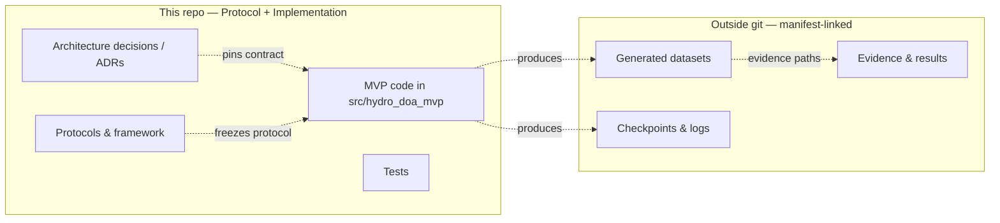
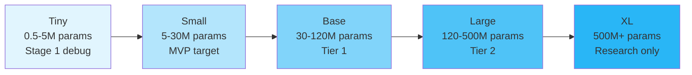

# Hydro-DOA World Model

> Research framework for geometry-conditioned self-supervised learning of hydroacoustic array-signal representations.
>
> **Note on terminology:** The term "world model" in this repository name refers to a *predictive latent scene representation* for hydroacoustic array observations, not an RL-style environment model. See [`docs/research/framework/overview.md`](docs/research/framework/overview.md) for the precise definition and usage restrictions.

## What This Is

This repository is the **canonical research and reproducibility control plane** for developing neural models that estimate direction-of-arrival (DOA)) and related spatial properties from hydrophone arrays in underwater environments. It contains documentation, the NO-GO experiment protocol, architecture decision records, and the `src/hydro_doa_mvp/` implementation skeleton (code under active development). There is no generated dataset, model checkpoint, or empirical result in this repository yet.

The primary Tier-0 hypothesis is that a **supervised geometry-conditioned backbone** improves held-out array transfer over a matched no-coordinate model. Self-supervised learning remains an optional, separately evaluated Tier-1 extension.

## MVP Claim And Success Criterion

- **Claim (sole Tier-0):** in domain-randomized BELLHOP shallow-water simulation under matched information, the supervised-from-scratch Small `full` geometry model improves zero-shot held-out topology transfer (sealed Rect-5, primary band `500-1400 Hz`) over its matched `no-coordinate` twin.
- **Decision rule:** one-sided margin test `H0: R <= 15%` at `alpha = 0.05` on environment-level paired relative improvement (white-noise strata), preregistered target effect `20%` (protocol Section 12.1).
- **Solver:** 2-D BELLHOP arrivals, one run per array element (no geometric shifts), engine `bellhopcuda` + `arlpy`, independent cross-check KRAKEN (ADRs [`0001`](docs/adr/ADR-0001-solver-dimensionality-and-per-sensor-computation.md), [`0002`](docs/adr/ADR-0002-solver-stack.md)).

## Architecture at a Glance


## Repository Boundary

The executable MVP implementation lives **in this repository** under `src/hydro_doa_mvp/` (Python, uv-managed). This repository is simultaneously the protocol control plane and the implementation; generated datasets, checkpoints, and run artifacts stay outside git (ignored paths) and are recorded through manifests and evidence links.



## Repository Structure

```
.
├── docs/
│   ├── research/framework/     # Framework documentation (global §1–30)
│   │   ├── overview.md         # Purpose, hypothesis, terminology
│   │   ├── architecture.md     # Pipeline, encoders, model ladder
│   │   ├── training_strategy.md # SSL stages, objectives, adaptation
│   │   ├── evaluation.md       # Metrics, baselines, gates
│   │   ├── risks.md            # Validity threats, external deps
│   │   └── roadmap.md          # Roadmap and success criteria
│   ├── adr/                    # Architecture decision records
│   │   ├── ADR-0001            # 2-D solver + per-sensor computation
│   │   └── ADR-0002            # bellhopcuda + arlpy + KRAKEN stack
│   ├── experiments/
│   │   └── bellhop_mvp_protocol.md  # Experiment protocol (NO-GO until gates)
│   └── research_go_no_go_history.md # GO/NO-GO decision log
├── src/hydro_doa_mvp/          # Executable MVP implementation (in development)
├── tests/                      # Test suite (in development)
└── README.md                   # This file
```

## Quick Navigation

| I want to... | Go to |
|---|---|
| Browse the documentation index | [`docs/README.md`](docs/README.md) |
| Understand the big picture | [`docs/research/framework/overview.md`](docs/research/framework/overview.md) |
| See the model architecture | [`docs/research/framework/architecture.md`](docs/research/framework/architecture.md) |
| Understand training stages | [`docs/research/framework/training_strategy.md`](docs/research/framework/training_strategy.md) |
| Review data and simulation rules | [`docs/research/framework/data_and_simulation.md`](docs/research/framework/data_and_simulation.md) |
| See the first experiment | [`docs/experiments/bellhop_mvp_protocol.md`](docs/experiments/bellhop_mvp_protocol.md) |
| Check evaluation criteria | [`docs/research/framework/evaluation.md`](docs/research/framework/evaluation.md) |
| Review risks and threats | [`docs/research/framework/risks.md`](docs/research/framework/risks.md) |
| Follow the research roadmap | [`docs/research/framework/roadmap.md`](docs/research/framework/roadmap.md) |
| Review the solver decisions | [`docs/adr/ADR-0001`](docs/adr/ADR-0001-solver-dimensionality-and-per-sensor-computation.md), [`docs/adr/ADR-0002`](docs/adr/ADR-0002-solver-stack.md) |
| Review the historical GO / NO-GO decision log | [`docs/research_go_no_go_history.md`](docs/research_go_no_go_history.md) |
| Trace the review findings | Consolidated in the [decision log](docs/research_go_no_go_history.md); full review texts are archived locally under `.omo/reviews/` (non-authoritative) |

## Model Family Ladder



## Key Design Principles

- **Phase-preserving representations** — IQ and STFT real+imag as primary inputs; no raw wrapped phase regression
- **Geometry-conditioned, not geometry-fixed** — Model adapts to different arrays via coordinate features, not retraining
- **Permutation equivariance** — Array encoder output must not depend on sensor ordering
- **Evidence-gated progression** — No Tier 2 (JEPA, Mamba, XL) until Tier 0 baseline passes
- **Simulation-first, real-world later** — BELLHOP MVP establishes baselines before real Novik Bay data

## Status

The framework and experiment protocol are active drafts. The 2026-08-16 remediation applied the consolidated P0 review block (per-sensor run-count formulas `x N_sensors`, the frozen statistical decision contract with a one-sided margin test, calibration controls, the solver ADRs, and the Tier-0 scope reduction). Full generation and confirmatory claims remain **NO-GO** until the protocol's documented prerequisites are satisfied. Simulator runs, power analysis, model training, dataset generation, checkpoints, and empirical results are all **not yet evaluated**.

The ignored `.omo/` directory is local planning and verification evidence, not published research documentation. Generated or stale local visuals are not authoritative; use the linked Markdown framework, protocol, ADRs, and dated reviews.

## Citation

This is an active research project. For questions or contributions, refer to the framework documentation or open an issue.
