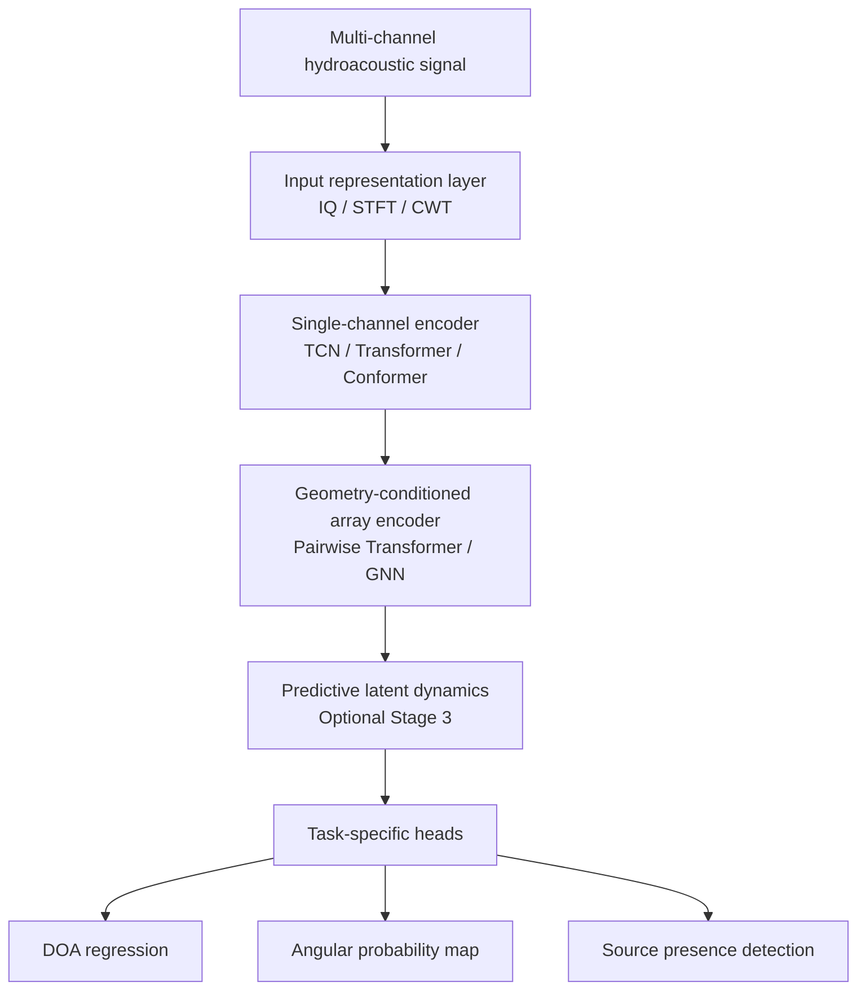
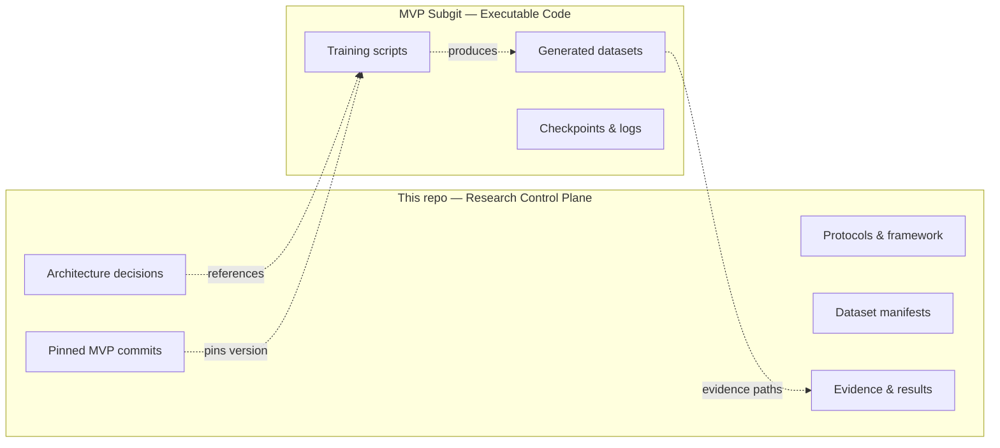
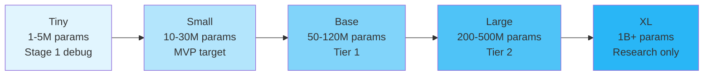

# Hydro-DOA World Model

> Research framework for geometry-conditioned self-supervised learning of hydroacoustic array-signal representations.

## What This Is

This repository is the **canonical research and reproducibility control plane** for developing neural models that estimate direction-of-arrival (DOA) and related spatial properties from hydrophone arrays in underwater environments.

The core hypothesis: a **geometry-conditioned self-supervised backbone** can learn transferable representations of hydroacoustic array scenes and support multiple downstream tasks (DOA regression, angular probability maps, source presence detection) through lightweight adaptation to different array geometries.

## Architecture at a Glance



## Repository Boundary



## Repository Structure

```
.
├── docs/
│   ├── research/framework/     # Framework documentation
│   │   ├── overview.md         # Purpose, hypothesis, terminology
│   │   ├── architecture.md     # Pipeline, encoders, model ladder
│   │   ├── training_strategy.md # SSL stages, objectives, adaptation
│   │   ├── evaluation.md       # Metrics, baselines, gates
│   │   ├── risks.md            # Validity threats, external deps
│   │   └── ...
│   └── experiments/
│       └── bellhop_mvp_protocol.md  # First executable protocol
├── .omo/
│   ├── plans/                  # Work plans
│   ├── evidence/               # Verification evidence
│   └── drafts/                 # Research drafts
└── README.md                   # This file
```

## Quick Navigation

| I want to... | Go to |
|---|---|
| Understand the big picture | [`docs/research/framework/overview.md`](docs/research/framework/overview.md) |
| See the model architecture | [`docs/research/framework/architecture.md`](docs/research/framework/architecture.md) |
| Understand training stages | [`docs/research/framework/training_strategy.md`](docs/research/framework/training_strategy.md) |
| See the first experiment | [`docs/experiments/bellhop_mvp_protocol.md`](docs/experiments/bellhop_mvp_protocol.md) |
| Check evaluation criteria | [`docs/research/framework/evaluation.md`](docs/research/framework/evaluation.md) |
| Review risks and threats | [`docs/research/framework/risks.md`](docs/research/framework/risks.md) |

## Model Family Ladder



## Key Design Principles

- **Phase-preserving representations** — IQ and STFT real+imag as primary inputs; no raw wrapped phase regression
- **Geometry-conditioned, not geometry-fixed** — Model adapts to different arrays via coordinate features, not retraining
- **Permutation equivariance** — Array encoder output must not depend on sensor ordering
- **Evidence-gated progression** — No Tier 2 (JEPA, Mamba, XL) until Tier 0 baseline passes
- **Simulation-first, real-world later** — BELLHOP MVP establishes baselines before real Novik Bay data

## Status

- [x] Framework documentation (v1)
- [x] BELLHOP MVP protocol (v1)
- [x] Channel encoder architecture plan
- [ ] Executable MVP implementation (in separate subgit repo)
- [ ] BELLHOP dataset generation
- [ ] Baseline results

## Citation

This is an active research project. For questions or contributions, refer to the framework documentation or open an issue.
