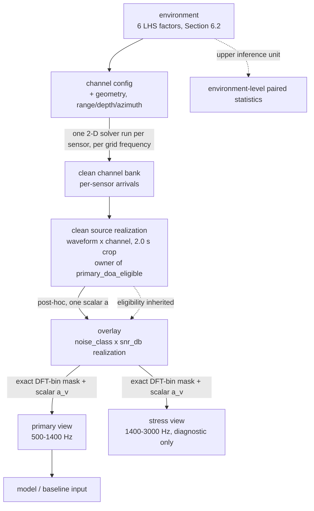

# BELLHOP MVP Experiment Protocol

## Status

This is a **non-final draft** of the first numeric, executable experiment protocol for the geometry-conditioned hydroacoustic DOA framework. It is a **BELLHOP-only simulation-stage protocol**. Its status is **NO-GO**: full dataset generation and confirmatory claims remain blocked until the diagnostic pilot prerequisites and gates below are completed; no experiment described here has been executed. Future results from this protocol may support simulation-stage claims only and must not be reported as real-world Novik Bay performance.

Framework references:

- [Overview](../research/framework/overview.md)
- [Architecture](../research/framework/architecture.md)
- [Training And Adaptation Strategy](../research/framework/training_strategy.md)
- [Data, Simulation, And Hydroacoustic Validation](../research/framework/data_and_simulation.md)
- [Evaluation, Baselines, And Protocols](../research/framework/evaluation.md)
- [Risks And Validity Threats](../research/framework/risks.md)
- [Roadmap And Success Criteria](../research/framework/roadmap.md)

## 0. Glossary (non-normative)

Definitions are given here once; the body uses these terms without re-defining them.

| Term | Meaning |
|---|---|
| **environment** | One draw of the six SSP/water/bottom LHS factors (Section 6.2). The upper unit of statistical inference. |
| **channel config** | One `(environment, geometry, source range/depth, receiver depth, azimuth, coordinates, run config)` tuple; defines one reusable clean multi-sensor channel bank entry. |
| **clean source realization** | One source waveform rendered through one channel config; owns primary DOA eligibility. |
| **overlay** | One noise/SNR (and interference/SIR) realization applied post-hoc to one clean realization. |
| **inference view** | A deterministic child of an overlay produced by exact DFT-bin projection: `primary-500-1400hz-dft-v1` or `stress-1400-3000hz-dft-v1` (Section 7.2a). Distinguished from **channel view** (the per-sensor single-channel Stage-1 SSL slice of an array example, Section 9.9), which is a different concept. |
| **eligible / primary_doa_eligible** | A clean realization whose primary-view projection has finite, strictly positive power at every active sensor and which was drawn under the primary support profile; only eligible rows support primary DOA use (Section 7.2a). |
| **support profile** | The frozen per-family parameter ranges (`primary-support-500-1400hz-v1`, Section 8.2.2) that guarantee nonzero primary-band energy. |
| **slate** | The complete set of frozen models/baselines, view definitions, preprocessing, metrics, and analysis code scored together in the one sealed batch (Section 8.1a). |
| **sealed** | The isolated Rect-5 confirmatory split: generated, frozen, and then accessed exactly once as one batch (Section 8.1a). |
| **frozen** | Three senses, disambiguated by context: (i) a *config* fixed before an evaluation stage (frozen slate); (ii) *data* written once and never regenerated in place (frozen manifest rows); (iii) *weights* not updated (frozen backbone). |
| **matched information** | The two Tier-0 runs see the same waveforms, splits, budget, and code and differ only in the declared coordinate fields (plus the geometry-bias computation). |
| **pilot-frozen** | A value that the diagnostic pilot measures and fixes before full-scale generation (e.g. the frequency grid, `N_power`, the absolute error floor); always `NOT_YET_EVALUATED` until the pilot artifacts exist. |
| **sensor-run** | One 2-D solver execution for one sensor at one frequency of one channel config; the unit of solver budget (`N_sensor_channel_runs`). |

## 1. MVP Claim

The sole Tier-0 positive claim this protocol may support is supervised-only:

> In domain-randomized BELLHOP shallow-water simulation under matched information conditions, the supervised-from-scratch Small `full` geometry model improves zero-shot held-out topology transfer over its matched supervised-from-scratch Small `no-coordinate` model.

This claim is tested by the frozen matched pair in Section 9.4. The two runs use one Small backbone and differ only in coordinate input. Classical comparators remain required context, but they do not create another Tier-0 positive claim. SSL and VAE are optional, separately preregistered Tier-1 studies and cannot support this claim.

**Primary endpoint and decision rule (see Section 12.1 for the full frozen contract):** the paired environment-level relative improvement `R` of `full` over `no-coordinate` on sealed Rect-5 primary-view rows (white noise strata), tested by the one-sided margin test `H0: R <= 15%` at `alpha = 0.05` with a preregistered target effect of `20%`. The claim is `supported` only if `H0` is rejected in the single sealed batch.

Out of scope for this protocol:

- real-world hydroacoustic performance;
- BELLHOP-to-real transfer;
- operational Novik Bay deployment;
- multi-source DOA;
- near-field localization;
- Stage 3 predictive latent dynamics;
- Tier 2 SSL objectives such as DINO/JEPA/wav2vec/HuBERT/Mamba.

## 2. Task Definition

| Field | Value |
|---|---|
| Stage | BELLHOP-only simulation |
| DOA target | Single-source 1D azimuth |
| Azimuth range | `[-70 deg, +70 deg]` broadside-relative |
| Train azimuth sampling | uniform random over `[-70, +70] deg` |
| Dev-test azimuth grid | `2.5 deg` spacing over `[-70, +70] deg`, plus random OOD angles |
| Source count | 1 target source |
| Source state | Static within one 2 s example |
| Receiver state | Static |
| Far-field assumption | Required; validate with Section 6.3 before dataset generation |
| Output heads | DOA regression and angular probability map |
| Source presence head | Diagnostic only: target-present vs noise/interference-only windows |

## 3. Array Configuration

All coordinates are in meters in an array-centered coordinate system. `x` is horizontal across the aperture, `y` is horizontal orthogonal to `x`, and `z = 0` for all sensors in this MVP.

### 3.1 Training Geometry A: ULA-5-H

| Sensor | x | y | z |
|---|---|---:|---:|
| 0 | -0.500 | 0.000 | 0.000 |
| 1 | -0.250 | 0.000 | 0.000 |
| 2 | 0.000 | 0.000 | 0.000 |
| 3 | 0.250 | 0.000 | 0.000 |
| 4 | 0.500 | 0.000 | 0.000 |

Parameters:

- hydrophones: `5`;
- spacing: `0.25 m`;
- aperture: `1.00 m`;
- nominal sound speed for geometry checks: `1500 m/s`;
- minimum wavelength at 3000 Hz: `0.5 m`;
- spacing-to-wavelength ratio at 3000 Hz: `0.5`.

### 3.2 Training Geometry B: Cross-5

Symmetric cross-shaped array with three sensors on the `x` axis and three sensors on the `y` axis, sharing the central sensor. This gives 5 unique sensors in a 2-D non-collinear cross topology. The symmetric shape avoids asymmetric leg-length bias. The leg spacing is kept at `0.25 m` to match the ULA-5-H element spacing and avoid spatial aliasing.

| Sensor | x | y | z |
|---|---|---:|---:|
| 0 | -0.250 | 0.000 | 0.000 |
| 1 | 0.000 | 0.000 | 0.000 |
| 2 | 0.250 | 0.000 | 0.000 |
| 3 | 0.000 | -0.250 | 0.000 |
| 4 | 0.000 | 0.250 | 0.000 |

Parameters:

- hydrophones: `5`;
- leg spacing: `0.25 m`;
- maximum aperture: `0.500 m` (along each leg);
- role: 2-D non-collinear symmetric training topology.

### 3.3 Validation Geometry: ULA-5-Shifted-Aperture

Same topology and sensor count as ULA-5-H, but spacing is `0.20 m` and aperture is `0.80 m`. This tests changed aperture without changed topology.

| Sensor | x | y | z |
|---|---|---:|---:|
| 0 | -0.400 | 0.000 | 0.000 |
| 1 | -0.200 | 0.000 | 0.000 |
| 2 | 0.000 | 0.000 | 0.000 |
| 3 | 0.200 | 0.000 | 0.000 |
| 4 | 0.400 | 0.000 | 0.000 |

Parameters:

- hydrophones: `5`;
- spacing: `0.20 m`;
- aperture: `0.80 m`;
- role: aperture transfer with same topology.

### 3.4 Held-Out Geometry A: Square-4

| Sensor | x | y | z |
|---|---:|---:|---:|
| 0 | -0.375 | -0.375 | 0.000 |
| 1 | -0.375 | 0.375 | 0.000 |
| 2 | 0.375 | -0.375 | 0.000 |
| 3 | 0.375 | 0.375 | 0.000 |

Parameters:

- hydrophones: `4`;
- side length: `0.75 m`;
- maximum aperture: `1.061 m`;
- role: held-out topology transfer; may be used for dev-test and model selection.

### 3.5 Held-Out Geometry B (Sealed): Rect-5

Asymmetric rectangular array with three sensors in the lower row and two sensors in the upper row. This topology is distinct from the ULA-5-H and Cross-5 training geometries while sharing the same 5-element sensor count.

| Sensor | x | y | z |
|---|---|---:|---:|
| 0 | -0.500 | -0.250 | 0.000 |
| 1 | 0.000 | -0.250 | 0.000 |
| 2 | 0.500 | -0.250 | 0.000 |
| 3 | -0.500 | 0.250 | 0.000 |
| 4 | 0.500 | 0.250 | 0.000 |

Parameters:

- hydrophones: `5`;
- maximum aperture: `1.118 m`;
- role: **sealed/future confirmatory topology transfer only**; same sensor count as ULA-5-H and Cross-5. Rect-5 must not appear in any development, adaptation, model-selection, ablation-tuning, or hyperparameter-search panel. It is evaluated only inside the one globally preregistered sealed batch in Section 8.1a.

### 3.6 Geometry Split Policy

Training, validation, and sealed-test geometries are split as follows:

| Geometry | Split | Purpose |
|---|---|---|
| ULA-5-H | Train | Primary horizontal collinear topology |
| Cross-5 | Train | 2-D non-collinear symmetric topology; same sensor count as ULA-5-H |
| ULA-5-Shifted | Validation | Aperture transfer, same topology |
| Square-4 | Dev-test / validation | Held-out topology for development; tests transfer to different sensor count |
| Rect-5 | Sealed test | Final confirmatory topology transfer |

### 3.7 Matched Coordinate Ablation Modes

All geometry-conditioned models must be compared against the same backbone run in these coordinate-input modes to make the geometry effect causally identifiable:

| Mode | Raw coordinate field | Pairwise coordinate field | Signal assignment | Purpose |
|---|---|---|---|---|
| `no-coordinate` | zeros | zeros | unchanged | Tests whether geometry metadata matters at all; only geometry-bias computation is removed |
| `random-coordinate` | false coordinates drawn from the training coordinate distribution (same sensor count, sensor-wise independent draw, never the true geometry) | recomputed from the false coordinates | unchanged | Input-statistics control: separates "any coordinate input present" from "true geometry present"; protects the "matched information" phrase of the claim |
| `coordinates-only` | true `x,y,z` | zeros | unchanged | Tests raw coordinate conditioning |
| `pairwise-only` | zeros | true distances/directions/RBF | unchanged | Tests relational geometry without raw coordinates |
| `full` | true `x,y,z` | true distances/directions/RBF | unchanged | Primary proposed geometry conditioning |
| `mismatched-coordinate` | permuted relative to signals | recomputed from the permuted coordinate assignment | unchanged | Negative control for incorrect signal-to-geometry association |
| `joint-permutation-canary` | jointly permuted | jointly permuted | permuted by the same mapping | Equivariance canary only; not a mismatched-coordinate control |

The no-geometry baseline in the ablation matrix is `no-coordinate`. The primary proposed model is `full`. `random-coordinate` is a mandatory calibration control (Section 13.2): zeroing the coordinate fields changes the input distribution, so `no-coordinate` alone cannot distinguish "geometry information absent" from "input statistics degraded"; `random-coordinate` supplies the missing matched-input-statistics arm. Coordinate-mode comparisons change only the two declared coordinate fields and the presence of geometry-bias computation; all other model and experiment fields are frozen in Section 9.4.

### 3.8 Sensor Perturbation Conditions

Sensor-coordinate perturbation is used only for robustness testing and calibration gates, not for the primary clean comparison.

| Condition | Coordinate noise | Gain error | Phase error |
|---|---|---:|---:|
| Clean | `0 mm` | `0 dB` | `0 deg` |
| Calibration-lite | Gaussian `sigma = 5 mm`, clipped at `15 mm` | Uniform `[-0.5, 0.5] dB` | Uniform `[-5, +5] deg` |
| Calibration-stress | Gaussian `sigma = 15 mm`, clipped at `40 mm` | Uniform `[-1.5, +1.5] dB` | Uniform `[-15, +15] deg` |

Notes:

- `Phase error` is a frequency-independent sensor phase rotation applied to the complex analytic signal or STFT complex channels. A sensor clock offset is a separate perturbation with frequency-dependent phase `Δφ(f) = -2πfτ`; neither perturbation may stand in for the other.
- Calibration-stress is diagnostic. It must not be used to support the main MVP claim.

### 3.9 Spatial Aliasing Note

The declared `λ/2` spacing at `3000 Hz` assumes `c = 1500 m/s`. The randomized SSP allows sound speeds as low as `1460 m/s`, which makes the wavelength at `3000 Hz` approximately `0.487 m`. At that speed, `0.25 m` spacing is slightly above `λ/2`, so the top of the band becomes a **spatial-aliasing stress regime**.

- Primary clean comparisons should treat the effective unambiguous upper frequency as `f_max_eff = c_min / (2 * spacing) = 1460 / (2 * 0.25) = 2920 Hz` for the `0.25 m` train geometries.
- The `3000 Hz` upper bound is retained for robustness and aliasing-stress diagnostics, but claims about clean-band performance must be restricted to `f ≤ 2920 Hz` for ULA-5-H and Cross-5 unless aliasing is explicitly modeled.

Effective unambiguous upper frequency per geometry (`c_min = 1460 m/s`):

| Geometry | Minimum spacing | `f_max_eff` | Status in useful band `500–3000 Hz` |
|---|---:|---:|:---|
| ULA-5-H | `0.25 m` | `2920 Hz` | Aliasing stress near top edge |
| Cross-5 | `0.25 m` | `2920 Hz` | Aliasing stress near top edge |
| ULA-5-Shifted | `0.20 m` | `3650 Hz` | Clean |
| Square-4 | `0.75 m` | `973 Hz` | Strong aliasing; held-out stress geometry |
| Rect-5 | `0.50 m` | `1460 Hz` | Aliasing above mid-band; sealed stress geometry |

Square-4 and Rect-5 are intentionally used as held-out / sealed stress geometries. Their aliasing behavior must be reported separately from the clean-band metrics of ULA-5-H and Cross-5. For sealed Rect-5, the primary alias-safe endpoint is `500-1400 Hz`; `1400-3000 Hz` is a separately reported stress-only panel and cannot support the Tier-0 claim. The 1400 Hz boundary bin is counted in the primary band only.

### 3.10 Ideal Geometry Assumption and Real-World Scope Boundary

The MVP uses **ideal sensor positions** exactly as specified in Sections 3.1–3.6. Manufacturing tolerances, mounting uncertainties, cable-length variations, and thermal deformation are intentionally excluded from the BELLHOP simulation stage.

- The calibration perturbation gates in Section 3.8 test algorithmic robustness to injected position, gain, and phase errors, but they do not model a real manufacturing process.
- The useful band `500–3000 Hz` and the spatial-aliasing limits in Section 3.9 are computed from these ideal positions.
- Frequencies used in historical Novik Bay experiments (e.g., `3219 Hz`, `12000 Hz`) are not part of the MVP useful band. They are out of scope for the BELLHOP simulation stage and may be addressed only in a future real-world transfer protocol with a different array geometry or explicit aliasing modeling.

This assumption is valid because the MVP claim is restricted to BELLHOP-only simulation. A real-world protocol must re-evaluate array tolerances and choose a geometry whose aliasing-free band covers the intended operational frequencies.


## 4. Signal And Preprocessing Configuration

| Field | Value |
|---|---|
| Useful acoustic band | `500 Hz` to `3000 Hz` |
| Master simulation sample rate | `48000 Hz` |
| Future sound-card acquisition sample rate | `48000 Hz` |
| Model target sample rate | `12000 Hz` |
| Decimation factor | `4` after coherent anti-alias filtering |
| Anti-alias low-pass before decimation | FIR, passband `<= 3400 Hz`, transition band `3400-5400 Hz`, stopband `>= 5400 Hz` |
| Chunk duration | `2.0 s` |
| Chunk hop | `1.0 s` |
| Samples per chunk at acquisition rate | `96000` |
| Samples per chunk at model target rate | `24000` |
| Base neural input | Not a model input. The `500-3000 Hz` base-overlay waveform is a generation intermediate; training and inference consume the primary inference view below (Section 7.2a) of eligible rows |
| Primary inference view (`primary-500-1400hz-dft-v1`) | Exact DFT-bin projection of the base clean/noise/interferer components to `500-1400 Hz`, followed by view-specific array-wide scaling and IQ/STFT preprocessing; the **sole model input for training, validation, dev-test tuning, and sealed prediction** |
| Stress inference view (`stress-1400-3000hz-dft-v1`) | Separate exact DFT-bin projection to `(1400,3000] Hz`; diagnostic only, never a training or tuning input |
| Secondary input | STFT real+imaginary channels |
| CWT | Excluded from MVP; future ablation only |
| Phase representation | `cos(Δφ)` and `sin(Δφ)` or complex ratio `X_i / X_j`; raw wrapped phase regression is banned |
| Primary acoustic cue | PDOA / IPD (phase-difference of arrival / inter-channel phase difference), not TDOA |

Useful-band and sample-rate rationale:

- The useful acoustic band `500-3000 Hz` lies in the low-mid frequency regime where BELLHOP ray tracing is accurate (>200 Hz in shallow water) and matches the dominant frequency content of surface-ship radiated noise and many marine mammal vocalizations.
- It provides adequate angular resolution for the small-aperture arrays in this protocol (wavelength `0.5-3 m` at `c = 1500 m/s`) while avoiding the strong frequency-dependent absorption that limits long-range propagation at frequencies above `5 kHz`.
- The `48 kHz` master sample rate is a hardware and anti-aliasing convenience, not a signal-bandwidth requirement. It permits a sharp anti-alias transition band (`3400-5400 Hz`) before clean integer decimation to the `12 kHz` model rate, and it is a standard acquisition rate for multichannel audio interfaces and hydrophone front-ends. The reusable base overlay remains band-limited to `500-3000 Hz`; Section 7.2a derives disjoint model inputs for primary and stress predictions.

Sound-card policy:

- the real acquisition target is multichannel `48 kHz` PCM from a shared-clock audio interface;
- all hydrophone channels must be sampled by the same device clock with no independent per-channel resampling;
- preferred bit depth is `24-bit` PCM or float capture from the interface driver;
- automatic gain control, noise suppression, echo cancellation, and per-channel DSP must be disabled;
- raw captured files must preserve the acquisition sample rate and channel order in metadata;
- if a specific interface only supports `96 kHz` reliably, capture may use `96 kHz`, but the MVP model input still decimates coherently to `12 kHz` after the same useful-band filtering;
- `44.1 kHz` capture is not used for MVP training unless hardware forces it, because integer decimation to the `12 kHz` model rate is not clean.

STFT settings:

| Field | Value |
|---|---|
| Window | Hann |
| Window duration | `64 ms` |
| Window samples at 12000 Hz | `768` |
| Hop duration | `16 ms` |
| Hop samples at 12000 Hz | `192` |
| FFT size | `1024` |
| Retained band | `500 Hz` to `3000 Hz` |
| Phase representation | real and imaginary STFT channels |
| Magnitude-only STFT | Diagnostic baseline only |

Neural input framing:

| Frame type | Primary | Alternative | STFT reference |
|---|---|---|---|
| Input branch | IQ / analytic signal | IQ / analytic signal | STFT |
| Frame duration | `512 ms` | `256 ms` | `64 ms` |
| Frame samples at 12 kHz | `6144` | `3072` | `768` |
| Hop duration | `128 ms` | `64 ms` | `16 ms` |
| Hop samples at 12 kHz | `1536` | `768` | `192` |
| Overlap | `75%` | `75%` | `75%` |
| Frames per 2.0 s chunk | `12` | `28` | `122` |
| Purpose | Primary per-channel encoder input | Ablation / fast temporal model | Frequency-domain branch |

- The **512 ms IQ frame** is the primary discrete input to the per-channel encoder. At 500 Hz it contains 256 cycles, giving stable phase estimation; at 3000 Hz it contains 1536 cycles, which is more than sufficient.
- The **256 ms IQ frame** is the alternative for ablations that need higher temporal resolution. It is used only as a secondary ablation, not as the default.
- The per-channel encoder may process IQ frames independently or with light causal context; the array encoder aggregates frame-level embeddings across the 2.0 s chunk.
- Frame boundaries are aligned across all hydrophone channels for a given array example.

Processing mode:

- The MVP uses **block-based processing** with `2.0 s` chunks and `1.0 s` hop.
- The per-channel encoder and array encoder may use the full `2.0 s` chunk context; causal-only streaming inference is **not required** for the MVP.
- Real-time / causal streaming is an explicit future extension and is listed in the roadmap.

Normalization:

- one shared RMS scale factor per multi-channel array chunk;
- statistics estimated on training split only;
- no independent per-channel RMS normalization;
- no per-frame max normalization;
- preserve phase, delay, and inter-channel amplitude ratios.

Phase-difference preservation (PDOA/IPD):

- The array is short-baseline (aperture 1.00 m, spacing 0.25 m). The primary spatial cue is the inter-channel phase difference, not the absolute time delay.
- Phase differences must be represented through complex-valued channels or through `sin/cos` of the phase difference. Direct regression of wrapped phase is banned.
- For STFT inputs, the complex ratio `X_i[f,t] / X_j[f,t]` or its real and imaginary components must be available to downstream models.
- Independent random phase shifts across hydrophone channels are banned as augmentations unless they model a physically documented calibration error.

## 5. Synthetic Source Families

Each family must produce examples across the full train azimuth range and all train BELLHOP environments.

All synthetic source waveforms are generated at the `48000 Hz` master rate before BELLHOP propagation. Unless a family states otherwise:

- waveform duration is embedded in a `2.0 s` chunk;
- active source onset is sampled uniformly from `0.10-0.30 s`;
- every non-CW duration is drawn conditionally after onset and must satisfy `duration <= 2.0 - onset - 0.10 s`;
- amplitude is peak-normalized to `-6 dBFS` before propagation and then randomly scaled by `[-6, +3] dB`;
- start phase is sampled uniformly from `[0, 2*pi)`;
- onset and offset use a Tukey or raised-cosine ramp of `10-25 ms`;
- no generated waveform may clip before or after propagation.

| Family | Count weight | Numeric parameters |
|---|---:|---|
| CW | `1.0` | carrier sampled uniformly from `500-3000 Hz`; duration `2.0 s` |
| LFM chirp | `1.0` | start/end in `500-3000 Hz`; bandwidth `500-2000 Hz`; duration `0.5 s` to `2.0 - onset - 0.10 s` |
| NLFM chirp | `1.0` | start/end in `500-3000 Hz`; polynomial order `2` or `3` |
| Broadband pulse | `1.0` | center `1000-2500 Hz`; bandwidth `500-1500 Hz`; pulse length `50-250 ms` |
| Impulsive transient | `0.5` | length `10-80 ms`; tapered with Tukey window `alpha = 0.25` |
| Band-limited noise burst | `1.0` | band within `500-3000 Hz`; burst length `0.25 s` to `2.0 - onset - 0.10 s` |

Detailed parameter distributions and sampling rules are frozen in Section 8.2. SNR-dependent masking is absent from Tier-0 and may appear only in a separately preregistered Tier-1 ablation.

Every row intended for the `500-1400 Hz` primary DOA slate uses the Section 8.2.2 primary-support profile. The wider ranges above remain available only to rows preregistered as stress-only. Source use is assigned before waveform generation; a stress-only draw cannot be promoted after labels, predictions, scores, or results are observed.

CW exception:

- CW is the only family allowed to use the full `2.0 s` active duration. The onset/offset ramp rule (active onset `0.10-0.30 s`, trailing context `≥ 0.10 s`) is waived for CW because a continuous tone is the defining characteristic of the family.
- All other families must follow the onset/offset contract.

OOD source-family test:

- hold out `20%` of parameter ranges per family for OOD evaluation;
- additionally run one complete-family holdout where NLFM is excluded from training and included only in test.

## 6. BELLHOP Environment Configuration

### 6.1 Environment Counts

The independent environment counts and geometry assignments are governed only by the canonical allocation table in Section 8.1. Environment-generalization claims must report mean, standard deviation, minimum, maximum, and per-environment results for that table's dev-test environments. If fewer than `10` dev-test environments are successfully generated, environment-generalization claims are preliminary only. Confirmatory claims require the symbolic sealed allocation and the Section 8.1a access policy.

### 6.2 Randomized Shallow-Water Parameter Ranges

The environment LHS has exactly the six SSP/water/bottom factors below. Source range/depth, receiver depth, azimuth, and geometry-specific channel configurations are nested draws or assignments within an environment; they are not additional LHS dimensions.

| Environment LHS factor | Train range | Validation/test policy |
|---|---:|---|
| Water depth | `15-60 m` | held-out values sampled independently |
| Sound speed at surface | `1460-1530 m/s` | independent |
| Linear SSP gradient | `[-0.05, +0.05] (m/s)/m` | independent |
| Bottom compressional speed | `1450-1800 m/s` | independent |
| Bottom density | `1.3-2.0 g/cm^3` | independent |
| Bottom attenuation | `0.1-1.0 dB/lambda` | independent |

| Nested channel-config draw | Train range | Validation/test policy |
|---|---:|---|
| Source depth | `3-20 m` and at least `3 m` above bottom | independent within environment |
| Receiver depth | `3-20 m` and at least `3 m` above bottom | independent within environment |
| Source range | `50-1000 m` | test includes `50-1200 m` |

The surface is pressure-release and flat, and MVP bathymetry is a range-independent flat bottom; neither is randomized.

The MVP intentionally uses range-independent flat-bottom environments to keep the first protocol executable. Range-dependent bathymetry and seasonal Novik Bay SSP are future protocol extensions.

### 6.3 Far-Field Validity Gate

Before generating a dataset for a geometry/source-range combination:

```text
R_min >= max(10 * aperture, 2 * aperture^2 / lambda_min)
```

where:

- `aperture` is the maximum sensor-to-sensor distance for the geometry;
- `lambda_min = c / f_max`;
- `c = 1500 m/s`;
- `f_max = 3000 Hz`;
- `lambda_min = 0.5 m`.

For ULA-5-H:

```text
max(10 * 1.00, 2 * 1.00^2 / 0.5) = max(10.0, 4.0) = 10.0 m
```

For Cross-5 the maximum aperture is `0.50 m`, giving an even smaller bound. The protocol uses `R_min = 50 m`, so the MVP far-field gate passes for all specified arrays. If later arrays use larger apertures or higher frequency bands, this calculation must be repeated.

### 6.4 BELLHOP Broadband/Azimuth Contract And Outputs

Primary generation mode:

- The Tier-0 executable propagation route is 2-D arrivals run type `A` (per `docs/adr/ADR-0001`): the **generation engine** is the pinned `bellhopcuda` build (C++/CUDA port of BELLHOP; `docs/adr/ADR-0002`), and the **reference build** for the port-equivalence gate is a pinned CPU BELLHOP from the Acoustics Toolbox. BELLHOP3D and Nx2D are out of scope (ADR-0001).
- For sensor `i`, run one receiver-range calculation with the same environment, source depth, and receiver depth as every other sensor and radial range `r_i = hypot(source_x - x_i, source_y - y_i)`. This radial mapping is the sole representation of the arbitrary horizontal array in the 2-D solver. **Per-sensor individual computation is mandatory: deriving any sensor's channel from another sensor's channel by geometric delay, phase shift, interpolation, or waveform translation is forbidden.** Each radial range `r_i` carries its own eigenray set — its own path amplitudes, path births/deaths, and caustic structure — and those inter-sensor multipath differences are exactly the aperture information under study; a shift-based synthesis would silently replace them with a free-space plane-wave model.
- Use the bearing convention below to obtain `source_x` and `source_y`; array rotation changes the sensor coordinates, not the bearing convention.
- Preserve continuous arrival delays. Nearest-sample arrival rounding and sampled impulse placement are forbidden. The parsed arrival delays must resolve timing to at least `0.3 us` (`10x` finer than `tau_max = 3 us`); the pilot must verify that the serialized `.arr` precision meets this bound before the channel bank is trusted.

The pilot manifest must contain these unresolved solver identity fields; the documentation and pre-pilot manifests keep the literal values shown and may replace them only when the pilot is frozen:

| Field | Pre-pilot value |
|---|---|
| `solver_repository` | `NOT_YET_SELECTED` |
| `solver_build_sha` | `NOT_YET_SELECTED` |
| `solver_compiler` | `NOT_YET_SELECTED` |
| `solver_precision` | `NOT_YET_SELECTED` |
| `solver_input_file_hashes` | `NOT_YET_SELECTED` |

Broadband contract (frozen except the frequency grid and solver identity, which remain `NOT_YET_EVALUATED` until the Section 8.1c study and the ADR-0002 pinning complete):

BELLHOP is a narrowband range-depth ray tracer. The source families defined in Section 5 remain broadband waveforms (LFM chirp, NLFM chirp, broadband pulse, noise burst, transient). To propagate these broadband waveforms through BELLHOP, the channel response is constructed from a set of narrowband BELLHOP runs and then recombined.

- **Narrowband arrivals:** at each candidate frequency, retain complex amplitude `A_ip(f)` and continuous delay `τ_ip` for every contributing path `p` at sensor `i`.
- **Reference and path matching:** use one common first-arrival delay `τ_ref = min_i,p(τ_ip)` per channel configuration. Across adjacent solver frequencies, match paths by delay and arrival-order continuity; interpolate each matched path's complex amplitude and residual delay `τ_ip - τ_ref`. Interpolating the raw sparse complex response is forbidden.
- **Phase-domain synthesis:** reconstruct the continuous-delay transfer function as `H_i(f) = Σ_p A_ip(f) exp(-j2πfτ_ip)`, multiply by the source spectrum `Y_i(f) = S(f)H_i(f)`, and use an IFFT padded to at least the full linear-convolution length. Restore the common reference-delay phase after interpolation; no circular wrap may enter the declared crop.
- **Waveform support and crop:** source samples before the declared onset are zero. Compute the full linear convolution, retain every arrival whose delayed source support can contribute to the crop, then take `[0, 2.0 s)` relative to emission time. If the convolution ends before `2.0 s`, right-zero-pad the crop. The DOA label is the source DOA at emission time; this protocol's sources are static during the chunk.
- **Frequency grid:** use the halving study in Section 8.1c. The selected spacing is `NOT_YET_EVALUATED` and no grid is valid until that full-multipath gate passes.
- **Bearing convention:** `0 deg` is broadside; positive azimuth is clockwise from broadside when looking down the `+x` axis; source coordinates are
  - `source_x = range * sin(azimuth)`;
  - `source_y = range * cos(azimuth)`;
  - `source_z = source_depth`.
- **Array heading:** all arrays use the same heading; array rotation is modeled by rotating hydrophone coordinates, not by changing the bearing convention.
- **Cross-solver validation:** on the same `20` pilot configurations, frequencies, and receiver positions used for the frequency-grid study, compare coherent complex pressure/transfer function against **KRAKEN** (Acoustics Toolbox, independently frozen build; selected per ADR-0002 — a port of the same BELLHOP algorithm does not qualify as independent). For each receiver, subtract the direct-path reference phase, unwrap phase along frequency, and evaluate only bins above `-40 dB` of that receiver's peak. The full-multipath residual must be `< 0.05 rad` in phase and `< 1 dB` in magnitude. The comparison-solver build identity is pinned in the solver manifest; the result is `NOT_YET_EVALUATED`.
- **Port-equivalence validation:** because the generation engine (`bellhopcuda`) is a port, not an independent solver, it must first match the reference CPU BELLHOP build on the same `20` pilot configurations: match arrivals across the two engines by delay and arrival-order continuity, then require per-sensor complex-pressure phase residual `< 0.01 rad` and magnitude residual `< 0.2 dB` on all retained bins after common-delay subtraction (thresholds pilot-frozen; tightened from the cross-solver values because the engines share the algorithm). Bulk generation may start only after this gate passes; otherwise the reference build is used as the engine and the runtime budget is recomputed.


Sanity and convergence checks:

All empirical checks below are `NOT_YET_EVALUATED`; their thresholds are future pilot gates, not reported results. The direct-path PDOA diagnostic isolates fractional-delay construction, while the frequency-grid and cross-solver validations retain full multipath and test different estimands.

| Check | Requirement | Status |
|---|---|---|
| Ray fan convergence | run with `N_beams = 2001` and `4001`; primary DOA metrics may proceed only if median arrival delay difference is `< 0.10 ms` and relative received-energy difference is `< 1 dB` on a 5-environment sample | `NOT_YET_EVALUATED` |
| Port equivalence (bellhopcuda vs reference BELLHOP) | on the `20` pilot configurations, matched-path phase residual `< 0.01 rad`, magnitude residual `< 0.2 dB` (ADR-0002; precondition for using bellhopcuda as the engine) | `NOT_YET_EVALUATED` |
| Arrival ordering | first-arrival delay must be finite for every hydrophone | `NOT_YET_EVALUATED` |
| `.arr` delay precision | serialized arrival delays resolve `<= 0.3 us` (`10x` finer than `tau_max = 3 us`) | `NOT_YET_EVALUATED` |
| Inter-sensor TDOA bound | absolute direct-path delay difference must be `<= aperture / 1450 m/s + 0.05 ms` (auxiliary convergence bound, not the primary gate) | `NOT_YET_EVALUATED` |
| Direct-path PDOA/IPD preservation | synthesize continuous fractional delays for a direct-path-only diagnostic and recover inter-channel phase difference within the frequency-dependent tolerance in Section 13.4 | `NOT_YET_EVALUATED` |
| Full-multipath frequency-grid convergence | all `20` pilot configurations meet the Section 8.1c complex-pressure, phase, and energy thresholds | `NOT_YET_EVALUATED` |
| Full-multipath cross-solver agreement (KRAKEN) | same `20` cases/frequencies/receivers meet the coherent complex-pressure phase and magnitude thresholds above | `NOT_YET_EVALUATED` |
| Metadata completeness | every example stores environment id, array id, hydrophone coordinates, source depth/range/azimuth, SSP parameters, bottom parameters, the complete Section 7 derived identity/replay record, and solver run config and identity fields | `NOT_YET_EVALUATED` |

## 7. Noise And Interference

BELLHOP is used only to compute **clean** multi-channel propagation responses. All additive noise, SNR scaling, and sensor-level interference are applied **after** channel generation. SNR is therefore a nested experimental factor, not a dimension of the BELLHOP channel bank.

### 7.1 Noise Model Categories

| Category | How generated | Spatial structure | Examples |
|---|---|---|---|
| Sensor-level additive noise | Post-hoc overlay on generated waveforms | Incoherent across channels by default | White noise, colored `1/f`/`1/f²` noise, sensor self-noise |
| Tonal narrowband interference | Post-hoc synthesized tone added per channel | Incoherent unless explicitly correlated | Single-tone interferer within `700-2800 Hz` |
| Acoustic interferer | Separate BELLHOP propagation run for the interfering source | Coherent across channels; same multipath structure as target | Second source at angular separation `{15, 30, 60} deg`, SIR `{20, 10, 0} dB` |
| Real recorded noise | Post-hoc overlay of recorded segments | Preserved if multi-channel recording; otherwise replicated per channel | Ambient sea noise, shipping noise |

White and colored generators must normalize their PSD over `500-3000 Hz` before example-specific scaling. A tonal overlay lasts the entire final `2.0 s` crop. Its frequency is drawn within `700-2800 Hz` and then fixed for that sensor and example; when the tone is declared incoherent, frequency and initial phase are drawn independently per active sensor. A correlated tone requires a separately frozen spatial model.

### 7.2 SNR/SIR Measurement and Scaling Contract

The normative measurement point is the **entire final `2.0 s` processed crop**. For measurement only, filter the clean target and the unscaled noise or interferer separately with an 8th-order Butterworth bandpass, represented as second-order sections and applied zero-phase, at `500-3000 Hz`. The contract ID is `butterworth-sos-order8-500-3000Hz-zero-phase-v1`; the manifest must store the filter-design/application library and version and the exact SOS coefficients. This measurement filter does not replace or alter the model preprocessing contract.

For active-sensor set `M`, crop samples `T`, filtered clean signal `s_m[t]`, and filtered unscaled noise `n_m[t]`, define

```text
P_signal_array = mean_{m in M, t in T}(s_m[t]^2)
P_noise_array  = mean_{m in M, t in T}(n_m[t]^2)
a = sqrt(P_signal_array / (P_noise_array * 10^(SNR_dB / 10)))
```

Apply the **one scalar `a`** to the complete unfiltered multichannel noise realization before addition. Do not scale sensors independently: array-wide scaling preserves the realization's spatial covariance, inter-sensor level ratios, and coherence. Measure coherent-interferer SIR by replacing `n` with the separately propagated interferer and using the same crop, filter, array-mean powers, and one-scalar rule.

Every derived row reports the target SNR or SIR and achieved values after scaling: in-band per active sensor and array mean, plus unfiltered full-band per active sensor and array mean. A clean row uses `noise_class=no_noise`, `snr_db=+inf`, and `noise_id=null`; a no-interferer row uses `interference_class=no_interference`, `sir_db=+inf`, and `interferer_id=null`. These are explicit sentinels, not missing factor values. If clean power is zero, do not evaluate or invent SNR: record `snr_db=null`, `source_present=false`, and an absolute noise-PSD configuration. This sentinel applies independently to each inference view; zero primary-view clean power never denotes a valid primary DOA row even when the base or stress view contains signal.

This `500-3000 Hz` scalar and its achieved levels remain the canonical **base-overlay** SNR/SIR contract. They are stored and reported unchanged; deriving an inference view never silently redefines them.

Noise and interference are separate factors:

```text
noise_class × snr_db
interference_class × sir_db
```

An ordinary-noise row must not encode a tonal or propagated interferer as a noise level, and an interference row must not reuse `snr_db` for SIR.

### 7.2a Frozen Primary and Stress Inference Views

Each immutable validation, dev-test, and sealed base row produces two deterministic child views from the same clean target and the same unscaled noise/interferer realization. **Training rows produce the primary child view under the same projection and scaling contract** (dynamic training overlays regenerate it deterministically per epoch through the Section 7.3 namespace); the base-overlay waveform and the stress view are never model inputs. The view IDs are geometry-neutral (they were renamed from the earlier `rect5-*` names in the 2026-08-16 remediation because they apply to every geometry, not only Rect-5):

| `inference_view_id` | Exact retained 12 kHz DFT bins | Allowed use |
|---|---|---|
| `primary-500-1400hz-dft-v1` | `500 <= f <= 1400 Hz` | training input, primary tuning on development data, and zero-shot sealed predictions, thresholds, metrics, and CI |
| `stress-1400-3000hz-dft-v1` | `1400 < f <= 3000 Hz` | separately reported diagnostic predictions only |

For each component and active sensor, take the real DFT of the entire final `24000`-sample, `2.0 s`, `12 kHz` crop, set every bin outside the view's retained set exactly to zero, and inverse-transform to the original `24000` samples. There is no window, padding, taper, overlap, resampling, or per-channel operation. The same real-valued bin mask is applied to every active channel and component, so the projection has zero phase, zero group delay, no boundary trim, and zero inter-channel phase/group-delay mismatch; the `1400 Hz` bin belongs only to the primary view. IQ/STFT framing occurs only after this projection and view scaling.

For each view `v`, compute `P_signal_array,v` and `P_noise_array,v` over its projected components using the Section 7.2 array mean and set

```text
a_v = sqrt(P_signal_array,v / (P_noise_array,v * 10^(target_snr_db,v / 10)))
input_v = projected_signal_v + a_v * projected_noise_v
```

Use the analogous one-scalar equation for SIR. One `a_v` scales the entire multichannel realization; per-sensor or per-frame scaling is forbidden. The target defaults to the base row's target but remains an explicit `target_snr_db_view` / `target_sir_db_view` field. Clean and zero-power sentinels follow Section 7.2. Reports retain the base-overlay target/achieved `500-3000 Hz` and full-band levels and add, for each view, target plus achieved SNR/SIR per active sensor and array mean.

A view row is not a new example, overlay, clean realization, channel configuration, or power unit. It is nested under its parent overlay and carries `parent_derived_row_hash`, `inference_view_id`, lower/upper edges and boundary inclusion, sample rate, sample count, DFT normalization/convention, retained-bin-mask hash, component content hashes, application point, `a_v`, target and achieved view levels, and the base filter/scalar/replay identity required by Section 7.3. Missing view identity, a per-sensor scalar, or a primary retained bin above `1400 Hz` invalidates the row.

Primary DOA eligibility is frozen before any model/baseline output or sealed access. After clean propagation and crop, but before overlay scaling, compute the exact primary projection above and its mean-square power for every active sensor. A clean source realization is `primary_doa_eligible=true` iff it was preregistered with `primary_source_profile_id=primary-support-500-1400hz-v1`, every projected sample and power is finite, and every active-sensor projected power is strictly greater than zero. This is an exact domain check, not a tunable energy threshold: the generator profile constructs nonzero retained-bin support, while SNR scaling removes any scientific basis for an arbitrary positive magnitude cutoff. Store the profile ID, per-sensor powers, array-mean power, boolean, reason code, and eligibility-record hash in the parent and child manifests; every overlay inherits its clean realization's eligibility.

An ineligible row follows the view-specific zero-power sentinel and is either stress-only when its stress projection has finite positive clean power or source-absent otherwise. It may support only the corresponding stress/source-presence report. It is forbidden from primary DOA training, tuning, threshold selection, prediction, metrics, bootstrap, CI, `N_power`, `N_sealed_examples`, or effective-`N` accounting. The complete frozen slate carries one eligibility-manifest hash, and supervised Small `full`, matched `no-coordinate`, and every applicable baseline must consume exactly the same ordered eligible parent-row hashes; a mismatch invalidates the comparison.

The supervised Small `full` and matched `no-coordinate` models and every applicable classical baseline in the frozen primary slate receive the primary-view waveform bins for the same eligible rows only and produce a distinct primary prediction. Baseline validation choices and all primary thresholds are frozen using eligible development **primary views only**. The stress view produces a separate prediction; its waveform, bins, predictions, scores, thresholds, or summaries may not enter primary training, tuning, model/baseline selection, threshold selection, prediction, metric, bootstrap, or CI. Both child views for the complete slate are evaluated within the same one-batch sealed access; they do not create another sealed access.

#### Worked example (non-normative; numbers illustrative, fixed precision for readability)

- **Environment #17** (LHS draw): depth `32 m`, surface speed `1495 m/s`, gradient `+0.02 (m/s)/m`, bottom `1650 m/s / 1.6 g/cm^3 / 0.4 dB/lambda`.
- **Channel config #412**: Rect-5, source range `300 m`, azimuth `+22.5 deg` (`source_x = 300·sin 22.5° = 114.805`, `source_y = 300·cos 22.5° = 277.164`), source depth `10 m`, receiver depth `8 m`. Per-sensor radial ranges (Section 6.4): `r = [300.42, 300.23, 300.04, 299.96, 299.58] m` — five distinct ranges, hence five individual 2-D solver runs per grid frequency; at the candidate `50 Hz` grid this config costs `5 x 51 = 255` sensor-runs.
- **Clean source realization**: LFM chirp under `primary-support-500-1400hz-v1` — start `600.0 Hz`, end `1200.0 Hz` (retained bin centers), duration `1.2 s`, onset `0.20 s`, Tukey ramps `15 ms`; RNG namespace `{"split":"train","environment":17,"channel":412,"source":2,"overlay":0,"epoch":0,"view":0,"mask":0}` (canonical JSON of exactly this form is the replay key).
- **Overlay #0**: white noise, base target `10 dB`. Section 7.2 measurement on the `2.0 s` crop gives (illustratively) `P_signal_array = 2.1e-3`, `P_noise_array = 7.4e-6`, hence the single base scalar `a = sqrt(2.1e-3 / (7.4e-6 · 10)) = 5.33` applied to the whole multichannel realization.
- **Child views**: primary projection retains DFT bins `500–1400 Hz` (bin `1400` included, `1400 < f` excluded); with (illustrative) `P_signal_v = 9.8e-4`, `P_noise_v = 3.1e-6` the view scalar is `a_v = sqrt(9.8e-4 / (3.1e-6 · 10)) = 5.62`. Stress projection `(1400, 3000] Hz` gets its own scalar (`5.12` illustrative) and a separate diagnostic prediction.
- **Eligibility record**: per-sensor projected clean powers `[2.9e-4, 3.1e-4, 3.0e-4, 2.8e-4, 3.2e-4]`, all finite and `> 0` → `primary_doa_eligible=true`, reason `ok`, record hash `0x…` stored in the parent and both child rows; every later overlay of this realization inherits eligibility.

### 7.3 Derived-Example Identity and Exact RNG

Each derived-example manifest row must contain `base_channel_hash` and the full `channel_config`; `source_waveform_id`, `source_waveform_seed`, `source_waveform_parameters`, primary source-profile ID, and eligibility record/hash; `noise_class`, `noise_id`, `interference_class`, and `interferer_id`; base target SNR/SIR and base applied scalar(s); crop and alignment parameters; preprocessing contract/version, `overlay_version`, and noise/interferer-generator version; realized generator parameters; base achieved in-band and full-band values; every Section 7.2a child-view identity/filter/scalar/achieved-level record; and the canonical replay fields below, including `rng_algorithm`. This full identity, rather than a seed tuple, is the replay key.

All stochastic generation uses **Random123 Philox4x32-10**. The namespace schema is exactly `split, environment, channel, source, overlay, epoch, view, mask`; reject missing or additional fields. Normalize every string value to Unicode NFC, require `epoch`, `view`, and `mask` to be nonnegative integers, then serialize the namespace to UTF-8 JSON with `sort_keys=True`, `ensure_ascii=False`, and `separators=(",",":")`. Define:

```text
D = SHA-256(canonical_json_bytes)
R = SHA-256(b"hydro-doa-mvp-v1")
counter = four little-endian uint32 words from D[0:16]
key     = two little-endian uint32 words from R[0:8]
```

Subsequent blocks increment the 128-bit counter modulo `2^128` in little-endian word order. Store the canonical JSON, full `D` and `R` digests, and algorithm ID `random123-philox4x32-10-v1` in every manifest row. Random draws are consumed in the generator's frozen documented order; adding a new draw requires a new generator version, not insertion into an existing draw stream.

Training overlays may change by epoch, but their namespace makes that dynamic augmentation exactly reproducible. Validation, dev-test, and sealed rows are immutable with `epoch=0` and `view=0`; their complete canonical namespace, identities, realized parameters, and overlay bytes or content hash are frozen before use. The split assignment and these fixed rows must never be regenerated in place.

### 7.4 Nested Factor Status

The inference hierarchy is `environment -> channel config -> clean source realization -> overlay -> inference view`. Primary eligibility belongs to the clean source realization and is inherited by its overlays/views. Multiple SNR/noise or SIR/interference overlays of the same clean realization are repeated measurements: average them within the clean realization or retain them as the lowest nested bootstrap level, but never count them as independent evidence for power. Primary and stress views are paired transformations of one overlay and add no power unit.



Rules:

- SNR does **not** multiply the number of BELLHOP channel configurations or the channel-bank size. One clean channel config supports multiple overlay identities.
- Source waveforms and overlays reuse the clean multichannel channel; neither ordinary noise levels nor ordinary noise realizations trigger another solver run.
- Dynamic training overlays follow Section 7.3. Fixed-split overlays are immutable manifest rows, not fresh draws at evaluation time.
- Statistical inference remains paired at the environment level and respects every nested level above.

### 7.5 Spatially Coherent Interference

Simple post-hoc noise overlay is valid only for sensor-level or incoherent interference. Any interference that shares propagation structure across sensors (e.g., a second acoustic source, coherent surface/shipping noise) must be modeled as a separate BELLHOP propagation channel or obtained from multi-channel recordings.

The coherent-interferer diagnostic stratifies exactly `500` dev-test target channel configs. For each target config, propagate preregistered separations `{15, 30, 60} deg`, yielding `500 * 3 = 1500` extra interferer channel configs. Reuse every propagated interferer at SIR `{20, 10, 0} dB`; those overlays do not multiply solver work. **This bank is a Tier-1 diagnostic, deferred from the Tier-0 MVP; it is not generated as part of the Tier-0 channel bank.** Like every channel config, each interferer config requires one 2-D solver run per sensor (Section 6.4), so its solver budget is

```text
N_interferer_runs = 1,500 * N_sensors * N_frequencies * convergence_multiplier
```

with `N_sensors = 5` for the 5-element target configs, and is separate from the ordinary clean-channel bank. The interferer reuses the target crop/alignment and is measured and scaled once by the Section 7.2 array rule.

Real-noise augmentation:

- excluded from the primary MVP because no real-noise corpus is assumed available;
- if introduced, it must be reported as augmentation only, never as real-world validation.

Exact replay of one frozen fixed-split overlay from its manifest is `NOT_YET_EVALUATED`. The future gate must regenerate identical canonical bytes, digests, realized parameters, and overlay content hash; any mismatch blocks dataset release and requires correcting the generator/version or rebuilding affected derived rows without altering their split assignments.

## 8. Dataset Size And Split Units

Split assignment is by independent environment, never overlapping windows; simulation/model seeds are crossed repeated measurements, not upper inference units. One **array example** is one clean source scene rendered for one array geometry and one post-hoc overlay identity as a synchronized multichannel chunk. For an array with `N` hydrophones it yields `N` single-channel Stage 1 views, but Stage 2 and Stage 4 consume the array example as one unit. Views, clean-scene variants, and overlays are never independent inference units.

### 8.1 Canonical Allocation Contract

This is the sole allocation source. Every total, channel-bank range, reuse factor, run count, storage estimate, runtime estimate, and allocation-manifest field in this protocol is obtained from this table and the formulas immediately below; downstream sections reference this contract rather than restating allocation numbers.

| Scale / split | Eligible environments | Geometries | Primary-eligible array examples `E` | Eligible examples / geometry | Unique clean channel configs `C` | Reuse `E / C` |
|---|---:|---|---:|---:|---:|---:|
| Full train | `32` | ULA-5-H, Cross-5 | `60,000` | `30,000` | `5,000-10,000` | `6-12` |
| Full validation | `8` | ULA-5-H, ULA-5-Shifted | `24,000` | `12,000` | `2,000-4,000` | `6-12` |
| Full dev-test | `12` | ULA-5-H, Cross-5, ULA-5-Shifted, Square-4 | `24,000` | `6,000` | `2,500-5,000` | `4.8-9.6` |
| Sealed confirmatory | `N_sealed = max(20, N_power)` | Rect-5 | `N_sealed_examples` | `N_sealed_examples` | `N_sealed_configs` | `N_sealed_examples / N_sealed_configs` |
| Novik-like diagnostic | `1` | ULA-5-H | `4,000` | `4,000` | `500-1,000` | `4-8` |
| Pilot train | `8` | ULA-5-H, Cross-5 | `20,000` | `10,000` | `1,500-3,000` | `6.67-13.33` |
| Pilot validation | `4` (pilot-frozen) | ULA-5-H, ULA-5-Shifted | `4,000` | `2,000` | `300-700` | `5.71-13.33` |
| Pilot dev-test | `6` (pilot-frozen) | ULA-5-H, Cross-5, ULA-5-Shifted, Square-4 | `8,000` | `2,000` | `800-1,600` | `5-10` |
| Sealed pilot | not used | — | — | — | — | — |

Scope note (2026-08-16 remediation): the Tier-0 quotas were reduced relative to the earlier draft — full train `120,000 -> 60,000`, full dev-test `48,000 -> 24,000` — after the external reviews found the larger apparatus disproportionate to the single Tier-0 claim. The full-train quota may be raised back toward `120,000` only by a documented protocol amendment if the pilot learning curves show clear under-saturation at `60,000`. The **Novik-like row and the OOD/stress panels of Section 8.2.6, the incoherent-tonal cells, and the Section 7.5 coherent-interferer bank are Tier-1 diagnostics deferred from Tier-0**; they are excluded from the Tier-0 generation quotas and from the aggregate formulas below.

The numeric `E` cells are frozen quotas of primary-eligible rows, not attempted draws: full train requires `1,875` eligible rows per environment, validation `3,000`, and dev-test `2,000`. The allocation manifest freezes each environment's eligible clean-realization count and inherited eligible-overlay count; stress-only/source-absent attempts are reported separately and do not satisfy `E`. The sealed row is defined only after the future pilot:

```text
N_sealed = max(20, N_power)
N_sealed_examples = N_sealed * N_sealed_eligible_scenes_per_environment * N_sealed_overlays_per_scene
N_sealed_configs = N_sealed * N_sealed_configs_per_environment
```

`N_sealed_eligible_scenes_per_environment`, `N_sealed_overlays_per_scene`, and `N_sealed_configs_per_environment` are pilot-derived and `NOT_YET_EVALUATED`. A base scene is one clean source realization nested in a channel config; its overlay identities are repeated measurements under Section 7.4 and cannot increase `N_power` or effective `N`.

Canonical aggregate formulas:

```text
N_nonsealed_examples = 60,000 + 24,000 + 24,000 = 108,000
N_all_examples = 108,000 + N_sealed_examples
N_nonsealed_configs = 5,000-10,000 + 2,000-4,000 + 2,500-5,000
                    = 9,500-19,000
N_channel_configs = 9,500-19,000 + N_sealed_configs
N_sensor_channel_runs = sum over channel configs of N_sensors(geometry)
                      = 5 * N_channel_configs - N_square4_configs
N_narrowband_runs = N_sensor_channel_runs * N_frequencies * convergence_multiplier
N_interferer_runs = 1,500 * 5 * N_frequencies * convergence_multiplier   [Tier-1 bank only]
```

`N_sensor_channel_runs` exists because Section 6.4 requires **one 2-D solver run per sensor** for every channel config: each sensor `i` is traced at its own radial range `r_i`, and `N_sensors = 5` for all geometries except Square-4 (`4`). All run-count, runtime, and storage arithmetic in this protocol uses `N_sensor_channel_runs`, never bare `N_channel_configs`; the earlier draft omitted this multiplier and underestimated every absolute budget by up to 5x.

The coherent-interferer configs are a separate Tier-1 diagnostic bank from Section 7.5; they do not enter `N_channel_configs`, rendered-example reuse, or the primary power calculation.

For power, an environment is usable only when its preregistered eligible-scene quota is complete; `N_effective` is the number of such independent environments and is never the row, overlay, view, or model-seed count. The future pilot estimates ICC and paired-effect variance only from these complete eligible environments, then defines `N_power`; the sealed generator must freeze exactly `N_sealed` complete eligible environments before the sealed manifest and access log are created. Thus `N_power`, `N_sealed`, `N_sealed_examples`, and primary effective `N` all derive only from primary-eligible environment-level rows.

Pilot coverage requirements:

- `8` train environments sampled via Latin Hypercube Sampling across the six SSP/water/bottom environment factors in Section 6.2;
- both train geometries (ULA-5-H, Cross-5);
- all four non-sealed geometries in the dev-test pilot, with `2,000` rendered examples per geometry;
- train azimuths uniformly sampled from `[-70, +70] deg` with `~18` effective coverage bins and dev-test azimuths on the 2.5° grid over `[-70, +70] deg`;
- `3` source families (CW, LFM chirp, band-limited noise burst);
- Tier-0 clean plus white-noise SNR `{20, 10, 0} dB` cells applied post-hoc;
- `2` source range bins and `2` source/receiver depth bins;
- `2` independent source-waveform seeds per channel config;
- `2` independent overlay identities per `(channel config, noise_class, snr_db)` for training;
- minimum `10` examples per `(geometry, environment, azimuth-sector, family, noise_class, snr_db)` cell.

Leakage rules:

- no BELLHOP environment appears in more than one split;
- no source waveform seed appears in more than one split;
- no validation/test noise or interference identity appears in more than one split;
- train overlays may vary by epoch only through the canonical namespace in Section 7.3 and must not reuse validation/test identities;
- augmented views of the same physical scene remain in the same split;
- validation/test normalization uses train-split statistics only;
- **sealed-test examples must not be inspected during model development, architecture selection, or hyperparameter tuning.**

### 8.1a Sealed Test Policy

The single randomized test split in the original protocol invited selection overfitting. This amendment splits evaluation into a development test and a sealed confirmatory test. The sealed environment count is canonically `N_sealed = max(20, N_power)`, where `N_power` is set by the future pilot from the upper confidence bound of the paired-effect dispersion (Section 12.1); its value and all dependent final totals are not yet evaluated.

- **Dev-test:** used for model development, ablation tuning, gate debugging, and pilot experiments. May be accessed repeatedly. Results on dev-test alone may not support the primary MVP claim.
- **Sealed confirmatory test:** generated independently from the same environment distribution but held in isolation. Rect-5 labels are evaluation-only and are never exposed for training, tuning, or selection before scoring. Access requires:
  - the complete primary slate, including the supervised Small `full` and matched `no-coordinate` runs, required classical comparators, both frozen inference-view definitions, preprocessing, metrics, and analysis code, frozen together in one hashed manifest;
  - one preregistered batch total, executed once for the complete frozen primary slate rather than separate or adaptive access per configuration;
  - one batch-level access-log entry with date, protocol/model commits, slate-manifest hash, reason, and any decision triggered by the result.
- **Sealed inference mode:** zero-shot only. Head-only tuning, geometry-adapter tuning, full-model tuning, threshold selection, and model selection are prohibited; none may use sealed examples or Rect-5 labels.
- **Primary claim:** the main MVP claim (geometry-conditioned model improves held-out topology transfer) must be supported by sealed-test results.
- **Failure action:** if the sealed test is accessed before freeze, the corresponding result is exploratory and must not be reported as confirmatory evidence.

Eligibility failure/replacement is generation QA, not result-adaptive selection. Before a validation, dev-test, or sealed manifest is frozen, failed primary candidates are retained in an attempt log and replaced by advancing the preregistered source counter under Section 7.3 until the environment's fixed eligible quota is met, subject to an **attempt cap of `3x` the quota**: an environment whose quota is still unmet after `3x` attempts is dropped and replaced by a fresh preregistered environment draw from the same distribution, with both events recorded in the attempt log and with the parameter distributions of completed vs attempted vs dropped environments reported (survivorship audit); the rule may inspect only source/view metadata and clean projected powers, never DOA labels, model/baseline outputs, scores, or aggregate results. **Before any sealed generation, a complete dry-run of the sealed procedure (generation, eligibility cycle, freeze, one-batch scoring, access-log entry) must be executed once on dev-test geometries and reported**; its purpose is to surface procedural failures that would otherwise invalidate the real sealed batch. Once the sealed manifest is frozen—or any sealed output, label, or result is accessed—no row or environment may be replaced or resampled. A later eligibility failure invalidates the confirmatory batch, leaves its claim `not yet evaluated`, and requires a new future protocol and sealed set.


### 8.1b Channel Bank, Storage, And BELLHOP Runtime Budget

The fixed rendered targets and symbolic sealed target in Section 8.1 must not be implemented as one independent BELLHOP run per final example. BELLHOP generates a reusable **channel**, defined by:

```text
environment_id
+ array_geometry_id
+ source_range
+ source_depth
+ receiver_depth
+ azimuth
+ hydrophone_coordinates
+ BELLHOP run configuration
```

The responses may be reused across source waveforms, source-family draws, and post-hoc overlays. The exact split targets, channel-bank ranges, and reuse factors are the Section 8.1 rows. The no-reuse rendered upper bound is therefore `108,000 + N_sealed_examples`, not a fixed total.

Storage remains symbolic until the pilot measures serialized sizes:

```text
B_storage = N_sensor_channel_runs * (B_clean_sensor_response + B_sensor_response_manifest)
          + N_all_examples * (B_rendered_example + B_example_manifest)
          + 1,500 * 5 * (B_interferer_channel + B_interferer_manifest)   [Tier-1 bank only]
```

`B_clean_sensor_response` is the serialized per-sensor clean response (arrivals or equivalent) for one channel config; because Section 6.4 computes one solver run per sensor, the clean-response term scales with `N_sensor_channel_runs`, not with `N_channel_configs`.

The pilot must report each measured byte term and compression/version before storage can pass. Allocation manifests store the Section 8.1 row ID and its `E`, `C`, geometry count, derived `E/C`, plus the sealed variables where applicable; they must not carry an independently entered total.

For comparison with the superseded pre-pilot placeholder only, the historical `18,500-37,500` config range with an 11-frequency candidate gives `203,500-412,500` runs **before** the per-sensor multiplier and `1,017,500-2,062,500` runs after applying it (`x5`). These are candidate-only historical values, omit the convergence multiplier, include an obsolete fixed sealed allowance, and are not the final symbolic allocation.

Therefore, this protocol requires a local pilot benchmark before freezing the channel-bank size.

Pilot benchmark:

| Step | Requirement |
|---|---|
| Sample size | `100` representative channel configs |
| Coverage | include all train geometries, all held-out geometries, `5` BELLHOP environments, near/far range bins, shallow/deep source depths |
| Runs per config | one `N_beams = 2001` run and one `N_beams = 4001` convergence run |
| Timing metrics | median, p90, p95, max wall time per run; separate compute time from file I/O if possible |
| Solver/build report | manifest fields from Section 6.4 plus CPU, RAM, storage type, and measured process concurrency |
| Frequency-grid convergence | run frequency-grid convergence study on `20` representative configs before freezing the grid |
| Freeze rule | choose final channel-bank size and frequency grid only after p95 runtime and convergence metrics are known |

### 8.1c Frequency-Grid Convergence Study

BELLHOP is a narrowband ray tracer; the ray-frequency grid is therefore an empirical approximation whose spacing must be selected from full-multipath complex pressure, not source bandwidth.

Run the Section 6.4 synthesis on the same `20` representative pilot configurations. Start at `50 Hz` spacing over `500-3000 Hz`, then halve spacing to `25`, `12.5`, `6.25`, `... Hz`. Compare each candidate against the next finer grid after common-delay subtraction, delay/order path matching, and amplitude-plus-residual-delay interpolation. Evaluate every receiver and all spectrum bins above `-40 dB` of that receiver's peak.

The coarser candidate is acceptable only when all `20` configurations meet all three full-multipath criteria:

1. p95 coherent complex-pressure relative error `< 1%`;
2. circular phase residual `< 0.05 rad`;
3. received-energy delta `< 0.5 dB`.

Choose the coarsest passing candidate. If it fails, continue halving; failure to obtain convergence within the runtime budget blocks channel-bank generation. The selected spacing and every criterion are `NOT_YET_EVALUATED` until the pilot artifacts exist; no frequency grid is frozen by this document.

Runtime estimate formula:

```text
T_total_seconds = N_sensor_channel_runs * N_frequencies * T_p95_seconds_per_run * convergence_multiplier + T_io
```

where:

- `N_sensor_channel_runs = sum over channel configs of N_sensors(geometry)` (Section 8.1; one 2-D run per sensor per frequency);
- `N_frequencies` is the pilot-selected number of ray-trace frequencies and is `NOT_YET_EVALUATED`;
- `T_p95_seconds_per_run` is the p95 wall time of one BELLHOP run at one frequency;
- `convergence_multiplier` accounts for beam-convergence checks.

Use `convergence_multiplier = 2` if both `2001` and `4001` beam runs are required for every generated channel. Use `convergence_multiplier = 1.1-1.3` only if the full convergence check is run on a representative subset and routine generation uses the chosen beam count.

Candidate-only arithmetic for the same historical 11-frequency range, with the per-sensor multiplier applied (`x5`), `convergence_multiplier=1`, and `T_io=0`, is shown solely to validate the formula:

| Historical configs | Candidate sensor-runs (x5) | `0.2 s/run` | `1 s/run` | `5 s/run` |
|---:|---:|---:|---:|---:|
| `18,500` | `1,017,500` | `56.53 h` | `282.64 h` | `1,413.19 h` |
| `37,500` | `2,062,500` | `114.58 h` | `572.92 h` | `2,864.58 h` |

No final numeric runtime is valid until `N_sealed_configs`, `N_frequencies`, the convergence policy, local p95 runtime, and I/O are measured in the pilot. If p95 runtime exceeds `5 s` per sensor-run on the available hardware, start with the canonical pilot rows in Section 8.1 and reduce the channel-bank size accordingly.

The full rows in Section 8.1 should be generated only after the canonical pilot rows and pilot training confirm that the channel bank is computationally affordable and scientifically useful.

## 8.2 Dataset Design and Sampling Contract

This section fixes the sampling strategy for BELLHOP environments, source signals, source-array geometry, SNR, and stratification. These rules must be frozen before dataset generation begins.

### 8.2.1 Environment Allocation and Sharing

Environment counts and shared geometry sets are exactly the Section 8.1 allocation rows. The same environment may be reused across the geometries named in its row because the channel config includes both `environment_id` and `array_geometry_id`; environments are never shared across splits. Train supports representation learning, validation supports model selection, dev-test supports diagnostics, sealed is the one-batch zero-shot confirmatory split, and Novik-like remains diagnostic only.

Environment sampling:

- Train environments must be drawn via **Latin Hypercube Sampling (LHS)** across the six SSP/water/bottom factors in Section 6.2.
- LHS must be stratified by water-depth quartile (`15-26`, `26-37`, `37-48`, `48-60 m`) to avoid depth-clustering.
- Validation, dev-test, and sealed environments must be drawn independently from the same parameter ranges but are not required to use LHS; a uniform random draw is acceptable if the resulting coverage is reported.
- Every environment manifest must report the exact parameter vector and LHS stratum.

### 8.2.2 Source Signal Parameters (Frozen)

Signal families and their parameter distributions. Parameters are sampled independently unless noted.

| Family | Weight | Parameter | Distribution | Notes |
|---|---|---|---|---|
| CW | `1.0` | carrier frequency | uniform `500–3000 Hz` | full 2.0 s active duration; onset/offset ramp waived |
| | | start phase | uniform `[0, 2π)` | independent per example |
| LFM chirp | `1.0` | start frequency | uniform `500–2500 Hz` | end frequency = start + bandwidth |
| | | bandwidth | uniform `500–2000 Hz` | clipped so end ≤ 3000 Hz |
| | | duration | uniform `0.5 s` to `2.0 - onset - 0.10 s` | conditional draw after onset |
| NLFM chirp | `1.0` | start/end frequency | same as LFM | polynomial order `2` or `3` |
| | | polynomial order | categorical `{2, 3}` | each order weight `0.5` |
| Broadband pulse | `1.0` | center frequency | uniform `1000–2500 Hz` | |
| | | bandwidth | uniform `500–1500 Hz` | clipped to `500–3000 Hz` |
| | | pulse length | uniform `50–250 ms` | |
| Impulsive transient | `0.5` | center frequency | uniform `1000–2500 Hz` | |
| | | length | uniform `10–80 ms` | Tukey window α = 0.25 |
| Band-limited noise burst | `1.0` | low cutoff | uniform `500–1500 Hz` | |
| | | high cutoff | uniform `1500–3000 Hz` | high > low + 500 Hz |
| | | burst length | uniform `0.25 s` to `2.0 - onset - 0.10 s` | conditional draw after onset |

The ranges above define the reusable broad/stress generator. Any row assigned to the primary DOA slate instead uses `primary-support-500-1400hz-v1` for every family:

- CW carrier is sampled uniformly from the retained `0.5 Hz` DFT-bin centers in `500-1400 Hz`;
- LFM/NLFM start and end frequencies are retained bin centers in `500-1400 Hz`, with nonzero bandwidth `100-900 Hz` and the frozen polynomial-order rule;
- broadband-pulse passband is wholly within `500-1400 Hz`, with bandwidth `200-900 Hz`;
- impulsive transient uses the declared time-domain taper, then the same exact `500-1400 Hz` DFT projection as Section 7.2a before peak normalization;
- band-limited noise-burst low/high cutoffs are retained bin centers satisfying `500 <= low < high <= 1400 Hz` and `high - low >= 200 Hz`.

These support constraints make a zero-primary-energy primary draw a generator/infrastructure failure rather than a scientific stratum. Every generated realization still passes the deterministic Section 7.2a manifest eligibility check after propagation; the original broad ranges remain available only under a preregistered stress-only use flag.

Common signal rules:

- Peak normalization to `-6 dBFS` before propagation.
- Random amplitude scaling `[-6, +3] dB` after propagation.
- Tukey or raised-cosine onset/offset ramps `10–25 ms` (waived for CW).
- Active source onset uniform `0.10–0.30 s` except CW.
- Every non-CW duration is sampled conditionally after onset and must satisfy `duration <= 2.0 - onset - 0.10 s`.

### 8.2.3 Source-Array Geometry

All sources are static within a 2.0 s example. Far-field assumption is enforced by Section 6.3.

| Parameter | Train | Validation | Dev-test | Sealed |
|---|---|---|---|---|
| Source range | `50–1000 m` | `50–1000 m` | `50–1200 m` | `50–1200 m` |
| Source depth | `3–20 m`, ≥3 m above bottom | same | same | same |
| Receiver depth | `3–20 m`, ≥3 m above bottom | same | same | same |
| Azimuth | uniform `[-70, +70] deg` | uniform `[-70, +70] deg` | `[-70, +70] deg`, 2.5° grid + random OOD | same as dev-test |

Range bins for stratification and reporting:

- Near: `50–150 m`
- Mid: `150–400 m`
- Far: `400–700 m`
- Very far: `700–1200 m` (dev-test/sealed only)

Azimuth sectors for stratification:

- Left far: `[-70, -50]`
- Left outer: `[-50, -30]`
- Left inner: `[-30, 0]`
- Right inner: `[0, 30]`
- Right outer: `[30, 50]`
- Right far: `[50, 70]`

### 8.2.4 SNR Regimes and Post-Hoc Noise Overlay

BELLHOP generates reusable **clean** multi-channel responses. Ordinary noise and synthesized tonal conditions are post-hoc overlays governed by the measurement, scaling, identity, and RNG contracts in Section 7; the coherent acoustic-interferer diagnostic alone requires the additional propagated configs in Section 7.5.

#### Frozen cells and factor values

| Condition | Factor value | Split | Purpose |
|---|---|---|---|
| Clean | `noise_class=no_noise`, `snr_db=+inf` | every split | Tier-0 upper-bound reference |
| White | `noise_class=white`, `snr_db in {20,10,0}` | every split | Tier-0 primary noise cells |
| Colored `1/f` | `noise_class=colored_1_f`, `snr_db in {20,10,0}` | every split | Tier-0 secondary noise strata |
| Colored `1/f²` | `noise_class=colored_1_f2`, `snr_db in {20,10}` | every split | Tier-0 secondary noise strata |
| Very-low white | `noise_class=white`, `snr_db=-5` | dev-test | Stress-only; cannot support the sealed primary claim |
| Incoherent tonal | `interference_class=tonal_incoherent`, `sir_db in {20,10,0}` | Tier-1 deferred | Deferred from Tier-0 (2026-08-16); requires its own preregistration |
| Coherent acoustic interferer | `interference_class=acoustic_coherent`, `sir_db in {20,10,0}` | Tier-1 deferred | Deferred from Tier-0 (2026-08-16); Section 7.5 bank |

`no_noise/+inf`, `no_interference/+inf`, and the Section 7.2 zero-clean-power record are the only allowed sentinels. `noise_class × snr_db` and `interference_class × sir_db` are separate factorial axes in manifests, sampling, stratification, and reports.

Noise-stratum decision hierarchy: the **white** cells are the primary stratum of the Tier-0 margin test (Section 12.1); the **colored** cells are preregistered Tier-0 secondary strata analyzed with Holm-corrected secondary margin tests and mandatory reporting whenever the secondary direction disagrees with the primary. The very-low-white dev-test cell and all Tier-1-deferred interference cells are excluded from the sealed Tier-0 claim.

#### Overlay replay policy

| Split | Overlay rule |
|---|---|
| Train | Dynamic or cached overlays are deterministic functions of the complete Section 7.3 namespace and generator version. |
| Validation | Immutable rows with `epoch=0`, `view=0`, frozen identity, realized values, and overlay hash. |
| Dev-test | Same immutable fixed-row contract as validation. |
| Sealed confirmatory | Same immutable fixed-row contract, selected and isolated before model freeze. |

Validation, dev-test, and sealed rows must not be altered or silently regenerated after their eligibility-complete split manifest is frozen. Pre-freeze eligibility attempts follow Section 8.1a; a changed generator creates a new versioned dataset and never mutates an existing frozen split.

#### Sensor-level vs coherent interference

- White, colored, and tonal interference are added as sensor-level waveforms. They are incoherent across channels unless a specific spatial-correlation model is declared and justified.
- Acoustic interferers have propagation structure and must be generated by a separate BELLHOP run (or multi-channel recording) before being added to the target observation.
- Real-noise augmentation, if used, must preserve any spatial coherence present in the recording.

#### Optional SNR-dependent masking

SNR-dependent masking is excluded from Tier-0 data and training. It may be tested only as a separately preregistered Tier-1 ablation with its own frozen ratios and the Section 7.3 namespace; it cannot alter the primary slate or support the Tier-0 claim.

### 8.2.5 Stratification and Minimum Coverage

Every generated dataset must satisfy the following coverage rules. A dataset that violates them is invalid for training or reporting.

| Stratum | Minimum examples per cell (full) | Minimum examples per cell (pilot) |
|---|---:|---:|
| `(geometry, environment)` | `30` | `10` |
| `(geometry, environment, azimuth-sector)` | `5` | `2` |
| `(geometry, environment, source-family)` | `5` | `2` |
| `(geometry, environment, noise_class, snr_db)` | `5` | `2` |
| `(geometry, environment, interference_class, sir_db)` | `5` | `2` |
| `(geometry, environment, range-bin)` | `5` | `2` |

Ordinary-noise cells are generated from the same BELLHOP channel config by post-hoc overlay and therefore do not increase the number of BELLHOP runs. The propagated coherent-interferer budget is the explicit exception in Section 7.5.

Global balance:

- Equal total examples per train geometry (ULA-5-H and Cross-5).
- Equal total examples per source family within `±10%` after weighting by family weight.
- Equal total examples per preregistered Tier-0 `noise_class × snr_db` cell within `±10%`.
- No cell with zero examples in any stratification table used for reporting.

### 8.2.6 OOD and Stress Panels (Tier-1, deferred)

The following controlled panels are **deferred to a separately preregistered Tier-1 study** (2026-08-16 remediation) and are not generated in the Tier-0 MVP dataset:

| Panel | Changed factor | Held-constant factors | Size |
|---|---|---|---|
| Environment-only | 1 held-out environment | ULA-5-H, train families, train ranges, 10 dB SNR | `~1,000` |
| Geometry-only | Square-4 only | 1 held-out environment, train families, train ranges | `~1,000` |
| Source-family-only | 1 held-out family | ULA-5-H, 1 held-out environment, train ranges | `~1,000` |
| Range-only | Very-far bin `700–1200 m` | ULA-5-H, 1 held-out environment, train families | `~1,000` |
| Azimuth-irregular | random angles in `[-70, +70] deg` not on 2.5° grid | ULA-5-H, 1 held-out environment, train families | `~1,000` |

When that Tier-1 study is preregistered, these panels are generated as part of dev-test and may be used for diagnostic reporting and factorial OOD decomposition.

## 9. Models Under Test

### 9.1 Model-Family Scope

The full-model ladder in `docs/research/framework/architecture.md` Section 9.12 defines five rungs: Tiny, Small, Base, Large, and XL. The parameter ranges in that ladder refer to the full trainable stack: shared per-channel encoder, geometry-conditioned array encoder, heads, and any optional SSL/VAE branches. This protocol uses only the first two full-model rungs and follows the per-channel encoder caps in Section 9.12.1.

**In scope for MVP:**
- **Tiny (0.5-5M full-model parameters; 0.5-2M per-channel encoder):** IQ-only TCN or lightweight CNN. Intended only as an unmatched architecture baseline for fast debugging, sanity checks, and hardware throughput tests. Not a primary scientific target or matched coordinate control.
- **Small (5-30M full-model parameters; 2-8M per-channel encoder):** IQ+STFT CNN+TCN frontend with a geometry-aware pairwise Transformer. This is the main MVP target.

**Explicitly deferred (not in MVP):**
- Base (30-120M parameters, Conformer-lite SSL backbone);
- Large (120-500M parameters, hybrid VAE+SSL);
- XL (500M+ parameters, research-only);
- JEPA, DINO, wav2vec, HuBERT, and Mamba backbones;
- Stage 3 predictive latent dynamics.

No model above the Small rung may be trained or reported as part of this MVP. If Tier 0 gates fail, do not rescue by scaling to Base or Large.

### 9.2 Allowed MVP Variants

Within the Tiny and Small rungs, the following variant configurations are permitted:

1. **Tiny supervised/IQ TCN**
   - single-channel IQ input only;
   - compact TCN or 1D CNN backbone;
   - no geometry input;
   - purpose: unmatched architecture baseline for fast convergence testing and pipeline validation; excluded from matched coordinate ablations.

2. **Small IQ+STFT CNN+TCN with geometry-aware pairwise Transformer**
   - dual-branch frontend: IQ analytic signal and STFT real+imaginary channels;
   - CNN+TCN encoder per channel;
   - pairwise geometry features and sensor coordinates fed into a lightweight Transformer;
   - no learned slot-index embeddings;
   - sensor availability mask required;
   - primary proposed model for MVP.

3. **Small IQ-only ablation**
   - same backbone as the primary Small model;
   - only the IQ/analytic-signal input branch is used;
   - STFT branch is removed;
   - purpose: isolate the contribution of the STFT branch.

4. **Small STFT-only ablation**
   - same backbone as the primary Small model;
   - only the STFT real+imaginary input branch is used;
   - IQ branch is removed;
   - purpose: isolate the contribution of the IQ branch.

5. **Optional VAE branch ablation**
   - same frontend and encoder as the Small variant;
   - adds a variational bottleneck (KVAE-inspired) on top of per-channel or array-level latents;
   - must run alongside the non-VAE Small variant to isolate VAE contribution;
   - not required for the primary MVP claim.

6. **Optional SSL branch (MVP-safe augmentations only)**
   - Stage 1: masked single-channel latent modeling on IQ/STFT;
   - Stage 2: masked sensor latent prediction with geometry metadata;
   - augmentations must be phase-safe and preserve inter-channel delay and amplitude ratios;
   - excluded augmentations: time warping that distorts inter-channel phase or group-delay structure, independent per-channel gain that breaks coherence, phase randomization that destroys group-delay structure;
   - if unsafe augmentations are used, the run must be reported as a non-MVP ablation.

### 9.3 Input-Format Ablation Matrix (Tier-1 development diagnostic)

The primary Small model uses both IQ and STFT branches. The following separately preregistered development matrix uses the **same backbone** and `full` geometry mode, varying only the input representation. It cannot support or alter the Tier-0 claim or sealed slate; all rows are mandatory only for a separate Tier-1 claim about input representation.

| Ablation | Input branches | Geometry input | Purpose |
|---|---|---|---|
| **IQ-only** | IQ analytic signal, 512 ms frames | full | Tests whether IQ alone is sufficient. |
| **STFT-only** | STFT real+imaginary, 64 ms windows | full | Tests whether STFT alone is sufficient. |
| **IQ+STFT** | both branches | full | Primary proposed input representation. |

The IQ-only and STFT-only ablations use the same encoder capacity and the same `full` geometry conditioning as the primary IQ+STFT model; only the input branch is removed. This makes the input-format effect causally identifiable.

### 9.4 Tier-0 Claim-to-Run Matrix (supervised-only)

The sole Tier-0 contrast is the first two rows below: supervised-from-scratch Small `full` versus matched supervised-from-scratch Small `no-coordinate`. Every coordinate mode uses one frozen Small pairwise Transformer: the shared per-channel IQ-frame encoder emits width `128`; the array encoder has `d_model=128`, `4` Transformer layers, `4` attention heads, feed-forward width `512`, and dropout `0.1`. The output heads, initialization policy, optimizer and schedule, training budget, effective batch size, early stopping, seeds, splits, examples, preprocessing, and evaluation code are identical. Both Tier-0 runs are frozen before, then scored zero-shot in, the one sealed batch. The remaining coordinate modes are development diagnostics and cannot create another Tier-0 claim.

**Channel-order randomization (normative for every coordinate mode and every run in this table):** the input channel order is randomized per training example during training (consistent with the framework permutation policy in `architecture.md` Section 10.3a). Without this, a zero-coordinate model can recover geometry through channel position, making `full`-beats-`no-coordinate` partially tautological; the requirement is repeated here so it is part of the executable contract, not only of the framework document.

**No-coordinate strength diagnostic:** before the sealed batch, report the dev-test median angular error of `no-coordinate` on its own training geometries (ULA-5-H, Cross-5). If `no-coordinate` is already strong there, its zero-shot Rect-5 deficit reflects geometry generalization, not capacity; this diagnostic is mandatory context for interpreting the primary contrast.

| Frozen field group | Identical value in every coordinate-mode row |
|---|---|
| Backbone | shared IQ-frame encoder output `128`; pairwise Transformer `d_model=128`, `4` layers, `4` heads, FF `512`, dropout `0.1` |
| Heads | identical DOA regression, angular probability-map, and source-presence heads |
| Training | identical initialization policy, optimizer/schedule, effective batch size, budget, early stopping, and five seeds |
| Data and evaluation | identical splits, examples, preprocessing, per-example channel-order randomization, zero-shot policy where applicable, and evaluation code |

| Run | Raw coordinate field | Pairwise coordinate field | Geometry-bias computation | Sole delta from `full` | Evaluation role |
|---|---|---|---|---|---|
| **Small `full`** | true `x,y,z` | true distances/directions/RBF | enabled | none | Primary Tier-0 model; sealed zero-shot |
| **Small `no-coordinate`** | zeros | zeros | removed | coordinate fields zeroed and geometry bias removed | Primary Tier-0 comparator; sealed zero-shot |
| **Small `random-coordinate`** | false coordinates from the train coordinate distribution | recomputed from false coordinates | enabled | coordinate fields replaced by false draws | Calibration control; sealed zero-shot; Section 13.2 gate |
| **Ceiling-reference** | true `x,y,z` | true distances/directions/RBF | enabled | trained on the train split augmented with one Rect-5-like geometry (same 3+2 rectangular topology, every coordinate perturbed by `>= 0.10 m` uniform jitter, frozen before training; Rect-5 itself never used) | Positive/ceiling calibration control; sealed zero-shot; calibrates the `15%` margin (Section 13.2) |
| **Small `coordinates-only`** | true `x,y,z` | zeros | raw-coordinate contribution only | pairwise field zeroed | Dev-test diagnostic only |
| **Small `pairwise-only`** | zeros | true distances/directions/RBF | pairwise contribution only | raw-coordinate field zeroed | Dev-test diagnostic only |
| **Small `mismatched-coordinate`** | permuted relative to unchanged signals | recomputed from permuted coordinates | enabled | declared coordinate fields reassigned | Dev-test negative control only |
| **Small `joint-permutation-canary`** | jointly permuted | jointly permuted | enabled | signal tokens and both coordinate fields share one permutation | Dev-test equivariance canary only |

The `random-coordinate` and ceiling-reference runs are frozen in the same slate and scored in the same single sealed batch as the primary pair and the classical comparators; they are calibration context and cannot create additional Tier-0 claims.

Required classical comparators are frozen in the same slate and scored in the same sealed batch for context, but they are not additional Tier-0 positive claims.

### 9.5 SSL/VAE Ablation Matrix (Tier 1, exploratory)

SSL and VAE are optional exploratory branches. Any such study requires a separate preregistration and is Tier-1 only. It is run on train/validation/dev-test data, never added adaptively to the sealed batch, and may not support the Tier-0 geometry-transfer claim. These rows are mandatory only if that separate Tier-1 claim is preregistered.

| Ablation | Geometry input | SSL pretraining | VAE branch | Purpose |
|---|---|---|---|---|
| **Supervised-from-scratch** | full | none | none | Non-SSL reference for label-efficiency claims. |
| **SSL-only** | full | Stage 1+2 | none | Tests SSL contribution without variational complexity. |
| **VAE-only** | full | none | yes | Tests variational bottleneck without SSL objectives. |
| **Hybrid SSL+VAE** | full | Stage 1+2 | yes | Tests combined contribution; must improve over both SSL-only and VAE-only. |
| **Head-only probe** | full | frozen SSL backbone | optional | Tests how much of SSL benefit is in the backbone vs the head. |

All ablations must use the same train/validation/dev-test split, chunk duration, sampling rate, SNR/SIR conditions, and primary metrics defined in this protocol. A result may not be reported as supporting a claim unless the corresponding ablation row has been run and reported.

### 9.6 Tier-0 Baselines

The Tier-0 claim runs are the supervised-from-scratch matched Small pair frozen in Section 9.4. Two calibration runs (Section 9.4) are scored in the same frozen slate for context:

1. **Small `full` geometry-conditioned pairwise Transformer**
   - input: per-channel encoder outputs plus sensor coordinates and pairwise geometry features;
   - no learned slot-index embeddings;
   - sensor availability mask required;
   - per-example channel-order randomization during training;
   - primary supervised model.

2. **Small `no-coordinate` pairwise Transformer**
   - identical trainable backbone, heads, capacity, training recipe, seeds, and splits;
   - raw and pairwise coordinate features replaced with zeros;
   - only geometry-bias computation removed;
   - per-example channel-order randomization during training (mandatory: without it this run can recover geometry through channel position);
   - sole matched supervised comparator for the Tier-0 claim.

3. **Small `random-coordinate`** and **ceiling-reference** calibration runs as defined in Section 9.4; they cannot create additional Tier-0 claims.

### 9.7 SSL Scope

SSL scope:

- Stage 1 SSL objective: masked single-channel latent/feature modeling on `12 kHz` IQ and STFT branches;
- Stage 2 SSL objective: masked sensor latent prediction using Stage 1 per-channel encoder outputs plus geometry metadata;
- Stage 4 supervised heads: DOA regression, angular probability map, and diagnostic source presence;
- Stage 3 latent dynamics: out of this protocol; it may be proposed only in a separate future protocol and is not run or reported here;
- Tier 2 objectives and backbones: no DINO/JEPA/wav2vec/HuBERT/Mamba in MVP.

### 9.8 Stage-wise Execution Order

Stage-wise execution order:

1. Run and freeze the supervised-from-scratch Small `full` and matched `no-coordinate` Tier-0 pair.
2. Only under a separate Tier-1 preregistration, train Stage 1 SSL on train channel views and Stage 2 masked-sensor SSL on train array examples, without DOA labels or split leakage.
3. Evaluate any Tier-1 head-only, adapter, or full-fine-tuning study on its separate labeled adaptation/dev split; it never uses sealed labels and never changes the frozen Tier-0 slate.

### 9.9 Stage-wise Data Usage

Stage-wise data usage:

| Stage | Training unit | Uses the Section 8.1 full-train row? | Label use | Notes |
|---|---|---:|---|---|
| Supervised baseline | array example | yes | DOA labels | Establishes no-SSL reference before SSL claims. |
| Stage 1 SSL | single-channel view extracted from array example | yes, expanded to channel views | no DOA labels | A 5-channel geometry gives `5` views per array example; a 4-channel geometry gives `4` views; split identity remains the parent array scene. |
| Stage 2 SSL | full array example with masked sensors | yes | no DOA labels | Uses Stage 1 encoder outputs plus geometry metadata. |
| Stage 4 head-only / adapter / fine-tune | labeled array example | label-budget subset of train examples | DOA labels | Budgets are `10%`, `50%`, `100%` of train array examples, not channel views. |
| Validation/test | array example | no; uses held-out val/test examples | labels for evaluation only | No validation/test channel views may influence Stage 1/2 training. |

## 10. Classical And Neural Baselines

Classical baselines:

| Baseline | Role | Required settings |
|---|---|---|
| Delay-and-sum / Bartlett | sanity lower-bound | `2.0 s` covariance window; `1 deg` azimuth grid; source count `1`; same declared sound speed |
| MVDR / Capon | primary classical comparator | `2.0 s` covariance window; `1 deg` azimuth grid; source count `1`; choose diagonal loading from `{1e-3, 1e-2, 1e-1}` by lowest validation median angular error, then freeze it before dev-test/sealed scoring |
| MUSIC | primary classical comparator | same `2.0 s` covariance and `1 deg` grid; source count fixed to `1` |
| GCC-PHAT / PDOA | broadband comparator | use only bins retained by the current inference view and above `-40 dB` of the reference peak; coherence-magnitude weights; circular pairwise phase residuals; weighted least-squares azimuth fit on the `1 deg` grid |
| SRP-PHAT | primary broadband comparator | same `2.0 s` window and azimuth grid `[-70, +70]` at `1 deg`; source count `1` |
| PDOA-only estimator | short-baseline physics baseline | same GCC-PHAT/PDOA bin selection, coherence weights, circular residuals, and weighted least-squares `1 deg` azimuth fit |
| Cramér–Rao lower bound (CRLB) | theoretical lower bound | deterministic conditional arbitrary-array reference defined below; not a competitor |

**Broadband covariance aggregation (frozen):** for Bartlett, MVDR, and MUSIC, compute the narrowband sample covariance from the `2.0 s` window **separately for each retained primary-view DFT bin**, evaluate the bin-level spectrum on the `1 deg` grid, normalize each bin spectrum by its own peak, aggregate by arithmetic mean of the normalized spectra across retained bins, and pick the argmax on the `1 deg` grid. The identical aggregation rule applies to all three estimators; it is frozen here and may not be tuned after seeing dev-test or sealed results.

For the short-baseline array in this protocol, the **PDOA-only estimator** is the most direct physics baseline. These settings and the validation-selected MVDR loading are recorded in the frozen slate; sealed output cannot alter them.

**Bartlett MFP** and **Oracle-environment MFP** are excluded from the Tier-0 matched classical slate. Either may appear only in a separately preregistered future study with frozen replica-generation, replica-selection, and numerical settings; both remain `not yet evaluated`.

The **CRLB** is a theoretical reference under the deterministic conditional single-source model

```
y_k = a(θ) s_k + n_k,  k = 1,...,K,
n_k ~ CN(0, σ² I).
```

Here `a(θ)` is the steering vector of the actual arbitrary array, each `s_k` is an unknown deterministic complex nuisance amplitude, the noise is spatially white circular complex Gaussian with declared `σ²`, and the `K` snapshots are non-overlapping and independent. With `d = ∂a(θ)/∂θ` and `Π_a^⊥ = I - a(aᴴa)⁻¹aᴴ`, the nuisance-projected Fisher information and variance bound are

```
J_θθ = (2/σ²) Σ_k |s_k|² Re{dᴴ Π_a^⊥ d},
Var(θ_hat) >= CRLB(θ) = 1/J_θθ.
```

This derivative-and-projection expression is normative for ULA-5-H, Cross-5, ULA-5-Shifted, Square-4, and Rect-5. For a ULA with `N` sensors, spacing `d_s`, wavelength `λ`, broadside azimuth `θ`, constant snapshot amplitude, and `ρ=|s|²/σ²`, its reduction

```
CRLB_ULA(θ) = 6 / (K ρ N (N² - 1) (2π d_s cos(θ)/λ)²)
```

is a sanity-check special case only and must not be applied to a non-ULA geometry. Independent frequency-bin information may be summed as `J_total = Σ_f J_f`, with `CRLB_total=1/J_total`, only when bin independence is explicitly declared and justified; otherwise report condition-wise bounds without summation. Report estimator bias and variance separately and compare `MSE/CRLB` only in compatible single-source, spatially white-noise SNR conditions. No CRLB-relative metric may be reported for an SIR or coherent-interference cell unless a condition-specific interferer/covariance/nuisance likelihood and matching FIM are separately declared. No median or percentile angular error may be compared with `sqrt(CRLB)`.

Neural baselines:

- supervised compact TCN (unmatched architecture baseline only);
- supervised compact CRNN (unmatched architecture baseline only);
- supervised CNN-Conformer strong comparator defined below;
- no-geometry version of the proposed model;
- same model trained from scratch without SSL;
- head-only probe on frozen SSL backbone;
- full fine-tuning as upper bound.

Every baseline must use the same train/validation/test split, chunk duration, sampling rate, SNR/SIR condition, and primary metrics.

The supervised **CNN-Conformer** strong comparator uses the same IQ+STFT input representation, preprocessing, and splits as the proposed model, a shared per-channel CNN stem, fixed-slot channel aggregation, and `4` Conformer blocks with `d_model=128`, `4` attention heads, feed-forward width `512`, convolution kernel `31`, and dropout `0.1`. Select its stem width deterministically from `{64, 96, 128}` by the smallest absolute full-model parameter-count difference from the frozen proposed model; ties select the smaller width. Reject the comparator if the closest candidate is outside `±10%`. **Fallback on rejection (frozen procedure):** if all stem candidates fall outside `±10%`, the comparator is reported as `not configurable — rejected`, no substitute architecture may be introduced (that would be post-freeze adaptation), and the frozen slate proceeds with the classical comparators (MVDR/MUSIC, PDOA-only, SRP-PHAT) as the strong-comparator context; the report must state this explicitly. Fixed-slot aggregation limits topology transfer, so this comparator is reported as a strong supervised but unmatched topology baseline and is excluded from every matched coordinate ablation. Its selection and all comparative outcomes are `not yet evaluated`.

No coordinate-control, classical baseline, neural baseline, CRLB-efficiency, or coherence-gate outcome has been evaluated; all remain `not yet evaluated` pending the future diagnostic pilot and frozen evaluation.

## 11. Training And Adaptation Protocol

Label budgets:

| Budget | Labeled train examples derived from Section 8.1 `E_train` | Purpose |
|---|---:|---|
| 10% | `0.10 E_train = 6,000` | low-label setting |
| 50% | `0.50 E_train = 30,000` | primary SSL label-efficiency gate |
| 100% | `E_train = 60,000` | full supervised comparison |

Training runs:

- random seeds: `5` per model/budget;
- early stopping: validation median angular error, patience `10` epochs;
- maximum epochs: `100`;
- batch size: chosen by memory, but effective batch size must be reported;
- optimizer, learning rate, scheduler, and weight decay must be reported before running.

**Fine-tuning data sampling:** Pre-training and fine-tuning must use cluster-aware sampling to prevent head-condition dominance. Cluster at the level of source family × `noise_class` × `snr_db` × `interference_class` × `sir_db` × BELLHOP environment family. Assign cluster-level sampling weights; head clusters are down-weighted and tail clusters are up-weighted. This is especially critical for 10% and 50% label-budget experiments, where a small labeled subset can be severely skewed without explicit cluster-level balancing.

The sealed Tier-0 evaluation uses **zero-shot inference only**. Every primary model and applicable baseline consumes only the identical frozen ordered set of `primary_doa_eligible=true` `primary-500-1400hz-dft-v1` rows; Rect-5 labels are used only after their distinct primary predictions to compute final metrics and CI. They are never training, adaptation, eligibility, threshold-selection, or model-selection inputs, and the stress view cannot affect any of those operations.

Any labeled adaptation study is a separate Tier-1 experiment on a separately generated adaptation/dev split using only development geometries. Its preregistered modes may be head-only tuning, geometry-adapter tuning, or full fine-tuning. No adaptation result supports the sealed Tier-0 claim, and no sealed example or Rect-5 label may enter that split.

## 12. Metrics

Primary DOA metrics:

- median angular error;
- 95th percentile angular error;
- accuracy within `5 deg`;
- accuracy within `10 deg`.

All primary DOA and angular probability-map metrics are computed only for the frozen `primary_doa_eligible=true` rows. Ineligible rows have no primary DOA prediction or angular score; they remain only in source-presence or stress reporting as specified in Section 7.2a.

Angular error convention (frozen):

- The error of prediction `θ_hat` against label `θ` is `err = abs(clip(θ_hat, -70, +70) - θ)`, i.e. predictions outside `[-70, +70] deg` are **clipped** to the nearest range boundary before the difference; circular/wrap-around differencing is forbidden (the label range is not periodic).
- Accuracy-within-X° windows are one-sided near the range edges: an example with label within X° of ±70° counts a clipped prediction at the boundary as within-X° only on the inner side; implementation must use the same clip-then-difference rule, so this note only fixes interpretation.
- The null predictor (predicting the label prior mean, ≈ `0 deg`) has label-dependent error by construction; per-sector errors are therefore reported alongside pooled metrics, and the primary endpoint uses the paired contrast, which cancels the null-predictor composition.

CRLB-relative metrics:

- condition-wise angular bias and variance under the declared deterministic conditional model, restricted to compatible single-source, spatially white-noise SNR conditions;
- `MSE / CRLB` as the sole CRLB efficiency ratio per geometry, frequency band, and compatible single-source, spatially white-noise SNR condition;
- no CRLB-relative reporting for SIR or coherent-interference cells unless a condition-specific interferer/covariance/nuisance likelihood and matching FIM are separately declared;
- explicit flag when measured variance or MSE falls below the compatible bound, indicating estimator bias, inconsistent noise/SNR estimation, dependent snapshots/bins, or incorrect CRLB assumptions.

Angular probability-map metrics:

- negative log-likelihood;
- top-1 angular error;
- probability mass within `5 deg` of true angle;
- expected calibration error with `15` confidence bins.

Source presence diagnostic metrics:

- F1;
- false alarm rate;
- missed detection rate.

Stratification:

- array geometry;
- BELLHOP environment id;
- source family;
- azimuth sector: `[-70,-50]`, `[-50,-30]`, `[-30,0]`, `[0,30]`, `[30,50]`, `[50,70]`;
- `noise_class` and `snr_db`;
- `interference_class` and `sir_db`;
- source range bins: `50-150 m`, `150-400 m`, `400-700 m`, `700-1200 m`.

### 12.1 Statistical Unit Of Inference And Frozen Decision Contract

Because examples are nested in environments and channel configs, the **BELLHOP environment** is the upper unit of inference. The following contract is the single frozen statistical decision rule for the Tier-0 claim; no competing rule may be applied to sealed results.

- **Estimand (single):** for each sealed environment `g`, the paired difference `d_g = median_err_g(full) - median_err_g(no-coordinate)` between the environment-level median angular errors of the two Tier-0 runs, and its environment-aggregate `d_bar = mean_g(d_g)` with sign convention `d_g < 0` = `full` better. The relative form is `R_g = (median_err_g(no-coordinate) - median_err_g(full)) / median_err_g(no-coordinate)` with aggregate `R = mean_g(R_g)`; `R > 0` = `full` better. All medians are computed on the identical ordered eligible sealed primary-view rows after seed-averaging (below). The paired difference within an environment/channel-config/example triple is the finest diagnostic granularity; pooled medians across environments are descriptive only and are never a decision statistic.
- **Primary test (single decision rule):** one-sided margin test of `H0: R <= 0.15` against `H1: R > 0.15` at `alpha = 0.05` on the environment-level `R_g` values. The Tier-0 claim is `supported` only if `H0` is rejected. A zero-exclusion CI on `d_bar` is **not** a decision rule.
- **Preregistered target effect:** power is designed at `R_target = 20%`, with sensitivity analyses at `15%` and `25%`. The target effect is deliberately separated from the `15%` decision margin: an observed effect near `15%` can be estimated (CI) but not confirmed at useful power.
- **Seed handling:** the `5` training seeds per run are averaged per example before any metric or contrast (seed-mean predictions); per-seed direction counts (Section 13.3) remain a diagnostic. Seed variance is reported but is not an inference unit.
- **Primary confidence interval:** `d_bar ± t_{0.975, G-1} * s_d / sqrt(G)` on the environment-level paired differences `d_g` (`G = N_sealed` complete eligible environments, `s_d` their sample standard deviation), with the analogous interval for `R`. A percentile bootstrap over environments with `>= 10,000` resamples (resampling complete eligible environments with replacement, then nested configs/realizations, averaging overlays within realizations) is a **sensitivity** analysis only: at small `G` the percentile bootstrap under-covers, which is why the t-interval is primary.
- **Power analysis and `N_sealed`:** the future pilot estimates the environment-level paired-effect standard deviation `sigma_d` (of `R_g`) from complete primary-eligible environments only, reports its `95%` chi-square CI on `df = G_pilot - 1`, and computes `N_power` for `80%` power at `alpha = 0.05` for the one-sided margin test at `R_target = 20%` using the **upper** CI bound of `sigma_d`. The frozen rule is `N_sealed = max(20, N_power)`. Documentation completion and clean-scene, overlay, view, or model-seed replication cannot pass this empirical gate; until the pilot report exists, `N_power` and every sealed-dependent total remain `NOT_YET_EVALUATED`.
- **Stratified secondary tests:** Holm-corrected one-sided margin tests per preregistered SNR cell (clean, 20, 10, 0 dB, white) and per noise class (white, `colored_1_f`, `colored_1_f2`) are secondary. If any secondary direction contradicts the primary direction, this must be reported; the primary white-cell-margin test remains the only claim-bearing decision.
- **Stress-view exclusion:** the separately inferred `stress-1400-3000hz-dft-v1` result is diagnostic and cannot enter this metric. Marginal model-CI overlap or non-overlap is descriptive only.

### 12.2 Factorial OOD Decomposition

The joint randomized test is decomposed into panels so that failures can be attributed to a single factor:

| Panel | Changed factor | Held-constant factors |
|---|---|---|
| Environment-only | BELLHOP environment | ULA-5-H geometry, train source families, train ranges |
| Geometry-only | Geometry (Square-4) | One dev-test environment, train source families, train ranges |
| Source-family-only | Source family | ULA-5-H geometry, one held-out environment, train ranges |
| Range-only | Source range bin | ULA-5-H geometry, one held-out environment, train source families |
| Joint-stress | All factors simultaneously | Diagnostic only; reports composite robustness. |

## 13. Mandatory Gates

The gates in this section are the MVP-specific instantiations of the framework-level phase-preservation and interpretability gates defined in Section 22 of the evaluation specification. Each MVP gate maps to a framework gate as noted below.

### 13.1 Data And Simulator Gates

| Gate | Pass threshold | Failure action |
|---|---|---|
| BELLHOP convergence | Section 6.4 thresholds pass on 5-environment sample | stop dataset generation |
| PDOA/IPD preservation | direct-path diagnostic recovers inter-channel phase difference within the frequency-dependent tolerance in Section 13.4 | fix preprocessing/IR construction |
| Metadata completeness | `100%` examples have required metadata fields | block training |
| Primary-source eligibility | every primary row uses the frozen support profile, has finite positive projected clean power at every active sensor, and all slate consumers share one ordered eligibility hash | before freeze, replace by the fixed metadata-only rule; after freeze, invalidate the batch |
| Leakage audit | no environment, source identity, or overlay identity appears in multiple splits; sealed test not accessed before freeze | regenerate splits; invalidate non-confirmatory claims |

### 13.2 Geometry Gates

| Gate | Pass threshold | Failure action |
|---|---|---|
| Joint-permutation equivariance canary | joint signal-token and attached-coordinate permutation changes median angular error by `< 0.1 deg`, relative probability-map NLL by `< 1%`, and absolute NLL by `< 0.01`; evaluated **exhaustively over all non-identity permutations** of the sensors (`119` for 5-sensor geometries, `23` for Square-4), deterministically enumerated (no random draw), with per-example paired statistics reported | block Stage 2/downstream reporting; see framework permutation canary gate (Section 22.6) |
| Mismatched-coordinate control | reassigning coordinates relative to unchanged signals does not spuriously improve the matched dev-test endpoint | block coordinate-effect interpretation and inspect signal-coordinate association |
| Random-coordinate control | `random-coordinate` (Section 3.7) does not outperform `full` on dev-test, and its dev-test median error is not systematically worse than `no-coordinate` by more than the `no-coordinate` vs `full` gap (input-statistics sanity for the "matched information" phrase in the claim) | treat the `full` vs `no-coordinate` contrast as confounded by input statistics; report and do not claim |
| No-geometry comparison (primary gate) | the frozen primary decision rule of Section 12.1 rejects `H0: R <= 0.15` at `alpha = 0.05` (one-sided margin test on environment-level paired relative improvement, white strata) | do not claim geometry transfer |
| Ceiling calibration control | the ceiling-reference run (Section 9.4, trained with a Rect-5-like training geometry) improves over `no-coordinate` by more than the observed `full`-vs-`no-coordinate` margin; report its absolute sealed median error alongside the gate | interpret the `15%` margin as uncalibrated; report ceiling-relative achieved fraction |
| Absolute clean floor | on clean (`no_noise`) sealed primary rows, the seed-mean median angular error of Small `full` is `<= 10 deg` (pilot-frozen bound; final value fixed from the pilot before sealed access) | the relative gate is uninterpretable at the noise floor; report absolute failure and do not claim |
| Coordinates-only comparison | on non-sealed dev-test geometries, `coordinates-only` improves over `no-coordinate`; `full` does not underperform `coordinates-only` by more than `10%` | do not claim benefit from pairwise features in Tier-1 diagnostics |
| Pairwise-only comparison | on non-sealed dev-test geometries, `pairwise-only` improves over `no-coordinate` | do not claim pairwise geometry benefit in Tier-1 diagnostics |
| Changed aperture | degradation from ULA-5-H to ULA-5-shifted is `< 25%` relative median angular error increase | mark transfer partial |
| Missing sensor diagnostic | random one-sensor dropout increases median error by `< 50%` | mark missing-sensor robustness unsupported |

### 13.3 Baseline Gates

| Gate | Pass threshold | Failure action |
|---|---|---|
| Classical competitiveness | proposed model beats or matches MVDR/Capon and MUSIC within `10%` median angular error under matched information | do not claim competitive DOA performance |
| PDOA-only competitiveness | proposed model beats or matches the PDOA-only physics baseline within `10%` median angular error on clean examples | flag that the neural model does not improve over direct phase-difference estimation |
| SRP-PHAT comparison | proposed model beats SRP-PHAT by `>= 10%` on noisy/interfered subsets or reports where it loses | claim only partial |
| Seed reliability | direction of improvement holds in at least `4/5` random seeds | mark result preliminary |

### 13.4 Phase-Preservation and Interpretability Gates

These gates instantiate the framework-level definitions from Section 22 of the evaluation specification with MVP-specific thresholds, adapted to the short-baseline PDOA/IPD regime.

**Frequency-dependent phase tolerance.** The timing-equivalent bound is `τ_max = 3 μs`. The phase tolerance per frequency is:

```
ε_φ(f) = 2π f τ_max
```

For the MVP operating band:

| Frequency | ε_φ(f) |
|---|---:|
| 500 Hz | 0.009 rad |
| 1000 Hz | 0.019 rad |
| 2000 Hz | 0.038 rad |
| 3000 Hz | 0.057 rad |

**Tolerance hierarchy (deliberate, not an inconsistency):** the `0.05 rad` grid/cross-solver tolerance (Sections 6.4 and 8.1c) and the port-equivalence `0.01 rad` bound apply to the *full-multipath coherent complex pressure* estimand — a sum over all paths where small per-path residuals partially cancel — while `ε_φ(f)` applies to the *single-path inter-channel IPD* estimand that the model must recover. These are different estimands with different error budgets, and the 5.3x gap at 500 Hz between `0.05 rad` and `ε_φ(500)` is accepted: a channel bank that passes the grid gate guarantees transfer-function fidelity, and the separate direct-path PDOA diagnostic (Section 6.4) plus this gate guarantee that the stricter per-path phase information survives preprocessing. If the pilot finds that per-path residuals near `0.05 rad` degrade IPD recovery, the grid tolerance must be tightened to `ε_φ(500)`-compatible levels rather than the IPD gate relaxed.

| Gate | Framework reference | MVP pass threshold | Failure action |
|---|---|---|---|
| PDOA/IPD recoverability | Section 22.2 | circular mean absolute IPD error below `ε_φ(f)` for `≥ 90%` of frequency bins; worst-bin error below `2 * ε_φ(f)` on direct-path diagnostic set. **Predefined response to failure (the only permitted rescue):** add a phase auxiliary loss (IPD/phase-increment regularization on intermediate per-channel features) and retrain once; a second failure blocks Stage 2 and triggers the Section 14 kill — the gate threshold itself may not be relaxed | block Stage 2 training and downstream reporting |
| Phase increment consistency | Section 22.3 | circular mean absolute phase increment error `< 0.2 rad` on clean CW and chirp examples | reject encoder configuration |
| Pairwise coherence preservation | Section 22.4 | Pearson correlation between input and latent-derived pairwise complex coherence `> 0.85` on clean examples across operating band | block array-encoder training |
| Calibration perturbation sanity | Section 22.5 | paired calibration-lite examples: sign of latent-derived IPD change matches injected analytical change for `≥ 80%` of affected pairs; magnitude ratio in `[0.5, 2.0]` for `≥ 80%` of affected pairs; affected-pair median change `≥ 2×` unaffected-pair median change; paired bootstrap `95%` CI excludes zero | flag calibration-invariant shortcuts; block geometry-transfer claims |
| Joint-permutation equivariance canary | Section 22.6 | jointly permuting signal tokens and their attached coordinate fields changes median angular error by `< 0.1 deg`, relative probability-map NLL by `< 1%` using `abs(NLL_permuted - NLL_original) / max(abs(NLL_original), 1e-6)`, and absolute NLL delta by `< 0.01`; evaluated exhaustively over all non-identity permutations (`119` for 5 sensors, `23` for Square-4), deterministically enumerated outside the RNG scheme | block all Stage 2 and downstream reporting |
| Early-pooling interface ablation | Section 22.7 | early-pooling ablation is not more than `25%` worse than unpooled representation on median angular error | reject early fixed-vector pooling as default interface; does not block the main unpooled path |

### 13.5 SSL-Specific Gates (Tier 1, optional)

These gates apply only if a claim about SSL pretraining is made.

| Gate | Pass threshold | Failure action |
|---|---|---|
| 50% label efficiency | SSL-pretrained model at 50% labels is within `5%` of 100% supervised-from-scratch median error or improves over 50% supervised-from-scratch by `>= 10%` | do not claim SSL label-efficiency benefit |
| Head-only probe | frozen SSL backbone with head-only tuning is non-inferior to full fine-tuning within `15%` median angular error | do not claim representation reuse benefit |

## 14. Kill / Pivot Criteria

Pause architecture expansion and report a negative or partial result if any of the following hold:

1. joint-permutation equivariance canary fails;
2. the frozen primary decision rule of Section 12.1 fails to reject `H0: R <= 0.15` (the `full` model does not confirmably improve sealed held-out geometry transfer over the matched `no-coordinate` baseline by the preregistered margin at the preregistered target effect); a primary-interval `d_bar` CI that includes zero while the margin test also fails is reported as part of the same single negative decision, not as a separate kill;
3. proposed model loses to both MVDR/Capon and MUSIC under matched information;
4. BELLHOP convergence, port-equivalence, or PDOA/IPD preservation gates fail;
5. calibration perturbation sanity fails (blocks geometry-transfer claims only).

Operational retry conditions (explicitly **not** scientific kills):

- the sealed batch contains fewer than the preregistered `N_sealed = max(20, N_power)` successful held-out BELLHOP environments **before freeze**: continue preregistered generation/replacement under Section 8.1a and re-run the eligibility cycle; the same shortfall **after freeze** invalidates the batch under Section 8.1a and requires a new future protocol, not a rescue;
- a per-environment eligible-quota shortfall before freeze: same Section 8.1a replacement rule.

SSL-specific kill criteria (apply only if an SSL claim is made):

1. SSL pretraining fails the 50% label-efficiency gate;
2. head-only probe fails the non-inferiority gate.

If a Tier 0 kill/pivot criterion triggers, do not add Stage 3, DINO/JEPA, Mamba, wav2vec/HuBERT, or larger backbones as a rescue step. First report the failure and isolate whether the blocker is simulation construction, preprocessing, geometry modeling, baseline strength, or SSL objective choice.

## 15. Required Artifacts

Before interpreting results, the run directory must contain:

- frozen protocol copy;
- YAML or JSON configs for data generation, preprocessing, model, training, and evaluation;
- generated environment manifest with all randomized parameters;
- array geometry manifest;
- source waveform seed manifest;
- derived-example manifest with the complete Section 7 identity, canonical RNG namespace/digests/algorithm, base generator/filter/scalar and target/achieved SNR/SIR, source profile and primary eligibility record/reason/hash, both child-view projection/mask/scalar identities and target/achieved SNR/SIR, and overlay/component content hashes;
- split manifest;
- BELLHOP `.env` files or equivalent generated inputs;
- solver identity manifest with `solver_repository`, `solver_build_sha`, compiler/precision, and hashes for every solver input file;
- BELLHOP arrivals and impulse-response metadata;
- convergence-check report;
- frequency-grid convergence report;
- PDOA/IPD preservation report;
- permutation-canary report;
- leakage-audit report;
- sealed-test access log (see Section 15.1 for required fields);
- hierarchical-bootstrap and power-analysis report;
- factorial OOD decomposition report;
- baseline configs and tuned hyperparameters;
- metrics tables with per-seed and per-environment results;
- failure-case table;
- compute report: parameter count, memory, preprocessing time, inference latency, hardware.

### 15.1 Sealed-Test Access Log Format

The sealed confirmatory test must be accessed only after the complete primary slate is frozen. The one preregistered batch total must be recorded as one entry in a single append-only log file (e.g., `sealed_test_access_log.yaml` or `sealed_test_access_log.csv`) with the following fields:

| Field | Required | Description |
|---|---|---|
| `access_id` | yes | monotonically increasing integer or UUID |
| `timestamp_utc` | yes | ISO 8601 timestamp of the access |
| `model_version` | yes | commit hash or tag of the model/repository |
| `protocol_version` | yes | commit hash or tag of the canonical protocol |
| `frozen_config_hash` | yes | hash of the manifest for the complete frozen primary slate, ordered eligibility record, preprocessing, metrics, and analysis code |
| `reason` | yes | why the sealed test was opened (the final one-batch evaluation of the complete frozen primary slate) |
| `claim_supported` | yes | which claim this access is intended to support (e.g., "geometry transfer on Rect-5") |
| `metrics_file` | yes | path to the sealed-test metrics file produced by this access |
| `decision_triggered` | yes | `none` or a description of any architecture/hyperparameter decision triggered by this result |
| `regenerate_sealed_test` | yes | `true` only if the sealed test was regenerated; must be `false` for confirmatory access |

Rules:

- The log must be append-only; no entry may be deleted or edited after creation.
- If `decision_triggered` is not `none`, the corresponding result is exploratory and may not be reported as confirmatory evidence.
- If a sealed test is accessed before the complete slate is frozen, or any configuration is evaluated separately, the access must be recorded and the result must be labeled as exploratory.
- Any architecture, hyperparameter, adaptation, or rerun decision based on sealed output invalidates confirmatory status; a new sealed set requires a future protocol, not another access under this one.
- The final confirmatory access must have `decision_triggered = none` and `regenerate_sealed_test = false`.

## 16. Reporting Rules

The report must use this claim status vocabulary:

- `supported`;
- `partially supported`;
- `not supported`;
- `not yet evaluated`.

Mandatory limitation statement:

> This experiment is BELLHOP-only and simulation-stage only. It does not demonstrate real-world hydroacoustic performance, BELLHOP-to-real transfer, or operational Novik Bay readiness. Propagation is computed with a 2-D range-independent ray model, individually per array element (no geometric channel shifts, no horizontal refraction, no 3-D effects; see `docs/adr/ADR-0001`); range-dependent bathymetry and real-array tolerances are out of scope for this MVP.

Every noise/interference result table must keep target SNR/SIR separate and report the canonical base-overlay achieved `500-3000 Hz` and unfiltered full-band values per sensor and as the array mean. It must additionally report each inference view's ID, source profile, primary eligibility/reason, target, scalar, and achieved per-sensor/array-mean SNR/SIR. Noise-only and zero-primary-power windows report the absolute noise PSD and the Section 7.2 null-SNR sentinel. Reports freeze eligible rows per environment plus attempted/stress-only/source-absent counts; only complete eligible environments and their eligible rows contribute to primary metrics, `N_power`, `N_sealed_examples`, or effective `N`.

Minimum report tables:

1. main model vs baselines (sealed-test);
2. classical baselines (sealed-test);
3. primary supervised `full` vs matched `no-coordinate` (sealed-test) and other coordinate-conditioning diagnostics (dev-test), reported separately;
4. optional separately preregistered Tier-1 SSL/VAE ablations (dev-test only);
5. geometry transfer (dev-test and sealed-test);
6. label efficiency and labeled adaptation (separate adaptation/dev split only);
7. preregistered primary noise/interference strata (sealed-test) and development diagnostics (dev-test), reported separately;
8. factorial OOD decomposition (dev-test; Rect-5 excluded);
9. CRLB comparison: deterministic conditional arbitrary-array bound with condition-wise bias, variance, and the sole efficiency ratio `MSE/CRLB`, restricted per geometry to compatible single-source, spatially white-noise SNR conditions (sealed-test); no colored-noise, SIR, or coherent-interference CRLB ratio unless a separately declared compatible condition-specific likelihood and matching FIM exist; ULA reduction is sanity-only;
10. held-out BELLHOP environment spread;
11. compute and latency;
12. claim-to-evidence scorecard;
13. failed/partial/not-yet-evaluated claims.

Dev-test and adaptation results must be clearly labeled as exploratory. The sole Tier-0 claim requires the one preregistered sealed batch, remains `not yet evaluated`, and is supported only by predictions whose model/baseline input is `primary-500-1400hz-dft-v1`; `stress-1400-3000hz-dft-v1` is inferred and reported separately and is stress-only.
