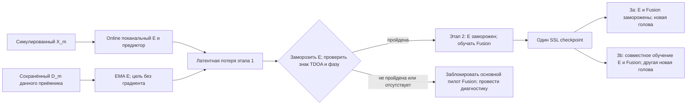

<a id="method-contract-front-end-model-and-three-stage-jepa"></a>

# Метод: входное представление, модель и трёхэтапное JEPA

**Канонический проект метода · 2026-09-27.** Документ задаёт принятое направление, а не реализованную или проверенную модель. [План проекта](project.md) определяет объём/сроки; [протокол оценки](evaluation.md) — доступ, симуляцию, сравнения и метрики; [зимний протокол](experiments/winter_field_protocol.md) — сбор данных. Численные размеры архитектуры ниже — инженерные кандидаты. Акустические настройки [осенней инструкции](experiments/bench_signal_trial.md) не проверены и не являются зафиксированной конфигурацией обучения.

<a id="1-shared-front-end-and-tensors"></a>

## 1. Общая предобработка и тензоры

Основной вход — **Re/Im STFT**: действительная и мнимая части одних комплексных коэффициентов на отдельной оси признаков, а не конкатенация по времени/частоте. Комплексное хранение и парное вещественное хранение эквивалентны; комплексные или вещественные обучаемые операции — отдельный выбор. Само хранение Re/Im не гарантирует сохранения фазы.

Порядок обработки: неизменяемые синхронные raw → отдельно измеренная фиксированная приборная калибровка → когерентная фильтрация с сохранением межканальной фазы/обоснованный ресэмплинг → окна на общей временной сетке → STFT → заявленный общий положительный масштаб амплитуды. Сохранять физические единицы, порядок каналов, измеренную систему координат, версию калибровки, исходную/обработанную частоты дискретизации, бины/полосу, окно/FFT/hop, масштабирование, дополнение отсчётами, привязку времени кадров и полный набор исходных отсчётов, влияющих на результат (поддержку по raw). Фильтрация непрерывной записи может предшествовать нарезке; учитывать переходные процессы и групповую задержку. Исходно использовать нецентрированные кадры (`center=False`) без неявного дополнения. Изменение соглашения требует записанного решения до подгонки, а не молчаливой смены значения по умолчанию в библиотеке.

**Защита пространственной информации:** сохранять физическую межсенсорную задержку, относительную фазу, когерентность и отношения амплитуд. Корректировать только измеренные приборные смещения. Запрещены независимое выравнивание пиков прихода, случайные сдвиги/растяжения времени/фазовые возмущения каналов, независимая нормировка датчиков/компонент Re/Im и обычная евклидова регрессия циклически завёрнутой фазы. Задержка такта и постоянный фазовый сдвиг — разные ошибки. Общая амплитудная аугментация решётки должна сохранять пространственные отношения.

Исходная нормировка: один фиксированный положительный скаляр `s`, оценённый по разрешённым обучающим данным и общий для датчиков, Re/Im и соответствующих представлений (`X/s`, `D/s`). Общий масштаб окна всей решётки — отдельно заявляемая альтернатива, а не независимое масштабирование наблюдения/чистой цели. В S масштаб оценивается только по симуляционным данным разработки; в R сохраняется, если отдельное разрешение не допускает переоценку. Приборная калибровка не является нормировкой каждого примера. Нормировка, внимание и кэш не должны связывать непересекающиеся представления временной задачи B.

<a id="tensor-interface"></a>

### Тензорный интерфейс

`N` — батч решёток; `M` — число датчиков; `L` — число обработанных вещественных отсчётов; `F,T` — сохранённые частотные бины/кадры входа; `N_ch` — батч окон отдельных датчиков, **не** объём независимой выборки. `C,F_e,T_e` описывают обученные признаки, а не физические комплексные коэффициенты.

| Объект | Форма / логический тип | Требование |
|---|---|---|
| Синхронные вещественные окна | `[N,M,L]`, float32 | Одно наблюдение и общий отсчёт времени |
| Комплексная STFT | `[N,M,F,T]`, complex64 | До эквивалентной упаковки |
| Основной упакованный вход | `[N,M,2,F,T]`, float32 | Re/Im на оси признаков |
| Вход общего E | `[N_ch,2,F,T]`, float32 | Без других датчиков и координат |
| Выход E | `[N_ch,C,F_e,T_e]`, float32 | Вещественная сетка признаков без объединения позиций |
| Восстановленные признаки решётки | `[N,M,C,F_e,T_e]`, float32 | Явная связь примера и датчика |
| Измеренные координаты | `[N,M,3]`, float32 | Только для Fusion; физическая система координат |
| Доступность датчиков | `[N,M]`, bool | Отсутствие не является измеренной тишиной |
| Частотные метаданные | `[F_e]`, физические Hz | Фактическая привязка закодированных позиций, одинаковая в обеих нейросетевых ветвях |
| Пригодность/дополнение TF | Заявленная маска, согласованная с сеткой | Исключает дополненные/непригодные позиции из потерь и агрегации |

Преобразовать форму `N*M` окон датчиков для общего E либо кодировать только пригодные датчики с сохранением ID. Координаты, калибровка и маски следуют тому же соответствию, не обучаемому номеру гнезда подключения. Поканальное предобучение сохраняет родительскую группу, датчик и временное происхождение. `[N_ch,F_e*T_e,C]` — эквивалентная форма хранения лишь при сохранении соответствий и всех признаков; она не разрешает объединение позиций, сжатие или внимание по всей развёрнутой TF-сетке. Основной интерфейс E одинаков для вариантов этапа 1 и последующих ветвей.

<a id="representation-reserves"></a>

### Резервные представления

Обязателен только Re/Im STFT. В отдельно согласованном сравнении можно выбрать **одну** альтернативу: сначала IQ, затем вещественную временную форму; без пересечения с вариантами SSL. См. [правила сопоставимости](evaluation.md#5-reserve-comparisons).

| Кандидат | Форма одного датчика | Статус / отличие |
|---|---|---|
| Re/Im STFT | `[2,F,T]` | Основной |
| Временной базовый IQ | `[2,L_IQ]` | Первая альтернатива; та же калиброванная физическая полоса/длительность |
| Вещественная временная форма | `[1,L]` | Следующий контроль; калиброванная и ограниченная по полосе, не необработанные отсчёты АЦП |
| Комплексное CWT | `[2,J,T_w]` | Резерв с отдельной гипотезой о временно-масштабном разрешении и измеренной стоимостью |
| Амплитуда + sin/cos фазы STFT | `[3,F,T]` | Перепараметризация, не новая информация; фаза ненадёжна около нулевой амплитуды |
| Только амплитуда STFT/mel | `[1,F,T]` / `[1,K,T]` | Абляция фазовой информации; иные признаки направления могут сохраниться |

Обучаемые банки фильтров — архитектурный выбор. GCC-PHAT, IPD, ковариация и лучевые представления (beamspace) используют несколько датчиков и меняют информационный контракт одного канала. Резервный IQ означает

\[
u_m(t)=\operatorname{LPF}\{[x_m(t)+j\,\mathcal H x_m(t)]e^{-j2\pi f_ct}\}.
\]

Аналитический сигнал сам по себе не является базовым/низкочастотно дискретизированным. Децимация разрешена только после корректного выбора полосы и антиалиасинговой фильтрации; частота, фаза и временной отсчёт генератора общие. Сохранять `f_c`, фильтры/задержки/переходы/частоты дискретизации и ограниченную поддержку по raw; изменение `f_c` требует сохранения физических частотных метаданных. Hilbert/FFT по целой записи может вовлекать отсчёты вне окна: разные индексы окон не доказывают их непересечение для B. IQ не добавляет измеренной информации или гарантированного преимущества.

<a id="2-channel-encoder-e"></a>

## 2. Поканальный энкодер E

Один общий E обрабатывает датчики независимо; веса общие **внутри** ветви, но не связаны между независимо обучаемыми ветвями с нуля/JEPA. Здесь нет межсенсорного внимания или глобального объединения времени/частоты. Выбранная основа общая для координатной/безкоординатной моделей с нуля и JEPA, а не эксперимент CNN против Transformer:

```text
[N_ch,2,F,T] real Re/Im
 → equivalent [N_ch,1,F,T] complex input
 → compact complex Conv2D stem [N_ch,C_s,F_e,T_e]
 → lossless Re/Im packing [N_ch,2*C_s,F_e,T_e]
 → real temporal Conformer-like blocks separately per frequency
 → local frequency mixing
 → [N_ch,C,F_e,T_e] learned real output, C=2*C_s
```

Временная форма — `[N_ch*F_e,T_e,C]`, параметры общие для датчиков/частотных позиций; сетка восстанавливается до локального смешивания частот. Используется остаточная схема Conformer: FFN с половинным вкладом → временное MHSA → временная свёртка → FFN с половинным вкладом [S1], а не речевая предобработка/декодер/предобученные веса. Это **гибрид**, не полностью комплексная или строго фазоэквивариантная сеть. Обучаемый входной блок (stem), нормировка, внимание, смешивание и прореживание могут терять фазу; проверять **весь E**, не только упаковку Re/Im.

**Внимание:** исходно полное, возможно двунаправленное, внутри ограниченного доступного окна наблюдения, отдельно по частотам. Окно STFT, длительность наблюдения/шаг нарезки и область внимания — разные настройки. Перекрывающиеся окна не означают локальное внимание или независимые единицы. Не заявляются причинный/потоковый режим, KV-кэш или состояние сцены. В B текущее и будущее окна кодируются отдельно: запрещены кодирование всей записи с последующей нарезкой признаков, общая зависимая от данных статистика или кэш сигналов между окнами.

<a id="engineering-presets-and-selection"></a>

### Инженерные размеры и выбор

| Вариант | Комплексная ширина `C_s` | Вещественная `C` | Временные блоки `B_enc` | Головы внимания | Скрытая ширина каждой FFN |
|---|---:|---:|---:|---:|---:|
| E-S | 32 | 64 | 2 | 4 | 256 |
| **E-M: первый пилот** | 48 | 96 | 4 | 4 | 384 |
| E-L: обоснованный резерв | 64 | 128 | 6 | 4 | 512 |

Обе FFN энкодера используют `4*C`; упаковка даёт `C=2*C_s` без дополнительной проекции ширины. Первый ресурсный/фазовый пилот E-M: **`C=96, F_e=F, T_e≈T/2`**, умеренное временное прореживание во входном блоке до сокращения частотной оси. Это не определяет stride: точно задать ядра, шаги, дополнение, привязку выходных позиций и поддержку по raw. Дополнительное сжатие `96→32`, латентные слоты или квантование не выбраны. Обязательного сравнения полного разрешения или матрицы «разрешение×SSL» нет.

Измерить полный прямой/обратный проход на намеченных формах, точности и вычислительной реализации. Если E-M не помещается в бюджет, использовать E-S; E-L требует обоснования до фиксации, не служит спасением неудачной проверки/результата. Зафиксировать **один** размер/конфигурацию для пары с нуля и этапов 1–3 JEPA до сравнительного обучения и к **2026-11-15**. Ядра, позиции, оси/состояние нормировки, точное прореживание и число параметров остаются TODO. Попарная арифметика полного временного внимания масштабируется как `N_ch*F_e*B_enc*T_e^2*C`, но это не полные FLOPs/память. Общие параметры E не умножаются на M; активации и работа растут. Переход к локальному вниманию ради ресурсов должен быть явным и одинаковым в сравнениях; одна плотная локальная маска не доказывает экономии.

<a id="3-coordinate-aware-fusion"></a>

## 3. Fusion с учётом координат

Fusion сравнивает датчики **в каждой сохранённой `(f,t)`**, а не в общей последовательности «датчики×частота×время». Вход: восстановленные `H:[N,M,C,F_e,T_e]`, координаты, частотные метаданные и маски датчиков/TF. Эквивариантная к перестановкам обработка множества и агрегация с масками позволяют интерфейс с разными M/геометрией; они **не** доказывают перенос на произвольные физические массивы, эквивариантность к повороту/отражению или устранение неоднозначности линейной решётки.

<a id="tokens-and-geometry"></a>

### Токены и геометрия

Использовать `r_tilde_m=(r_m-r_0)/L_0`: `r_0` — опорная точка, вычисленная из геометрии (например, центроид всей измеренной решётки), не меняющаяся при выпадении/перестановке каналов; `L_0` — один фиксированный физический масштаб длины, **не** собственная апертура каждого массива. Общая декартова MLP `g_r:3→C→C` использует GELU. Общая частотная MLP `g_f:R→R^C` кодирует `f_Hz/f_0` с одним фиксированным частотным масштабом; её точные слои/масштабы/правило отсчёта ещё подлежат фиксации на данных разработки.

```text
p_m = g_r(r_tilde_m)
q_f = g_f(f_Hz/f_0)
z_m,f,t = h_m,f,t + p_m + q_f
```

Вычислять и распространять координатные/частотные кодировки по соответствующим осям, не меняя ширину признаков. Частотные позиции следуют фактической привязке входного блока, а не предполагаемой физической фазе обученных признаков. Не выбраны зеркальные пары ULA, GCC от опорного микрофона, ветвь направляющих векторов, попарное геометрическое смещение логитов, метка топологии или обучаемый номер гнезда.

<a id="attention-masks-and-pooling"></a>

### Внимание, маски и агрегация

Логическая форма — `[N*F_e*T_e,M,C]`; параметры общие по TF. Исходный Fusion: **один** блок pre-LayerNorm, **четыре** головы внимания, ширина C (E-M 96), FFN **`2*C`** (96→192→96); LayerNorm действует по оси признаков C одного токена датчика/TF, не по датчикам. При фиксированной TF-позиции:

```text
z_bar_i = LayerNorm(z_i)
Q_i = W_Q z_bar_i; K_i = W_K z_bar_i; V_i = W_V z_bar_i
alpha_ij = softmax_{j in valid visible sensors}(Q_i^T K_j / sqrt(C/4))
a_i = W_O concat_heads(sum_j alpha_ij V_j)
u_i = z_i + a_i
y_i = u_i + FFN(LayerNorm(u_i))
```

Следовательно, координаты/частота влияют на Q/K/V. Обученное внимание не становится автоматически физической фазой, GCC, ковариацией или объяснением. После взаимодействия каналов: среднее по датчикам с маской → `[N,C,F_e,T_e]`; среднее по пригодным TF-позициям → `[N,C]`. Недоступные датчики исключаются из ключей/значений, запросов последующего выхода и агрегации; дополненные позиции — из знаменателей. Полностью закрытые TF-позиции пропускать без softmax по пустому множеству и деления на ноль. Если пригодного агрегированного наблюдения нет, возвращать **нет азимута** и учитывать отказ, а не тишину или придуманный угол.

**Вариант без координат:** та же структура, параметры и частотная информация, но для каждого датчика `g_r` получает постоянный нулевой трёхмерный вектор. Обучаемая `g_r(0)` общая, не идентификатор. В эту ветвь не поступают апертура, результат центрирования, попарные смещения, топология или номер гнезда. Неупорядоченная симметричная линейная решётка без позиций может потерять знак направления: [протокол оценки](evaluation.md#3-required-comparisons) требует диагностики наблюдаемости до приписывания координатного выигрыша архитектуре.

**Контрольные проверки (canaries):** совместная перестановка сигналов/координат/калибровки/масок сохраняет итоговое предсказание в пределах заранее заданной точности; отвязанные/переставленные координаты при фиксированных сигналах — отдельная диагностика соответствия; аудит отсутствия координатной информации в абляции; скрытые/дополненные значения не влияют на online-выход; безопасная обработка пустого входа; фазовые/временные пробы полного E/Fusion. Ожидаемую интерпретацию задать до итоговых данных, не после удачного результата. Неудачи блокируют соответствующие выводы.

Попарная арифметика Fusion масштабируется как `N*F_e*T_e*M^2*C`, но не предсказывает полные ресурсы. Измерять прямой/обратный проходы и применение всей модели, включая E, маски, агрегацию/голову, а при обучении — соответствующих учителей и предикторы.

**Прецеденты, не дословные реализации:** GI-DOAEnet [S2, §II-C/D, eqs. 7–12] добавляет позиции микрофонов до канальных Q/K/V, но использует синусоидальное сферическое кодирование, свёрнутую частотную ось, GRU и другие агрегацию/спектральные головы. AGG-RL/AuGeonet [S3] дополнительно использует координаты относительно опорного элемента и GCC-PHAT опорных пар через LNuDFT. Эти признаки/программы обучения не импортируются. Сохранённая TF-сетка, декартова/частотная MLP и компактный блок — предлагаемая адаптация проекта; результаты комнатной акустики не подтверждают подводную пригодность или новизну.

<a id="4-one-azimuth-head-and-supervised-loss"></a>

## 4. Одна азимутная голова и функция потерь

Голова: `Linear(C,C) → GELU → Linear(C,2)` (E-M 96→96→2), без выходной активации. Для угла θ в радианах в объявленной физической системе координат цель `(cosθ,sinθ)`; сырое предсказание `(a,b)` **не нормируется** перед обучением:

\[
\mathcal L_{\mathrm{DOA}}=\frac1B\sum_{i=1}^B[(a_i-\cos\theta_i)^2+(b_i-\sin\theta_i)^2].
\]

Это среднее по батчу **суммы** ошибок двух компонент, без дополнительного деления на два. Оно также штрафует величину вектора; тождество единичных векторов `2(1−cos Δθ)` не делает сырую MSE чисто угловой. Не распространять градиент через atan2 и не добавлять угловую сетку/CE, спектр/BCE, IPD, PIT, потери уверенности/активности/геометрии без отдельного согласованного изменения. Декартова параметризация направления связана с ACCDOA [S4], но не переносит её многоисточниковую или связанную с активностью семантику SELD.

При применении декодировать `atan2(b,a)` только для конечных компонент с нормой, **превышающей** общий заранее заданный численный порог `tau≥0`; нулевой вектор всегда недопустим. Порог tau выбирается и фиксируется по численным проверкам разработки, одинаков для нейросетевых голов и не является порогом уверенности/отбора. Пустой Fusion, вырожденный или неконечный вектор дают отсутствие оценки. Норма не является калиброванной неопределённостью. Конечные невырожденные углы оцениваются как есть, без ограничения/отражения в сектор; круговая ошибка и **штраф отказа 180 градусов** определены в [оценке](evaluation.md#4-scoring-and-independent-unit-inference), не в этой функции потерь.

<a id="5-three-stage-jepa-and-gates"></a>

## 5. Трёхэтапное JEPA и обязательные проверки

JEPA-like здесь — предсказание online-ветвью **непрерывных латентных целей с stop-gradient/EMA** [S5]; это не означает восстановление временной формы или независимо известное чистое реальное наблюдение. Учитель/предиктор используются только при обучении. Доступ S/R/E1 задаёт [протокол оценки](evaluation.md#1-data-access-and-independent-units). Наличие записи само по себе не даёт разрешения на её использование.



<a id="stage-1-channel-recipes"></a>

### Этап 1: поканальные варианты

- **A/S:** симулировать/сохранять `X_m=D_m+R_m+N_m`. E видит наблюдаемый X; временный предиктор оценивает `sg(E_EMA(D_m))` того же приёмника/окна на общем физическом времени. D включает задержку/фазу приёмника, а не переданную форму или независимо выровненный чистый импульс. TF-признаки сохраняются без объединения позиций.
- **B/S или разрешённый B/R:** текущее наблюдаемое окно предсказывает EMA-признаки **будущего наблюдаемого**, не чистого, окна того же канала. Зафиксировать смещение и непересечение полной **поддержки raw/фильтра/STFT**, включая дополнение, переходные процессы и двунаправленную обработку. Разных индексов кадров недостаточно. Кодировать представления отдельно; без обработки полной записи с последующей нарезкой, общей межоконной статистики/кэша. Повторы известного chirp/тишины могут давать тривиальную подсказку положения в сигнале.
- **A/R:** только независимо проверенный **оценённый** прямой `D_hat_m` по разрешённому доступу R; он не становится известным из одной преамбулы. Проверки идентификации пути, калибровки, неопределённости, отказов и покрытия — в [обзоре прямой цели](../outputs/jepa_evidence.md#3-real-direct-reference-is-a-separate-gate). Сейчас **заблокировано/не проверено**. Неудача оставляет A/S и условный B/R с наблюдаемой целью, не выдуманную реальную прямую истину.

A и B — разные целевые задачи/данные, не неявная объединённая потеря A+B. **TODO до запуска:** отдельные запуски либо продолжение A/S→B/R, контроль источника данных B/S, согласованные инициализация/бюджеты обновлений, checkpoint этапа 2, интерфейс предиктора/токенов, состояние EMA/нормировки, масштаб потери/защита от коллапса, seeds и измеренные ресурсы. Наличие R не предполагается. A/S получает привилегированную истинную D симулятора; одинаковые шаги последующего обучения не уравнивают информацию или полную стоимость.

<a id="frozen-e-gate-before-fusion"></a>

### Проверка замороженного E до Fusion

На независимо сгруппированных **симуляционных сценах разработки/отчётной диагностики** заморозить E; обучить заранее заданный маломощный парный считыватель (probe) по двум отдельно закодированным каналам с общим временем. Сначала контролируемая прямая плоская волна, затем углы/шум/многолучёвость/ошибки калибровки и слабый/отсутствующий прямой путь. Сравнить TDOA со знаком и круговую относительную фазу с исходным входом и необученным E при одинаковых ёмкости считывателя, группах подгонки, данных и бюджете. Отдельно определить смысл целей по D и наблюдаемой смеси X и их пригодность; произвольные углы латентных координат не являются физической фазой.

Показывать медиану/p95, отказы/покрытие по углу/межсенсорной базе/условию, группы обучения/выбора/отчётности пробы, дисперсию/ранг признаков и диагностику коллапса. Снижение потери или отсутствие коллапса сами по себе не означают прохождения. Пороги остаются **TODO: физический бюджет ошибки DOA и разрешённые данные разработки**, не настройка по итоговому тесту. Слабая проба ограничивает испытанный считыватель, а не математически все возможные считыватели. Тем не менее неудачная/отсутствующая заранее заданная проверка блокирует основной пилот этапа 2 до записанного исправления и повторной проверки; обучение с нуля/классика остаются доступными. Цифровая проверка STFT этот допуск не заменяет.

<a id="stage-2-random-subarray-to-full-array-tokens"></a>

### Этап 2: случайная подрешётка предсказывает токены всего массива

После успешно проверенного checkpoint этапа 1 **заморозить E, включая состояние**. Для синхронных/калиброванных `N_good≥3` выбирать случайно и число скрытых каналов **`1≤K≤N_good−2`**, и их состав H; множество V содержит **не менее двух видимых** каналов, H — **не менее одного скрытого**. Закон K/подмножеств и покрытие межсенсорных баз/апертур/областей алиасинга — TODO разработки; K=1 пригоден для отладки, не заменяет распределение. Два видимых элемента не гарантируют предсказания независимого шума/отражений скрытых каналов.

Online Fusion читает только видимые признаки E, координаты и явные маски; для отсутствующего входа использовать нулевые признаки E **вместе с** явной маской доступности. Одних нулей недостаточно: исключить скрытое содержание **до межсенсорного смешивания или зависимой от данных статистики**, убрать скрытые ключи/значения/вклад в агрегацию и не допустить утечку через кэш/батч-нормировку. Предиктор получает все измеренные координаты/позиции запросов и маску отсутствия, **не скрытые сигналы**; выдаёт токены каждого датчика/TF **во всех позициях**.

EMA-учитель отслеживает только веса/заявленное состояние нормировки Fusion; E остаётся замороженным. Учитель видит все пригодные каналы и выдаёт цели **до агрегации по датчикам и TF**. Исходная потеря считается **только по скрытым пригодным позициям датчик/TF**:

\[
\mathcal L_2=\operatorname{mean}_{m\in H,\;(f,t)\,valid}
\left\|P(F_\theta(V),r_{1:M},mask)_{m,f,t}
-\operatorname{sg}F_{\bar\theta}(E(X_{all}),r_{all})_{m,f,t}\right\|^2.
\]

Видимые предсказания в неё не входят. Токен учителя не является физическим комплексным коэффициентом. До запуска определить размерность/масштаб цели, сведение потери, состояние EMA и диагностику коллапса. Проверка подменой: изменение **только скрытых входов** не должно менять online-предсказание до учителя/потери; проверить градиенты и статистику, не только маски. Учитель/цель при этом законно могут измениться. Проверить перестановку/соответствие датчиков и случаи слабого пути/выпадения каналов. При применении использовать E+агрегированное представление Fusion+голову, без SSL-предикторов или EMA-копий.

<a id="stage-3-parallel-descendants-and-attribution"></a>

### Этап 3: параллельные потомки и разделение эффектов

Обе ветви начинаются с **одного checkpoint E+Fusion после этапа 2**, с **разными заново инициализированными** головами C→C→2:

| Ветвь | Обновляемые параметры | Научный вопрос |
|---|---|---|
| 3a: считывание замороженных признаков | Только голова; E+Fusion/состояние заморожены | Доступность выбранной голове, не наилучшая достижимая DOA |
| 3b: совместное дообучение | E+Fusion+новая голова | Практическая польза SSL-инициализации |

Ветви **параллельны**, не последовательность 3a→3b. Одинаковы разрешённые метки/группы, сектор, MSE сырых компонент, численное декодирование/учёт отказов и заранее заданные правила seeds/выбора модели. Для 3b обязателен сопоставимый контроль полного обучения с учителем с нуля при одинаковых последующих данных/бюджете. По возможности замороженные/совместные контроли только после этапа 1 отделяют добавленный эффект Fusion; раскрыть обращение с новым/случайным Fusion, поскольку замороженный случайный Fusion может ослаблять сравнение. Сохранить отдельную абляцию без координат и классику. Показывать стоимость предобучения, учителей, предикторов, проб, выбора checkpoint и обеих ветвей **сверх** последующего обучения. Результаты S, R и E1 не объединяются.

Выигрыш только после 3b может отражать помощь оптимизации, а не уже читаемые замороженные признаки. Успех замороженного варианта без практического улучшения относительно обучения с нуля не доказывает преимущества применения. Отражать нулевые, неудачные, заблокированные и невыполненные этапы; формальная обязательность всех стадий M3 ещё требует решения руководителя/ресурсной оценки в [плане проекта](project.md).

<a id="6-freeze-and-stop-contract"></a>

## 6. Фиксация метода и правила остановки

К ноябрьской контрольной точке до итогового теста записать точные ID источников/конфигураций/checkpoints; согласованную предобработку/поддержку; одну конфигурацию E/Fusion/головы; разрешения подгонки S/R/E1; состав этапа 1 и цели/пороги E; закон маски, токены, EMA, масштаб и проверки утечки этапа 2; инициализации/сравнения этапа 3; пределы seeds/обновлений/настройки/ресурсов; правила исключений и отказов. Неизвестным параметрам назначаются ответственные, доказательства и действия при неудаче, а не угаданные значения.

Ни одна неудачная проверка времени, истины, эталона, фазы, коллапса, утечки, перестановки или повторяемого запуска не становится положительным доказательством. Этап без данных, допуска или измеренных ресурсов — **заблокирован/не выполнен**. Изменения делаются на разрешённых данных разработки с прослеживаемой повторной проверкой, не ради спасения результата после закрытого теста. Неудача необязательной модели не отменяет обязательную зимнюю натуру и письмо; научный минимум меняется только явным согласованием.

<a id="sources"></a>

## Источники

- [S1] Gulati et al. (2020), *Conformer: Convolution-augmented Transformer for Speech Recognition*: https://arxiv.org/abs/2005.08100
- [S2] Baek, Chang & Cohen (2025), *GI-DOAEnet*: https://doi.org/10.1109/TASLPRO.2025.3577336
- [S3] Baek et al. (2026), *AGG-RL* (AuGeonet): https://proceedings.iclr.cc/paper_files/paper/2026/hash/ee860a9fa65a55a335754c557a5211de-Abstract-Conference.html
- [S4] Shimada et al. (2020 preprint / 2021), *ACCDOA: Activity-Coupled Cartesian Direction of Arrival Representation for Sound Event Localization and Detection*: https://arxiv.org/abs/2010.15306
- [S5] Assran et al. (2023), *Self-Supervised Learning from Images with a Joint-Embedding Predictive Architecture*: https://arxiv.org/abs/2301.08243

Ссылки сохранены как методологические прецеденты, не вновь воспроизведённые результаты. Подробности чтения литературы и пробелы переноса — в [обзоре JEPA](../outputs/jepa_evidence.md).
