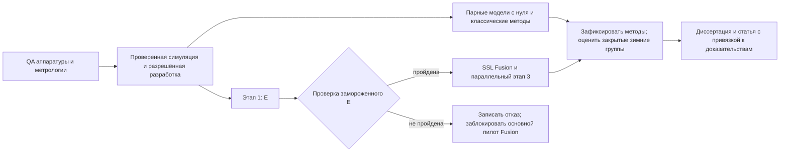

# Требования к проекту: объём, этапы и риски

**Канонический план · 2026-09-27.** Цель — полный текст кандидатской диссертации к **2027-03-31**, основной текст статьи, готовый к подаче, и воспроизводимые доказательные материалы. Эта дата не является обещанием защиты, присуждения степени, принятия или публикации статьи. Требуемое число опубликованных статей, допустимые издания и стадии публикации, а также требования научной специальности **не подтверждены**.

## Объём исследования и имеющиеся доказательства

**Вопрос:** может ли фазочувствительное обучение поканальных и межсенсорных представлений по схеме JEPA/JEPA-like улучшить **оценку азимута одного подводного источника на одной измеренной линейной решётке** относительно сопоставимых моделей, обученных с нуля, и классических методов — в контролируемой симуляции и на независимо полученных подлёдных записях зимы 2026–2027?

Обязательны два вида доказательств:
- **Симуляция:** независимые акустические среды для измеренной линейной конфигурации, с проверенными физическими допущениями, сохранёнными прямыми компонентами каждого приёмника и воспроизводимой генерацией.
- **Натура:** обязательные размеченные **подлёдные** записи с фактической подводной геометрией источника и приёмников, калибровкой, контролем качества (QA), независимыми группами съёмки и закрытым итоговым тестом. Проба в открытой воде или симулированный источник с реальным шумом не заменяют эту часть.

**Нет принятого полевого набора данных, обученных E/Fusion, проверенной реальной прямой цели или измеренного улучшения DOA в проекте.** Есть литература, геометрические расчёты при допущениях и ограниченная цифровая проверка STFT/TDOA; последняя не проверяла аппаратуру или обученный энкодер. См. [акустические доказательства](../outputs/acoustic_frontend.md).

Владелец сообщил начальные параметры: восемь гидрофонов, номинальный шаг равномерной линейной решётки (ULA) ≈27 мм и запись 96 ksample/s/«32 bit». Это не измеренные подводные координаты, не доказательство общего такта, эффективной разрядности АЦП или рабочей полосы. Бухта, источник, полевое оборудование и безопасные даты не подтверждены; бухта Новик/остров Русский — прежний кандидат, а не утверждённое место. В текущем осеннем выезде нельзя менять направление на источник; [автономная инструкция](experiments/bench_signal_trial.md) предусматривает сравнение сигналов при одной геометрии только для разработки и QA.

## Физические ограничения и границы научных выводов

1. **Сначала идентифицируемость.** Линейная решётка имеет структурную зеркальную неоднозначность «перед/зад». Нужен измеренный идентифицируемый сектор/полуплоскость, одинаковый для всех методов. Также необходим фиксированный/известный угол места либо измеренные ограничения по глубине и дальности: неизвестный неограниченный угол места оставляет проекцию направления, а не единственный азимут. Координаты и машинное обучение не создают отсутствующую информацию. При нарушении этих условий согласовать задачу оценки направляющего косинуса/неоднозначного направления **до** итоговой фиксации протокола; не заявлять молча однозначный азимут на 360°.
2. **Фактическая подводная истина.** Запланированные направления, лунки или поверхностные положения сами по себе не являются метками. Записывать глубины источника/датчиков, ориентацию, движение кабелей и неопределённость. Обосновать дальнеполевую модель направляющего вектора (far-field steering) для измеренных апертуры, полосы и дальности; иначе ограничить условия либо явно учитывать дальность. Это не обосновывает общую 3-D локализацию.
3. **Физика льда не предполагается доказанной.** Свободная поверхность с нулевым акустическим давлением не является моделью льда. Кандидатный решатель, например BELLHOP, требует проверки; без проверки взаимодействия со льдом допустимы выводы об общей симуляции и сдвиге домена, а не о подтверждённом подлёдном распространении.
4. **Независимые доказательства.** Окна, направления, повторы, подмножества датчиков и начальные состояния генераторов модели/шума (seeds) внутри одной установки — вложенные наблюдения. Один сеанс не доказывает перенос между сеансами; одна реальная линейная решётка — перенос на произвольные физические топологии.
5. **Новизна требует оценки, а не названия.** Учёт геометрии в DOA и предсказание латентных представлений уже имеют прецеденты. Возможные вклады — обоснованный метод/модификация, измеренные применимость и ограничения, воспроизводимая процедура «метрология–симуляция–оценка». Реализация, набор данных, выигрыш над абляцией с намеренно исключённой информацией или строгий нулевой результат не обеспечивают автоматически диссертационную новизну. Обсудить это с руководителем после проверки требований и ноябрьского пилота.

Историческое название «world model» не описывает текущую задачу. Отложены: динамика сцены, сопровождение нескольких источников, несколько выходных голов, 3-D локализация, широкие переборы архитектур/представлений/SSL, масштабирование больших моделей и заявления об эксплуатации, периферийных вычислениях или реальном времени. Временная задача B предсказывает наблюдаемые окна сигнала, не динамику сцены.

## Обязательный метод и доказательства

Точные требования к реализации находятся в [методе](method.md); доступ, сравнения и отчётность — в [оценке](evaluation.md). Общий основной вход — **Re/Im STFT**, подлежащий фиксации на основании стендовых данных. Выбранные гибридный поканальный E, учитывающий координаты Fusion и одна азимутная голова с сырым векторным выходом общие для обучения с нуля и JEPA, а не отдельные архитектурные эксперименты.

Обязательные сравнения: компактная координатная модель, обученная с учителем с нуля (supervised from scratch), сопоставимый вариант без координат (no-coordinate), **MVDR/Capon и MUSIC**; Bartlett/суммирование с задержками — диагностика. Вариант без координат является информационной абляцией с возможным пределом ошибки из-за симметрии, а не единственным доказательством практического превосходства или новизны. Планировать **три парных запуска нейросетей с согласованными seeds**, с учётом ресурсов; записывать фактические запуски и не считать их независимыми полевыми группами.

**JEPA — основное направление SSL**, а не отменённая пятиэнкодерная VAE/HuBERT-матрица E4. Принята последовательность: E → проверка фазы/TDOA замороженного E → SSL Fusion → параллельные ветви обучения новой головы при замороженных признаках и совместного дообучения. **Обязательность завершения каждой стадии для формального минимума M3 ещё зависит от решения кандидата/руководителя и измеренных ресурсов.** Неудачный или невыполненный этап нужно отразить, а не засчитать или молча заменить успешной ветвью. Историческая оценка E4 в пять сосредоточенных рабочих дней не доказывает выполнимость основного метода.

Схема не разрешает обучение на закрытых данных. Полевая готовность не должна ждать необязательных модельных работ.

### M1–M5: проверяемый минимум

| ID | Результат работы | Свидетельство завершения |
|---|---|---|
| **M1** | Размеченные зимние данные линейной решётки с контролем качества | Повторно открытые неизменяемые raw, хеши/копии, калибровка, подводная истина/неопределённость, фон, реестры групп/доступа/разбиения и пройденная полевая приёмка |
| **M2** | Проверенная симуляция и классические методы сравнения | Физическая и ресурсная проба только на данных разработки, граничные допущения, независимые среды, происхождение генератора и базовые проверки методов |
| **M3** | Компактный метод DOA и сопоставимые сравнения с отчётом по проверкам JEPA | Зафиксированный оцениватель, предсказания моделей с нуля/без координат/классики, заявленные seeds/бюджеты, проверка этапа 1 и честно показанные исходы этапов 2/3; формальное требование всех стадий ещё не утверждено |
| **M4** | Ограниченный доказательствами анализ симуляции и измерений | Ошибки/отказы/покрытие по независимым единицам, неопределённость, сдвиг домена/ограничения, оценка без утечек и пакет воспроизводимости |
| **M5** | Полный текст диссертации и основной статьи | Все главы, введение/заключение/библиография/приложения, карта «утверждение–доказательство», правки руководителя и готовая к подаче статья к 2027-03-31 |

Для M1 нужен управляемый либо независимо локализуемый источник; его наличие не установлено. Стремиться к нескольким независимым группам, желательно **не менее трёх повторно установленных сеансов/дней**, если это безопасно и выполнимо. Это цель съёмки, не расчёт статистической мощности. Малое число групп сужает выводы. Без пригодных зимних данных **M1 и натурная часть M4 не завершены**; изменить минимум может лишь явное решение руководителя.

### Дополнительные работы и правила остановки

| Расширение | Допустимый вопрос только после отдельного согласования объёма, ресурсов и доступа |
|---|---|
| E1 | Адаптация на небольшом бюджете реальных меток, отдельно от S и безметочного R |
| E2 | Контролируемая чувствительность к подмножеству/шагу линейной решётки либо исключённые из обучения линейные конфигурации в симуляции |
| E3 | Ограниченная чувствительность к калибровке/ледовой границе при обоснованных допущениях |
| E4 | **Одно** резервное сравнение входного представления: основное против одной альтернативы, сначала IQ, затем временная форма, **либо** перенос на нелинейные топологии только в симуляции |

Одновременно активно не более одного расширения. Каждому нужны измеренный предел затрат и правило остановки; полный перебор «вход×SSL×архитектура» не допускается. Новые расширения не начинать после **2027-02-01**; целевая фиксация дополнительных результатов — **2027-02-15**. При задержках полевого качества, проверки E, основной оценки или письма первыми останавливать расширения. Дополнительные представления и нелинейные физические решётки не являются скрытыми обязательствами.

## Реестр решений и календарь

Даты — **плановые контрольные точки, не доказательство завершения или безопасности льда**. Кандидат ведёт реестр с ответственным, доказательствами и действием при неудаче. Разрешение и остановку выезда определяет квалифицированный полевой руководитель; этот план не задаёт допустимую толщину льда.

| Срок / точка | Ответственный | Необходимое решение/доказательство | Действие при неудаче |
|---|---|---|---|
| **2026-09-30** | Кандидат + руководитель / совет | Специальность, карта вкладов/глав, число публикаций, допустимые издания и требуемая стадия публикации | Пересмотреть научный/формальный объём; не придумывать число статей или обещание принятия к марту |
| **2026-10-15** / R1 | Кандидат + аппаратный/метрологический/полевой руководители | Выделенные трудозатраты/вычисления/хранилище; разрешённое место и резервная возможность; отклик источника/приёмника/синхронизации и показанный способ подводного позиционирования | Сократить дополнительные работы/размер модели; исправить источник/метрологию или поставить вопрос о выполнимости минимума |
| **2026-10-31** | Кандидат | Черновики введения/литературы и план полевых методов | Защитить время письма; не ждать положительных результатов модели |
| **2026-11-15** | Кандидат + руководитель + метролог | Зафиксировать обоснованные полосу/частоту/сектор/предобработку/QA; выбрать один размер E; измеренный бюджет полного тракта, состав/checkpoint/фазовую проверку этапа 1, маску/токены этапа 2, сравнения этапа 3, реестры S/R/E1 и решение о минимуме JEPA | Неподтверждённые ветви остаются только разработкой/невыполненными; любое изменение M1–M5 требует явного согласования |
| **2026-11-30** / R2 | Руководитель записи/метрологии + кандидат | Сквозная репетиция: регистратор → raw → такт/калибровка/истина → диагностика → QA → повторно открытые проверенные копии | Исправить сбор данных до зимы; прогресс модели не заменяет его |
| **Декабрь 2026–2027-01-31** / R3 | Квалифицированный полевой руководитель + кандидат | Самая ранняя разрешённая безопасная съёмка; сначала разработка, независимые итоговые группы зарезервированы | Безопасность выше дат; сохранять безопасный резервный вариант, не предполагая его наличия |
| **2027-01-15**, проверка риска | Кандидат + руководитель + полевой руководитель | Пригодная размеченная запись или реалистичный безопасный путь к ней | Рассмотреть резервное окно и явный ограниченный по выводам запасной план; не ждать марта |
| **2027-02-01…15** | Полевой руководитель + кандидат | Необходимая безопасная досъёмка, если требуется; ограничения расширений выше | Без новых расширений; неполные зимние доказательства вынести на согласование, не заменять симуляцией |
| **2027-02-28** / R4 | Кандидат + руководитель | Зафиксировать основные данные/модели/сравнения/таблицы; проверить неопределённость/отказы по независимым единицам и доказательства | Раскрыть недостающее; не выбирать новую метрику/ветвь ради улучшения результата |
| **2027-03-10** / R5 | Кандидат | Первый полный текст диссертации, включая библиографию/приложения и результаты статьи | Приоритет полноте текста; без новой исследовательской ветви |
| **2027-03-11…21** | Кандидат + руководитель | Рецензирование и исправления в зафиксированном объёме | Документировать меняющие результат исправления и влияние на сроки |
| **2027-03-22…31** / R6 | Кандидат | Итоговая проверка согласованности/артефактов, полный текст и пакет для подачи | Завершение исследования не означает выполнения требований к степени/публикациям |

Статья готовится параллельно: один связный основной текст — единица планирования труда, не обещание, что одной статьи достаточно для степени. Дополнительные статьи нужны только для содержательно независимых результатов, не искусственного дробления. Предлагаемый порядок глав: проблема/литература/вклады → наблюдение/идентифицируемость/методы → симуляция/модель/сравнения → зимняя съёмка/оценка → совместный анализ/ограничения/выводы. Каждое утверждение связано с артефактом, сравнением, разбиением данных и ограничением. Ошибки достоверности исправлять и раскрывать даже после фиксации; срок не оправдывает сохранение неверного результата.

## Реестр рисков и обязательные действия

| Угроза / условие | Контроль и решение | Граница вывода |
|---|---|---|
| Небезопасное/пропущенное ледовое окно; нет источника/метрологии | Октябрьская проверка выполнимости, ноябрьская репетиция, январская контрольная точка; полевой руководитель останавливает выезд, научный руководитель согласует сокращение объёма | Симуляция не может молча завершить M1/натурную M4 |
| Неизвестные геометрия/полоса/источник/направленность; движение кабелей/дрейф калибровки | Фактический подводный замер и неопределённость, журналы источника, QA такта/усиления/фазы до и после | Номинальная геометрия не доказывает ULA/дальнее поле/абсолютный угол |
| Зеркальная неоднозначность и неопределённый угол места | Одинаковый физический сектор для всех; ограничить угол места; проверить наблюдаемость до обучения | Без молчаливого ограничения/отражения предсказаний или заявления полного круга |
| Несоответствие льда/границы/модели | Проверить решатель/компоненты, независимые среды и измеренные метаданные среды | Свободная поверхность или наложенный реальный шум не подтверждают физику льда |
| Утечка/псевдорепликация; мало независимых групп | Разделить доступ/группы до окон, не подгонять по закрытым данным, учитывать полную поддержку обработки и raw ID; парные сводки по единицам | Окна/seeds/подмножества не создают сеансы или обоснованные доверительные интервалы |
| Потеря фазы, коллапс или утечка скрытого входа | Диагностика raw/STFT/полного E/Fusion; проверка до Fusion; контроль масок/перестановок/подмены скрытого входа | Малый loss, комплексный входной блок или отсутствие коллапса не доказывают полезную фазу |
| Смешение эффектов вычислений/окна/архитектуры | Сначала E-M, один общий проверенный размер; полные прямой/обратный проходы и затраты учителей/проб/голов; только согласованные альтернативы | Без бесплатного предобучения, скрытой смены основы сети, заявленного ускорения от плотной маски или причинного режима |
| Узкий набор сравнений / предел ошибки абляции без координат | Равные условия настройки классики и доступа; диагностика симметрии; показывать проигрыши/отказы вместе с выигрышами | Ограниченный набор не доказывает широкое SOTA-превосходство/архитектурную новизну |
| Адаптация названа zero-shot | Отдельные реестры/результаты S, R, E1; фиксированная независимая метрология доступна одинаково | В S нет подгонки по реальным сценам, в R — по азимутам/симулятору; закрытая группа не переименовывается |
| Задержка натуры/JEPA/письма или недостаточный научный вклад | Сначала остановить расширения; руководитель оценивает достаточность и формальные требования | Ни нулевой, ни положительный результат не гарантирует достаточную диссертацию |

Неудача проверки такта, истины, эталона, фазы, маски, перестановки или повторяемого запуска делает затронутые выводы недействительными до исправления и повторной проверки. Обязательные сравнения/зимние доказательства нельзя молча исключить. Отрицательный результат нейросети/JEPA допустим в отчёте; расширенный поиск архитектур не является автоматическим исправлением.

## Внешние зависимости

Литература — мотивация, не доказательство подводной эффективности или наличия доступной реализации. [Обзор JEPA](../outputs/jepa_evidence.md) разделяет механизмы, опубликованные измерения и пробелы переноса. Не встраивать внешние репозитории/веса в этот репозиторий. Любой будущий импорт исполняемого кода требует назначенного места реализации, закреплённого источника/коммита, проверенной лицензии, анализа зависимостей/безопасности/соответствия задаче, реестра конфигурации и согласования; отдельный репозиторий реализации пока не считается выбранным. Чтение кода не подтверждает науку и не ослабляет правила доступа.
