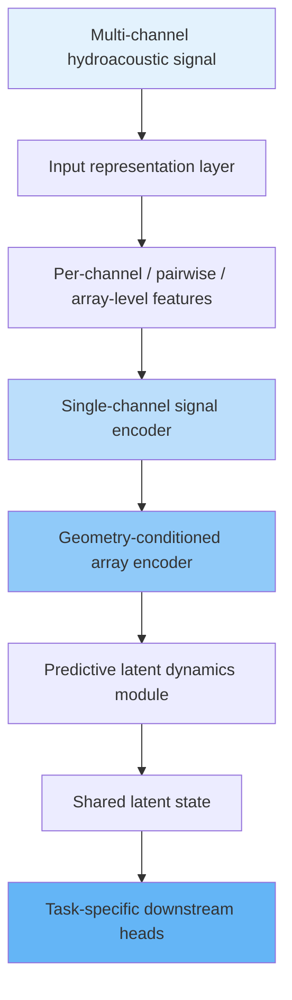
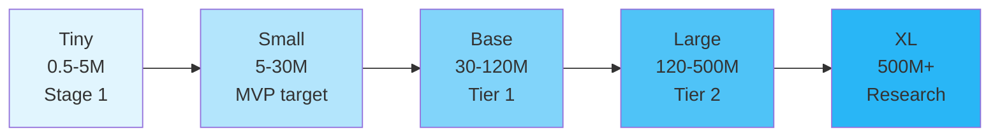

# Framework Architecture

> This file covers the conceptual pipeline, input representations, encoders, latent dynamics, and downstream heads.

## 6. Framework Overview

The proposed framework consists of five main components:

1. **Input representation layer**
2. **Single-channel signal encoder**
3. **Geometry-conditioned array encoder**
4. **Predictive latent dynamics module**
5. **Task-specific downstream heads**

The intended data flow is:



The diagram is conceptual: the frozen MVP connects Stage 2 directly to Stage 4 heads, with Stage 3 deferred.

### 6.1 Component Priority Tiers

The five components above are not equally required for a first result. Treating them as a single mandatory pipeline risks delaying any usable output until the full architecture is built. Components are instead organized into priority tiers:

- **Tier-0 (required for the MVP claim):** Supervised-from-scratch input representation, single-channel encoder, geometry-conditioned array encoder, and Stage 4 heads.
- **Tier-1 (optional and separately preregistered after Tier-0 is stable):** Stage 1/2 SSL, VAE branches, Base-scale capacity increases, data2vec-style teacher-student SSL, and controlled Conformer-lite / CNN-augmented Transformer variants.
- **Tier-2 / deferred:** Stage 3 predictive latent dynamics, DINOv3-inspired self-distillation, JEPA-style advanced objectives, wav2vec 2.0 / HuBERT-style speech SSL transfer, S4/Mamba/Mamba-2, Hyena, Large/XL tokenizers, and world-model-scale branches.

No Tier 2 component should be reported as part of the framework's contribution until its Tier 0 ablation comparison exists. This tiering is the authoritative priority order for the framework; mentions elsewhere in this document that a component "should be evaluated only after" an earlier stage is stable (e.g. Sections 8.10, 8.11, 9.3, 12.1, 20.11) are specific instances of this same rule and must not be read as contradicting it.

---

## 7. Input Representation Strategy

The framework should use a deliberately limited set of **core single-channel input representations**. Since the single-channel signal encoder is applied to each hydrophone channel independently, its primary inputs should not require information from other channels.

The core input representations are:

1. **IQ signal representation**;
2. **STFT representation**;
3. **CWT representation**.

The **IQ signal representation** should be treated as the primary neural input baseline. STFT and CWT should be evaluated as time-frequency front ends that may improve representation learning for nonstationary or structured hydroacoustic signals.

Representations that require multiple channels, such as GCC-PHAT, inter-channel phase difference, cross-spectrum, covariance matrices, and beamspace features, are not primary inputs to the single-channel encoder. They may be used later as:

- array-level auxiliary features;
- diagnostic tools;
- physics-informed extensions;
- components of classical baseline methods.

This separation is important because the framework is based on a two-level design:

```text
single-channel representation learning
        ↓
geometry-conditioned multi-channel aggregation
```

The single-channel encoder should learn reusable signal features from each channel separately. The geometry-conditioned array encoder should then learn inter-channel structure and array-specific information.

### 7.1 IQ Signal Representation

IQ signal representation is the baseline input form for the single-channel encoder.

A single channel may be represented as:

```text
(2, N_samples)
```

where the two components correspond to in-phase and quadrature components, or equivalently to a complex analytic signal representation.

The IQ baseline is important because it tests whether the neural model can learn useful signal representations directly from minimally processed time-domain information.

Experiment-level protocols must specify:

- how the IQ or analytic representation is obtained;
- whether the original hydroacoustic signal is real-valued or complex-valued;
- whether Hilbert transform, demodulation, or another analytic-signal construction is used;
- sampling rate;
- window length;
- amplitude normalization;
- channel synchronization assumptions.

If the signal is originally real-valued and no complex demodulation is used, the term “IQ” must be replaced by a more precise description such as “real waveform” or “analytic signal representation”.

### 7.2 STFT Representation

STFT should be used as the main time-frequency baseline representation because it is standard, reproducible, computationally efficient, and compatible with classical signal-processing analysis.

STFT may be represented as:

- magnitude;
- phase;
- real and imaginary parts;
- magnitude plus phase encoding;
- log-magnitude with phase-related auxiliary channels, if justified.

Experiment-level protocols must specify:

- window size;
- hop length;
- FFT size;
- window type;
- frequency range;
- magnitude scaling;
- phase representation;
- normalization strategy.

STFT is expected to be useful for signals with localized time-frequency structure and for comparing neural representations with classical spectral processing pipelines.

### 7.3 CWT Representation

CWT may be evaluated as an alternative time-frequency representation for strongly nonstationary signals.

It is especially relevant for:

- linear chirps;
- nonlinear chirps;
- broadband pulses;
- impulsive transients.

CWT may provide better local time-frequency resolution for some signal families, but it is usually more computationally expensive and introduces additional design choices.

Experiment-level protocols must specify:

- wavelet type;
- scale range;
- frequency mapping;
- time resolution;
- normalization strategy;
- computational cost.

CWT should not replace IQ or STFT as a default representation unless experiments show a clear advantage under hydroacoustic validation conditions.

### 7.4 Sampling-Rate, Basebanding, and Chunking Policy

The preprocessing policy should make signals recorded at different sampling rates comparable before they are passed to the encoder. For the first executable protocol, the preferred approach is to use a common target sampling rate after coherent band-limited preprocessing.

The recommended v1 preprocessing pipeline is:

```text
raw hydrophone signal
-> useful-band selection
-> coherent downconversion to complex baseband / IQ, when applicable
-> anti-alias filtering
-> decimation or resampling to common target sampling rate
-> physical-time chunking
-> IQ / STFT / CWT representation
```

Simple waveform resizing or resampling without useful-band selection, anti-alias filtering, and a documented target bandwidth is not acceptable.

The original sampling rate must cover the useful signal band before preprocessing. The target sampling rate must cover the post-baseband useful bandwidth plus a guard margin. The experiment-level protocol must define the target sampling rate and must retain both the original and target sampling rates in metadata.

For multi-channel array data, preprocessing must be coherent across hydrophones. All channels in one array example should use:

- the same filter design;
- the same downconversion reference;
- the same decimation or resampling policy;
- the same group-delay compensation;
- the same chunk start times;
- the same chunk duration and hop.

This requirement is critical because inconsistent preprocessing across channels can destroy inter-channel phase, delay, and coherence information required for DOA estimation.

All chunking parameters should be defined in physical time:

- `T_chunk`;
- `T_hop`;
- `T_context`;
- `T_prediction_horizon`.

Sample counts should be derived only after the target sampling rate is known:

```text
N_chunk = round(T_chunk * target_fs)
N_hop   = round(T_hop * target_fs)
```

The default v1 chunk hop should be:

```text
T_hop = 0.5 * T_chunk
```

This corresponds to 50% overlap and should be treated as the initial balance between temporal coverage and computational cost. A more expensive setting,

```text
T_hop = 0.25 * T_chunk
```

may be used for transient signals, moving sources, Stage 3 dynamics, or source presence detection when compute permits. Non-overlapping chunks should be treated only as a low-compute ablation, not as the default.

IQ, STFT, and CWT inputs should all be processed as physical-time chunks rather than isolated samples, frames, bins, or scale slices:

- IQ input unit: a contiguous complex/baseband time chunk, not independent samples;
- STFT input unit: a time-frequency patch over `T_chunk`, not isolated frames or frequency bins;
- CWT input unit: a time-scale or time-frequency patch over `T_chunk`, not isolated scale slices.

The input tensor must preserve enough temporal context for signal morphology, phase evolution, frequency evolution, source activity, and delay-sensitive information.

If complex demodulation is used, the protocol must specify the reference frequency, baseband bandwidth, decimation rate, and phase-continuity policy. If an analytic signal is constructed from a real waveform, the protocol must specify the Hilbert-transform or analytic-signal construction and any filtering applied before conversion.

For the frozen BELLHOP MVP, the IQ branch is an analytic signal constructed from the band-limited real waveform with one documented Hilbert/analytic-signal procedure applied coherently across channels. Filtering and resampling must use the same design and group-delay compensation on every channel. Propagated waveforms are formed by full linear convolution and cropped to `[0,2.0 s)` relative to emission time, with right-zero-padding when needed; circular wrap must never enter the crop.

STFT parameters should be defined in seconds and Hz, including window duration, hop duration, frequency resolution, retained frequency band, and phase representation. Across sampling rates, STFT should target comparable physical frequency bins or use a documented interpolation or bin-selection policy.

CWT parameters should map scales to physical frequencies. The protocol must specify wavelet type, frequency range, scale density or voices per octave, time resolution, and whether coefficients are interpolated to a common time-frequency grid.

The chunk-boundary policy must define centered versus causal chunks, overlap, padding, incomplete final chunks, timestamp convention, whether chunk boundaries may cut source events, and how phase continuity is preserved.

Stage-specific implications:

- **Stage 1 (optional Tier-1 SSL only):** SSL context and target units are chunks or patches. Next-embedding prediction horizons should be defined in seconds, not only in chunk indices.
- **Stage 2:** all channels in one array example must share the same time reference after preprocessing, and preprocessing must preserve inter-channel timing and phase.
- **Stage 3 (deferred):** any future scene-latent timestep must correspond to a physical time interval, and temporal comparisons must use matched time horizons.

Each preprocessed example should retain metadata for original sampling rate, target sampling rate, resampling or filtering policy, chunk duration, chunk hop, useful signal band, retained frequency band, chunk timestamp, and array/channel synchronization assumptions.

### 7.5 Multi-Channel Features as Auxiliary or Baseline Components

Multi-channel features are not primary inputs to the single-channel encoder, but they remain important for the overall research program.

Examples include:

- GCC-PHAT;
- inter-channel phase difference;
- cross-spectrum;
- spatial covariance matrix;
- beamspace features.

These features may be used in three roles:

1. **Classical baselines**  
   For example, GCC-PHAT, SRP-PHAT, MUSIC, MVDR, and beamforming.

2. **Array-level auxiliary features**  
   They may be added to the geometry-conditioned array encoder in later experiments.

3. **Diagnostics**  
   They may be used to analyze whether the learned representation captures physically meaningful inter-channel structure.

The initial framework should keep the single-channel encoder inputs limited to IQ, STFT, and CWT.

### 7.6 Phase and Inter-Channel Information

The preprocessing pipeline must preserve DOA-relevant information.

In particular, care must be taken not to destroy:

- inter-sensor delays;
- phase differences;
- cross-channel coherence;
- relative timing;
- geometry-dependent structure.

Independent random time shifts or phase perturbations across channels may damage DOA information and must be used only when physically justified. See Section 21 of the evaluation specification for the complete set of phase-preservation and interpretability gates.

A constant sensor phase-calibration error is a frequency-independent rotation of the complex analytic signal or complex STFT channels. A sensor clock delay is a different perturbation whose phase is frequency-dependent, `Δφ(f)=-2πfτ`; neither may be substituted for the other.

### 7.7 Normalization

Normalization must be representation-aware. Its purpose is to remove irrelevant gain and scale variation while preserving DOA-relevant inter-channel amplitude, phase, delay, coherence, SNR/SIR, and source-presence information.

Normalization statistics must be estimated on the training split only. Validation and test data must not influence normalization statistics, clipping thresholds, dB references, or scaling parameters.

The default policy should not normalize each hydrophone independently. Independent per-channel normalization can erase inter-channel amplitude ratios and distort spatial cues. For array examples, normalization should use either:

- one shared scale factor for the full multi-channel array chunk;
- fixed statistics estimated from the training split;
- a calibrated physical reference, if reliable calibration is available.

The same normalization policy should be used across fair comparisons unless a representation-specific difference is explicitly justified.

#### IQ or Analytic-Signal Normalization

IQ normalization should preserve complex structure. Preferred approaches include:

- complex-preserving RMS scaling;
- robust RMS or robust amplitude scaling;
- one scale factor for the full multi-channel array chunk;
- fixed train-split dataset statistics.

The protocol should avoid:

- independent I and Q normalization;
- independent per-channel RMS normalization;
- per-sample normalization;
- transformations that change phase relationships inside a chunk.

If calibrated pressure or voltage units are available, the protocol should state whether normalization preserves absolute level. If absolute level is not reliable, normalization may remove global gain, but source-level or absolute-amplitude claims should not be made.

#### STFT Normalization

The recommended primary neural STFT input is log-magnitude or dB magnitude with a phase representation when DOA-relevant phase information is needed.

Valid STFT representations include:

- log-magnitude or dB magnitude plus `cos(phase)` and `sin(phase)`;
- real and imaginary STFT channels;
- log-magnitude with phase-related auxiliary channels, if justified.

Linear magnitude alone is allowed as an ablation but should not be the only primary STFT representation, because its dynamic range can make training unstable and can overemphasize strong narrowband components.

The dB or log-magnitude policy must specify:

- reference level;
- epsilon or numerical floor;
- clipping range, if clipping is used;
- whether train-split mean and standard deviation are applied after log compression;
- whether normalization is global, per-band, per-example, or array-window based.

The protocol should avoid:

- per-frame maximum normalization;
- per-time-frame normalization that erases source-presence or SNR cues;
- per-frequency-bin normalization that removes physically meaningful spectral or noise structure unless explicitly justified.

Phase should not be treated as an ordinary scalar feature. If phase is used directly, it should be represented through `cos(phase)` and `sin(phase)` or through real and imaginary STFT channels.

#### CWT Normalization

CWT normalization should account for scale-dependent coefficient energy. The recommended default is log magnitude or log power of CWT coefficients, with optional phase channels when a complex wavelet is used.

For complex CWT, valid representations include:

- log absolute value plus `cos(phase)` and `sin(phase)`;
- real and imaginary coefficient channels.

For real CWT, the protocol should use robust or log scaling followed by train-split statistics.

The protocol should avoid:

- independent per-time-slice normalization;
- scale-wise normalization that removes physically meaningful spectral or scale structure without justification;
- normalization that makes CWT coefficients incomparable across signal families or sampling-rate conditions.

#### Normalization Reporting

Each experiment-level protocol must report:

- normalization scope: dataset-level, array-window-level, channel-level, band-level, or representation-specific;
- whether the same scale factor is shared across channels;
- train-split statistics used;
- STFT dB reference and clipping policy;
- phase representation policy;
- whether absolute signal level is preserved or discarded;
- whether the policy is identical across proposed models and baselines.

---

## 8. Single-Channel Signal Encoder

### 8.1 Purpose

The single-channel encoder learns generic signal structure from individual hydrophone channels.

Its purpose is to capture:

- local time-frequency structure;
- signal morphology;
- noise-robust features;
- nonstationary patterns;
- source activity cues.

It should build robustness to noise, amplitude variation, and minor signal distortions while preserving information that may later support array-level DOA estimation.

This module is strictly limited to one hydrophone channel at a time. It does not perform array aggregation, geometry modeling, or DOA prediction. It must not be expected to solve DOA by itself, because DOA is primarily encoded in inter-channel relationships.

### 8.2 Input Contract

The single-channel encoder should support the core single-channel representations defined in Section 7:

- IQ or analytic-signal representation;
- STFT representation;
- CWT representation.

The initial neural baseline should use the IQ or analytic-signal representation, for example:

```text
(2, N_samples)
```

This IQ-shaped input is the recommended first baseline, not the only valid encoder input. STFT and CWT inputs require representation-specific front-end shapes and normalization policies defined in experiment-level protocols.

### 8.3 Candidate Architectures

Candidate architectures include:

- temporal convolutional network;
- compact Transformer;
- CNN + TCN hybrid;
- CNN-Transformer hybrid;
- Conformer-style or CNN-augmented Transformer encoder;
- wav2vec 2.0 / HuBERT-style self-supervised encoder;
- AST-like encoder for STFT or CWT inputs;
- S4, Mamba, or Mamba-2 sequence encoder;
- Hyena or long-convolution encoder;
- lightweight CNN;
- masked autoencoding-style encoder.

For the first implementation stage, the candidate set should be narrowed to three practical encoder families:

1. **TCN encoder**  
   Primary baseline for single-channel IQ or analytic time-series data.

2. **Transformer encoder**  
   Main flexibility-oriented alternative when explicit long-range context modeling is important.

3. **CNN + TCN hybrid**  
   Practical compromise when local detail and longer temporal context must both be captured.

Lightweight CNN, conformer-style, CNN-Transformer, and masked-autoencoding-style variants may be evaluated later, but they should not be required for the first baseline.

Advanced architecture families should be treated as promising research candidates requiring ablation, not as proven hydroacoustic DOA state-of-the-art methods.

### 8.4 Recommended Initial Baseline

The recommended first single-channel baseline is:

```text
IQ or analytic-signal input
        ↓
TCN encoder
        ↓
masked signal modeling objective
```

This baseline is deliberately simple, efficient, and suitable for early BELLHOP-based experiments. It should establish a stable reference point before more expressive encoders are introduced.

### 8.5 TCN Encoder

A TCN encoder is a strong first baseline for single-channel IQ or analytic time-series data because it uses dilated one-dimensional convolutions to capture temporal context efficiently.

Strengths:

- efficient and stable training;
- good local and multi-scale temporal feature extraction;
- natural fit for self-supervised time-series modeling;
- practical first baseline for real-time and edge-computer-oriented research.

Limitations:

- context control depends on receptive-field design;
- long-range interactions are less explicit than in attention-based models;
- window-length studies require careful receptive-field analysis.

### 8.6 Transformer Encoder

A Transformer encoder is the main alternative when flexible context modeling is required. Self-attention allows different parts of the input window to interact directly, which is useful for studying temporal context length and masked pretraining.

A Transformer encoder may include convolutional components. For signal data, useful variants include:

- a CNN or TCN frontend before the Transformer;
- convolutional patch embedding for STFT or CWT inputs;
- convolution modules inside Transformer-style blocks;
- lightweight local-convolution blocks around global self-attention.

These variants should be described as CNN-augmented Transformers or Conformer-style encoders when the convolutional component is part of the architecture, rather than as pure Transformers.

Strengths:

- flexible long-range context modeling;
- direct fit for masked pretraining and token-level representation learning;
- useful for experiments where temporal context length is a key variable.

Limitations:

- higher memory and compute cost than TCN;
- more sensitive to sequence length and training setup;
- less suitable as the first lightweight baseline if edge-computer constraints are important.

**Position encoding variants:** The default position encoding for Transformer-style encoders in this framework is sinusoidal. Rotary Position Embeddings (RoPE) may be evaluated as an ablation, particularly when experiments vary chunk length (e.g., 2 s vs. 4 s), because RoPE generalizes better to sequence lengths not seen during training. RoPE should be treated as an architectural hyperparameter and reported explicitly; it does not replace geometry-aware sensor-coordinate embeddings in the array encoder.

**Frequency-aware positional encoding for STFT/CWT inputs:** When the Transformer operates on time-frequency representations (STFT or CWT), the input tokens form a 2-D grid over physical time and physical frequency. Explicit frequency encoding should be used so the model can distinguish low-frequency bins from high-frequency bins without learning this mapping from scratch. The recommended approach is sinusoidal encoding of the physical frequency associated with each bin: `γ(f) = [sin(2⁰π·f/f_max), cos(2⁰π·f/f_max), ...]`. For multi-scale representations, the frequency bandwidth parameter should be reported. Time-position encoding (sinusoidal or RoPE) may be used along the temporal axis. These encodings are transferable across different STFT configurations (varying FFT size or hop length) because they depend on physical frequency, not bin index.

### 8.7 CNN + TCN Hybrid

A CNN + TCN hybrid uses CNN layers for local pattern extraction and TCN layers for longer temporal aggregation.

Strengths:

- strong local feature extraction;
- better multi-scale temporal modeling than a plain CNN;
- practical balance between simplicity and expressiveness.

Limitations:

- more design choices than a pure TCN;
- less conceptually simple for first-stage ablations;
- still requires explicit checks that temporal structure is preserved before array aggregation.

### 8.8 Output Interface and Pooling

The single-channel encoder must not compress the signal too aggressively before array-level aggregation.

If each channel is reduced too early to a single fixed-length vector, inter-channel timing and phase relationships may be lost. Therefore, the default interface from the single-channel encoder to the geometry-conditioned array encoder should preserve temporal, time-frequency, or multi-scale structure.

Recommended output forms include:

- a temporal feature map;
- a time-frequency feature map;
- a multi-scale feature representation.

A fixed-length embedding, for example `(d_emb,)` with `d_emb = 128` or `256`, may be used for:

- single-channel self-supervised probes;
- diagnostic embedding analysis;
- simple baseline models;
- pooling ablations.

It should not be treated as the default array-encoder input unless an ablation shows that early pooling does not damage DOA-relevant information. The early-pooling rejection gate (Section 21.7 of the evaluation specification) defines the exact pass/fail criterion for this ablation.

### 8.9 Single-Channel SSL Objective and Augmentation Constraints

For the optional, separately preregistered Tier-1 SSL study after the supervised Tier-0 baseline is frozen, the preferred first objective is masked signal modeling. For STFT or CWT inputs, the corresponding objective may be masked time-frequency modeling.

Contrastive learning should be treated as a comparison baseline. A hybrid masked plus contrastive objective is a valid follow-up experiment after the masked-modeling baseline is stable.

The first advanced SSL step after masked modeling should be data2vec-style contextual latent prediction, because it keeps the objective close to masked feature prediction while adding teacher-student latent targets. V-JEPA-inspired temporal latent prediction is a later Tier 2 objective. It predicts the next or future embedding of a single-channel chunk from previous context embeddings and should predict latent representations, not raw IQ samples, STFT coefficients, or CWT coefficients.

Candidate single-channel augmentations include:

- masking;
- additive noise;
- amplitude scaling;
- variable window sampling;
- window cropping.

Phase jitter, time shifts, and frequency perturbations require explicit physical justification. They must not create invariances that remove timing, phase, or spectral information required by downstream array-level DOA estimation.

Independent random phase jitter or independent random time shifts across hydrophone channels are not valid for array-level training unless a protocol explicitly proves that they preserve the intended DOA information. These operations are banned under the phase-preservation gates defined in Section 21 of the evaluation specification.

### 8.10 Advanced Candidate Architecture Families

The following architecture families are promising candidates from speech, audio, and long-sequence modeling. They should be evaluated only after the supervised Tier-0 TCN/CNN baseline is frozen; any SSL study remains optional and separately preregistered as Tier 1. The priority column is a within-tier research priority and does not override the component tiering in Section 6.1.

| Architecture family | Tier | Primary role in this framework | Priority within tier |
|---|---|---|---|
| Conformer-lite / CNN-augmented Transformer | Tier 1 | Near-term alternative combining local convolution with global attention for IQ, analytic, STFT, or CWT inputs | High |
| wav2vec 2.0 / HuBERT-style encoder | Tier 2 | Self-supervised architecture family for large unlabeled or BELLHOP-generated single-channel datasets | High |
| AST-like encoder | Tier 2 | Transformer-style encoder for STFT or CWT time-frequency inputs | Medium |
| S4 / Mamba / Mamba-2 | Tier 2 | Long-sequence and edge-oriented alternative to full self-attention for long IQ or analytic windows | Medium |
| Hyena / long-convolution models | Tier 2 | Exploratory option for very long context when attention cost becomes limiting | Low |

**Empirical anchor:** Large-scale multilingual speech SSL (GigaAM Multilingual, arXiv:2607.10371) reports that a Conformer encoder with 240M parameters achieves strong SSL representations and outperforms significantly larger baselines (Whisper Large, Omnilingual-1B) under matched adaptation conditions. This supports treating Conformer-lite (Base scale, 30-120M full-model parameters in this framework) as a well-justified Tier 1 candidate, while maintaining that Tiny and Small TCN/CNN baselines must be established first.

Conformer-lite or CNN-augmented Transformer models are the most relevant near-term advanced candidates because hydroacoustic signals require both local waveform or time-frequency structure and broader temporal context.

wav2vec 2.0 / HuBERT-style encoders are relevant when the research program has enough unlabeled BELLHOP-generated or real hydroacoustic data to justify larger self-supervised pretraining. Their objectives and quantization or hidden-unit construction must be adapted to hydroacoustic signals rather than copied directly from speech recognition.

AST-like encoders should be considered only for STFT or CWT branches. They should not replace the IQ-first baseline unless time-frequency experiments show clear value.

S4, Mamba, and Mamba-2 are relevant for long-sequence modeling and future real-time or edge-computer constraints. They should be evaluated against TCN and Transformer baselines with the same input windows, metrics, and computational reporting.

Hyena and related long-convolution models may be useful for very long contexts, but they should remain lower-priority exploratory candidates until simpler and more established sequence models are evaluated.

### 8.11 Reference Papers and Implementations

The following references may guide future implementation choices. They are not evidence of hydroacoustic DOA performance by themselves.

| Topic | Paper | Implementation reference |
|---|---|---|
| Conformer / CNN-augmented Transformer | [Conformer](https://arxiv.org/abs/2005.08100) | [ESPnet](https://github.com/espnet/espnet), [NVIDIA NeMo](https://github.com/NVIDIA-NeMo/NeMo) |
| Contrastive predictive learning | [CPC](https://arxiv.org/abs/1807.03748) | Conceptual reference for temporal contrastive latent prediction |
| wav2vec 2.0-style SSL | [wav2vec 2.0](https://arxiv.org/abs/2006.11477) | [fairseq wav2vec](https://github.com/facebookresearch/fairseq/tree/main/examples/wav2vec) |
| HuBERT-style SSL | [HuBERT](https://arxiv.org/abs/2106.07447) | [fairseq wav2vec](https://github.com/facebookresearch/fairseq/tree/main/examples/wav2vec) |
| data2vec-style SSL | [data2vec](https://arxiv.org/abs/2202.03555) | Conceptual reference for contextual latent target prediction |
| Audio Spectrogram Transformer | [AST](https://arxiv.org/abs/2104.01778) | [YuanGongND/ast](https://github.com/YuanGongND/ast) |
| Structured state-space sequence models | [S4 repository and paper links](https://github.com/state-spaces/s4) | [state-spaces/s4](https://github.com/state-spaces/s4) |
| Mamba / Mamba-2 | [Mamba repository and paper links](https://github.com/state-spaces/mamba) | [state-spaces/mamba](https://github.com/state-spaces/mamba) |
| Hyena / long convolutions | [Hyena](https://arxiv.org/abs/2302.10866) | [HazyResearch/safari](https://github.com/HazyResearch/safari) |
| V-JEPA-style latent prediction | [V-JEPA 2](https://arxiv.org/abs/2506.09985), [V-JEPA 2.1](https://arxiv.org/abs/2603.14482) | Conceptual reference; requires hydroacoustic adaptation |
| DINO-style self-distillation | [DINO](https://arxiv.org/abs/2104.14294), [DINOv2](https://arxiv.org/abs/2304.07193), [DINOv3](https://arxiv.org/abs/2508.10104) | Conceptual reference; requires array-domain adaptation |
| BYOL-style self-distillation | [BYOL](https://arxiv.org/abs/2006.07733) | Conceptual reference for EMA teacher-student alignment without negative pairs |
| Variance/covariance collapse control | [VICReg](https://arxiv.org/abs/2105.04906) | Conceptual reference for variance and covariance regularization |
| Cross-channel spatial acoustic SSL | [Cross-channel signal reconstruction](https://arxiv.org/abs/2312.00476) | Conceptual reference for Stage 2 cross-channel reconstruction |
| Spatial contrastive audio SSL | [MC-SimCLR spatial audio](https://arxiv.org/abs/2309.15938) | Conceptual reference for Stage 2 spatial contrastive learning |
| Spatial HuBERT | [Spatial HuBERT](https://arxiv.org/abs/2310.10922) | Conceptual reference for hidden spatial-unit prediction |
| Self-supervised acoustic maps | [Latent Acoustic Mapping](https://arxiv.org/abs/2507.07066) | Conceptual reference for geometry-conditioned acoustic-map targets |
| Geometry-aware DOA with coordinates | [Geometry-aware DoA estimation](https://arxiv.org/abs/2212.04788) | Conceptual baseline reference; uses non-hydroacoustic microphone-array setting |
| GNN localization for distributed arrays | [GNNs for sound source localization](https://arxiv.org/abs/2306.16081) | Conceptual reference for variable sensor count and graph-based array modeling |
| Neural-SRP / learned SRP | [Neural-SRP](https://arxiv.org/abs/2403.09455) | Conceptual reference for differentiable steering-aware localization |
| Spatial encoding as attention bias (molecular graphs) | [Graphormer](https://arxiv.org/abs/2106.08203) | Conceptual reference for pairwise geometric attention bias in graph attention networks |
| Relative position representations in self-attention | [Shaw et al.](https://arxiv.org/abs/1803.02155) | Conceptual reference for encoding pairwise position differences directly in attention scores |
| Multilingual HuBERT scaling | [mHuBERT-147](https://arxiv.org/abs/2406.06371) | Conceptual reference for cluster-level data balancing in large-scale SSL pre-training |
| Low-resource corpus construction | [GigaSpeech 2](https://aclanthology.org/2025.acl-long.135/) | End-to-end pipeline for automated corpus creation with pseudo-label refinement; adaptable to hydroacoustic weakly-supervised data |
| Heterogeneous data mixing in speech foundation models | [OWSM v3.2](https://arxiv.org/abs/2405.02991) | Analysis of heterogeneous-source effects on foundation models; informs BELLHOP/real-noise/synthetic mixing policy |
| SELD output and sequence-modeling references | [SELDnet](https://arxiv.org/abs/1807.00129), [ACCDOA](https://arxiv.org/abs/2010.15306), [Multi-ACCDOA](https://arxiv.org/abs/2110.07124), [w2v-SELD](https://arxiv.org/abs/2312.06907) | Useful for output heads, localization losses, and SSL spatial-audio ideas |
| Underwater data-driven localization | [Direct underwater localization via CNNs](https://arxiv.org/abs/2207.10222), [Robust underwater data-driven localization](https://arxiv.org/abs/2305.17920) | Hydroacoustic reference; not a transferable geometry-conditioned backbone by itself |

### 8.12 Full-Model Family Ladder

To make scaling decisions explicit and avoid premature investment in large models before the baseline is validated, the framework defines a five-rung model-family ladder for the **full trainable model stack**, not only for the per-channel encoder. These parameter ranges include the single-channel encoder, geometry-conditioned array encoder, heads, and any optional SSL, VAE/KVAE-inspired, Neural-SRP, or latent-dynamics branches used by that rung. Each rung specifies full-model parameter budget, intended framework stage, input representation, main backbone family, objective family, role, and a rejection gate that must be passed before the next rung is justified.



| Family | Full-model parameter range | Intended stage | Input representation | Main trainable blocks | Objective family | Role | Rejection gate |
|---|---|---|---|---|---|---|---|
| **Tiny** | 0.5-5M | Stage 1 sanity/debug | IQ / analytic signal | TCN | Supervised sanity baseline | Fast sanity-check, debug baseline, receptive-field studies, edge-compute lower bound | Fails to beat random baseline, or phase/delay structure is lost before array aggregation |
| **Small** | 5-30M | Stage 1 + Stage 2 | IQ + STFT real/imag | CNN + TCN (single-channel); pairwise geometry Transformer (array) | Supervised DOA; optional Tier-1 SSL | Main target for first results; the model that must prove Tier 0 before any larger family is justified | Phase-preservation gate: permutation canary fails, or inter-channel phase/delay is not recoverable from encoder output (see Section 21 of the evaluation specification) |
| **Base** | 30-120M | Stage 1 + Stage 2; Stage 3 deferred | IQ, STFT real/imag, optional CWT | Conformer-lite or CNN-augmented Transformer | Separately preregistered Tier-1 SSL | First scale-up candidate after Small Tier 0 ablation shows measurable gain over Tiny; evaluates whether added capacity and SSL sophistication improve DOA robustness | Tier 0 ablation shows no improvement over Small at comparable compute budget |
| **Large** | 120-500M | Stage 1 + Stage 2; Stage 3 deferred | IQ, STFT real/imag, CWT | Hybrid VAE/KVAE-like continuous latent encoder; Neural-SRP auxiliary branch | Latent predictive coding + hybrid self-supervised objectives | Research-scale candidate for continuous latent dynamics and physics-informed array encoding; explicitly not required for first results | Deferred indefinitely if Base does not show measurable gain over Small; requires evidence from Tier 0 and Tier 1 before any experiment is allocated |
| **XL** | 500M+ | Research branch only, Tier 2 | IQ, STFT real/imag, CWT, multi-scale | JEPA-style latent predictor, Mamba/Mamba-2 long-sequence encoder, or world-model architectures | JEPA/Mamba-world-model objectives | Long-horizon research branch for world-model-style hydroacoustic scene understanding; explicitly not required for first results and should not be started until Tier 0 evidence is established | Remains paper-study-only if Tier 0 or Tier 1 ablations do not justify compute cost; no training run without pre-registered hypothesis and clear Tier 0 comparison baseline |

**Scaling policy:** No rung above Small may be trained until the Small family has passed its rejection gate and produced a stable Tier 0 result. Large and XL are research-only expansions and are not part of the required first-result pipeline. The parameter ranges are approximate full-model guides with contiguous boundaries and no intentional gaps. Use the lower bound as inclusive and the upper bound as exclusive for classification (`5M` belongs to Small, `30M` belongs to Base, `120M` belongs to Large, `500M` belongs to XL). Exact counts should be reported in every experiment protocol and should be broken down by component.

#### 8.12.1 Per-Channel Encoder Parameter Budget

The single-channel encoder should use a smaller budget than the full model ladder above. The array encoder, heads, optional SSL teachers, VAE/KVAE-inspired branches, Neural-SRP branch, and Stage 3 latent dynamics consume the rest of the full-model budget. Unless an experiment explicitly justifies a different allocation, use the following per-channel encoder budget as the default cap:

| Full-model family | Recommended per-channel encoder budget | Notes |
|---|---:|---|
| **Tiny** | 0.5-2M | IQ/analytic TCN or lightweight CNN used for sanity checks and throughput tests. |
| **Small** | 2-8M | Main MVP per-channel encoder budget; leaves capacity for geometry-aware pairwise array encoder and heads. |
| **Base** | 8-25M | Conformer-lite or CNN-augmented Transformer channel encoder after Small passes Tier 0 gates. |
| **Large** | 25-80M | Research-scale encoder or hybrid SSL/VAE branch; not an MVP target. |
| **XL** | 80M+ | Research-only encoder budget for large-scale unlabeled corpora or world-model experiments. |

These values are not additive per hydrophone instance at inference time. The same per-channel encoder weights are shared across hydrophones unless a protocol explicitly evaluates sensor-specific adapters. Therefore a 5-channel array does not multiply shared encoder parameter count by 5. It does multiply per-example compute, activation memory, and input/output tensor volume by approximately the number of active channels before array aggregation. Parameter reports must therefore distinguish:

- shared per-channel encoder parameters;
- channel-scaled compute and activation-memory estimates;
- geometry-conditioned array encoder parameters;
- heads and calibration/adaptation parameters;
- any sensor-specific adapters or calibration modules whose parameter count actually scales with channel count;
- optional teacher, VAE/KVAE-inspired, Neural-SRP, or Stage 3 modules.

## 8.13 VAE/KVAE and SSL Hybrid Architecture Contract

This section elaborates the hybrid encoder design referenced in the Large family row of Section 8.12. It combines a variational or continuous latent branch inspired by KVAE/VAE with a deterministic self-supervised learning (SSL) branch. The hybrid is an optional architecture family for the single-channel encoder, not a required baseline. It should be evaluated only as a separately preregistered Tier-1 study after the supervised Tier-0 TCN/CNN baseline is frozen.

### 8.13.1 Position of KVAE and KVAE-Audio

KVAE and KVAE-Audio are treated as design inspiration and optional frozen or ported ablations, not as a direct channel model for hydroacoustic DOA.

- The KVAE-Audio repository (`github.com/kandinskylab/kvae-audio`) and its Hugging Face model card describe a continuous 48 kHz waveform autoencoder with compact continuous latents for reconstruction and generative modeling. Public metrics report 166.9M parameters and latent dimension 64.
- The KVAE repository (`github.com/kandinskylab/kvae`) frames KVAE as an image and video tokenizer family for diffusion models, with temporal and spatial compression variants.
- A Sber/Kandinsky article (`habr.com/ru/companies/sberbank/articles/1053410/`) reports KVAE-Audio evaluation tables for reconstruction and generation.

None of these sources provide evidence that KVAE-Audio weights solve hydroacoustic DOA. KVAE-Audio optimizes perceptual and generative reconstruction at 48 kHz with a hop length of 960 samples, which corresponds to roughly 50 Hz latent frame rate. That compression is useful for compact tokenization but too aggressive to preserve DOA-relevant phase and delay information without explicit phase-preservation gates. Therefore, KVAE and KVAE-Audio may inform bottleneck design, hierarchical downsampling, and reconstruction metrics, but they must not be used as directly imported encoders for this framework.

### 8.13.2 Shared Phase-Safe Frontend

The hybrid architecture uses the same phase-safe frontend as the rest of the framework:

- IQ or analytic-signal representation;
- STFT with real and imaginary channels, or log-magnitude with `cos(phase)` and `sin(phase)`;
- No raw wrapped phase regression;
- No independent per-channel normalization.

The frontend must preserve inter-sensor delays, phase differences, cross-channel coherence, and relative timing, as required by Sections 7.6 and 7.7.

### 8.13.3 Dual-Branch Latent Design

The hybrid encoder produces two distinct latent representations from the same frontend:

1. **Deterministic SSL latent `h_ssl`**
   Produced by a data2vec-style teacher-student SSL branch. The student encoder maps the input to a latent representation. A teacher encoder, updated via exponential moving average (EMA) of the student, produces target representations. The student learns to predict the teacher's latent targets. This branch is deterministic in the sense that `h_ssl` is a point estimate, not a distribution.

2. **Optional variational continuous latent `z_vae`**
   Inspired by KVAE/VAE continuous latent bottlenecks. The encoder maps the input to parameters of a continuous latent distribution, typically a diagonal Gaussian. The latent `z_vae` is sampled via reparameterization during training and may use the mean at inference. This branch provides a smooth, interpolatable, and compressible channel state representation.

The two branches share the same frontend but have separate encoder heads. They may share early convolutional or downsampling layers if ablation shows that sharing does not damage phase or delay information.

### 8.13.4 Loss Structure

The hybrid objective is a sum of branch-specific losses. Each loss is weighted by a scalar coefficient that must be reported in experiment protocols.

**VAE branch losses:**

- **Reconstruction loss:** measures fidelity between the decoder output and the frontend input. For IQ or analytic signals, this may be a time-domain MSE or a complex-domain distance. For STFT inputs, it may be a spectrogram MSE on magnitude and phase channels, or a combined time-frequency loss.
- **Compactness loss:** KL divergence between the learned latent distribution and a standard normal prior. This encourages a compact, structured latent space.
- **Optional perceptual or multi-scale loss:** if justified, a learned or fixed feature-space distance may be added, but it must not override the primary reconstruction and compactness terms.

**SSL branch losses:**

- **Teacher-student alignment loss:** measures the distance between the student latent `h_ssl` and the EMA teacher latent. This is the core data2vec-style objective.
- **Optional variance/covariance regularization:** inspired by VICReg, to prevent representation collapse. This may include variance regularization (maintaining non-zero variance across batch dimensions) and covariance regularization (decorrelating latent dimensions).
- **Optional masking loss:** if the SSL branch uses masked input modeling, the alignment loss is computed only on masked positions or masked time-frequency patches.

The two branches may be trained jointly from scratch, or the VAE branch may be pretrained and frozen while the SSL branch is trained, or vice versa. These training schedules must be treated as ablations and reported explicitly.

### 8.13.5 Explicit Physics Probes

The hybrid architecture must include explicit physics probes that verify whether the learned representations preserve DOA-relevant physical structure. These probes are diagnostic and regularization components, not standalone encoders.

- **Phase increment probe:** computes or regresses inter-frame or inter-bin phase differences from the latent representation. It checks whether phase evolution is preserved through the encoder bottleneck.
- **Group delay probe:** estimates frequency-dependent group delay from the latent representation or from a partial reconstruction. It verifies that dispersive propagation structure is not lost.
- **IPD probe:** predicts inter-channel phase-difference (`Δφ_ij`) or the equivalent complex ratio from pairwise latent comparisons. It tests whether the primary spatial cue for short-baseline arrays is encoded.
- **Pairwise coherence probe:** estimates magnitude-squared coherence or complex coherence between channel latent pairs. It checks whether spatial coherence structure is preserved.
- **Calibration perturbation probe:** applies known gain or phase perturbations to input channels and measures whether the latent representation changes in a predictable, geometry-consistent way.

Probe outputs may be used as auxiliary losses, as validation diagnostics, or as gating signals that suppress representations failing a physical-consistency check. Probe losses should be weak enough that they guide representation geometry without dominating the primary reconstruction or SSL objectives. The correspondence between these probes and the phase-preservation gates defined in Section 21 of the evaluation specification is: phase increment probe maps to the phase increment consistency gate (21.3); group delay probe supports the PDOA/IPD recoverability gate (21.2); IPD probe is the primary mechanism for the PDOA/IPD recoverability gate (21.2); pairwise coherence probe maps to the pairwise coherence preservation gate (21.4); calibration perturbation probe maps to the calibration perturbation sanity gate (21.5).

**Single-channel physics probes:** The phase increment probe and group delay probe can be applied directly to single-channel encoder outputs (before array aggregation) to verify that the single-channel representation preserves time-frequency structure needed for downstream DOA. In addition, the following channel-level probes may be evaluated:
- **Instantaneous frequency probe:** for IQ/analytic inputs, regress the instantaneous frequency `dφ/dt` from the latent representation to verify that frequency modulation structure is preserved.
- **Envelope probe:** for IQ/analytic inputs, verify that the amplitude envelope is recoverable from the latent representation. This checks whether the encoder has discarded amplitude information critical for SNR estimation and source detection.
- **Spectral centroid/bandwidth probe:** for STFT inputs, regress spectral centroid and bandwidth from the latent to verify that spectral shape is preserved. These probes are lightweight diagnostics that can be run during single-channel pretraining, before any array-level training begins.

### 8.13.6 Output Interface

The hybrid encoder outputs must respect the same interface rules as the single-channel encoder (Section 8.8).

- `h_ssl` should be emitted as a temporal or time-frequency feature map when possible, not prematurely pooled to a single vector.
- `z_vae` may be emitted as a sequence of latent vectors or as a fixed-length bottleneck vector, depending on the decoder architecture. If `z_vae` is pooled early, an ablation must show that the pooling does not destroy DOA-relevant information.
- Both representations may be passed to the geometry-conditioned array encoder (Section 9). The array encoder may consume `h_ssl`, `z_vae`, or a concatenation of both, but this choice must be ablated and reported.

### 8.13.7 Ablation and Evaluation Requirements

Before the hybrid architecture is claimed as a framework contribution, the following ablations are required:

- optional Tier-1 TCN masked-modeling baseline (Section 8.4) versus hybrid with only the VAE branch;
- TCN baseline versus hybrid with only the SSL branch;
- TCN baseline versus full hybrid with both branches;
- Early pooling of `z_vae` versus time-structured `z_vae`;
- Shared frontend layers versus separate frontend layers;
- Physics probes as auxiliary losses versus probes as diagnostics only;
- Frozen KVAE-inspired weights versus randomly initialized VAE branch.

No public KVAE-Audio weight may be reported as solving hydroacoustic DOA without first passing the permutation canary (Section 9.3a), the physics-probe consistency checks, and the Tier 0 downstream metric comparisons defined in this framework.

---

## 9. Geometry-Conditioned Array Encoder

### 9.1 Purpose

The array encoder aggregates information across hydrophone channels and learns geometry-aware representations.

In the frozen MVP, Cross-5 is a five-channel array with five unique sensor tokens; the shared center is counted once.

It should model:

- inter-channel phase;
- inter-channel delay;
- spatial coherence;
- sensor positions;
- array aperture;
- geometry-dependent ambiguities;
- sensor calibration effects.

### 9.2 Geometry Conditioning

To support adaptation to different hydrophone arrays, the array encoder should be conditioned on geometry.

The geometry representation should include:

1. **Sensor-coordinate embeddings**  
   Each hydrophone channel is associated with its physical coordinate vector.

2. **Normalized coordinates**  
   Sensor coordinates should be represented relative to the array center or another documented reference point so that translation of the whole array does not create an artificial new geometry.

3. **Pairwise geometry features**  
   Pairwise distances, relative displacement vectors, relative directions, and maximum physically possible propagation delays should be available as edge or attention features.

   **Radial Basis Function (RBF) encoding of distance:** Instead of feeding raw distance as a scalar, encode it through a set of RBF kernels (e.g., Gaussian or sinc) centered at different distance values. This provides a smooth, differentiable representation of spatial relationships and generalizes better to unseen array geometries. For hydroacoustic arrays with aperture ~1 m and wavelengths ~0.5 m, RBF centers should span the range [0, max_aperture].

   **Angle triplet features (DimeNet-style):** For each sensor triple `(i, j, k)`, compute the angle `θ_ijk = angle(r_j - r_i, r_k - r_i)`. These triplet angles capture local geometric topology (e.g., right angles in square arrays, collinearity in ULAs) and provide strong inductive bias for geometry transfer. The number of triplets for N sensors is `C(N,3)`, which is feasible for N=4-8 (4 to 56 triplets). Triplet angles can be concatenated to pairwise features or fed into a triplet-aware message function.

4. **Fourier features of sensor coordinates**  
   Sensor positions may be encoded using sinusoidal or Fourier-style features when higher-frequency spatial variation is useful.

   **Neural Fields / Positional Encoding (NeRF-style):** Encode each sensor coordinate `r = [x, y, z]` through multiscale sinusoidal features: `γ(r) = [sin(2⁰πr), cos(2⁰πr), sin(2¹πr), cos(2¹πr), ...]`. This builds a continuous spatial prior that is transferable across array geometries and naturally handles multi-scale spatial relationships (from sub-wavelength to aperture-scale).

   **Random Fourier Features (RFF):** Sample frequencies `ω ~ N(0, σ²)` and encode coordinates as `γ(r) = [cos(2πω₁r + b₁), cos(2πω₂r + b₂), ...]`. The bandwidth parameter `σ` controls the effective spatial resolution; for hydroacoustic arrays, `σ ~ 1/λ_max` is a reasonable starting point. RFF theoretically approximates a Gaussian kernel in high-dimensional space and is computationally efficient.

   **Transferability note:** Because these encodings are functions of physical coordinates (not slot indices), they are automatically transferable to new arrays: a sensor at `(0.5, 0, 0)` in one array and a sensor at `(0.5, 0, 0)` in another array receive identical encodings, regardless of their position in the input list.

5. **Steering-aware conditioning**  
   The model may use physically motivated steering-vector, candidate-azimuth delay, or delay-range information as auxiliary input.

6. **Sensor availability mask**  
   The model should receive an explicit mask indicating which sensors are present, dropped, corrupted, or intentionally hidden during masked-sensor training.

### 9.2a Optional Geometric Attention Bias in Array Self-Attention

In a geometry-aware pairwise Transformer, the self-attention mechanism over sensor tokens may incorporate the **physical geometry of the sensor pair** directly into the attention score. This is analogous to relative positional encoding in text Transformers, but with a critical difference: the "position" of a sensor is its physical coordinate in 3-D space, and the "relative position" between two sensors is their pairwise geometric relationship.

**Coordinate-token association:** A coordinate embedding attached to the same sensor token as its signal preserves joint permutation equivariance: jointly permuting signal tokens and their attached coordinate fields simply permutes the corresponding internal tokens. Equivariance is violated by slot/index embeddings or by permuting or otherwise detaching coordinates from their signals.

**Optional pairwise formulation:** Geometry may additionally enter the attention score between a pair of sensors `(i, j)`:

```text
Attention(i, j) = softmax( (Q_i K_j^T) / sqrt(d) + b(g_ij) )
```

where `g_ij` is a pairwise geometric feature vector and `b(g_ij)` is a **geometric attention bias**. Because `g_ij` depends only on the physical relationship between sensors `i` and `j` (not on their slot indices), the bias is unchanged when the input list is permuted: if we swap sensors `i` and `k`, the score for pair `(i, j)` simply moves to the corresponding position in the permuted attention matrix. Thus permutation equivariance is preserved.

**Candidate forms of geometric attention bias:**

1. **Distance-based learned bias (bucketized)**  
   Discretize pairwise distance into buckets and learn a scalar bias per bucket, analogous to T5 relative positional bias. Simple, but loses directional information.

2. **Continuous MLP over pairwise geometric features (Graphormer-style)**  
   Feed the full pairwise geometry vector into a small MLP to produce a scalar bias:  
   `b(g_ij) = MLP([ ||r_i - r_j||, (r_i - r_j), max_delay_ij, ... ])`  
   This captures both distance and direction, as well as physics-informed quantities such as maximum propagation delay. This is the preferred default for the first implementation.

3. **Fourier features of relative displacement**  
   Encode the relative displacement vector `r_i - r_j` through sinusoidal Fourier features and add the result to the attention score (or to the key/query vectors before dot-product). This naturally handles multi-scale spatial relationships.

4. **Physics-informed attention bias**  
   Incorporate physically motivated terms such as:  
   - predicted TDOA between sensors `i` and `j` for a candidate azimuth;  
   - expected phase difference at operating frequency;  
   - steering-vector inner product.  
   These can be precomputed from geometry and sound speed, then added as fixed or learned biases.

**Relationship to other geometry features:** Geometric attention bias is optional and is not the sole legal geometry input. Attached sensor-coordinate embeddings and pairwise geometry features in the value or feed-forward path remain allowed. The bias is a complementary mechanism that conditions the *attention pattern* itself on geometry.

**References:** This pattern is well established in geometric deep learning:
- Graphormer (Ying et al., NeurIPS 2021) uses spatial encoding as attention bias in molecular graphs.
- Relative Position Representations (Shaw et al., NAACL 2018) encode pairwise position differences in text attention.
- EGNN (Satorras et al., 2021) uses radial-basis edge features in message passing, conceptually similar to attention bias in graph attention networks.

### 9.3 Candidate Architectures

Candidate architecture families should be prioritized as follows:

1. **Geometry-aware pairwise Transformer**  
   Primary candidate architecture for the first full geometry-conditioned array encoder. Attention over sensor tokens uses pairwise geometric attention bias (Section 9.2a) so that the attention pattern itself is conditioned on physical sensor relationships. No slot-index positional encoding is used; all geometry enters through coordinate-derived features and pairwise attention bias.

2. **GNN / relation network over hydrophones**  
   Strong alternative for variable sensor counts, missing sensors, and geometry-transfer experiments.

   **Typed/hierarchical relations:** Edges may be typed by geometric relationship—e.g., "near" (`d < λ/2`), "mid" (`λ/2 ≤ d < 2λ`), "far" (`d ≥ 2λ`), "diagonal" (pairs crossing array center in planar arrays)—with type-specific message functions (R-GCN, HGT). This allows the model to learn different interaction modes at different spatial scales: near pairs capture local coherence/aliasing, far pairs capture global DOA information. Typed aggregation remains permutation-equivariant provided type embeddings are shared across edges and do not depend on slot index.

   **Edge-conditioned message passing with RBF filters (SchNet-style):** Use radial basis function filters on pairwise distances to generate continuous edge features, then condition messages on these features. This is particularly effective when arrays have irregular or variable spacing, as RBF filters interpolate smoothly between known and unknown distances.

3. **Neural-SRP / differentiable steering-aware encoder**  
   Physics-informed branch that connects learned representations with classical steered-response and beamforming-style methods.

4. **E(n) Equivariant Graph Neural Network (EGNN)**  
   Tier 2 candidate for explicit geometry-transfer experiments. EGNN uses E(n)-equivariant message passing: messages depend on invariant scalar distances, while coordinate updates are equivariant to rotations and translations. This guarantees that predictions transform predictably under array rotation or translation. For fixed arrays, coordinate updates may be frozen and only the message-passing layers used. Applicable to 4-8 sensors with O(N²) edge cost (12-56 directed edges). No verified hydroacoustic deployment was found in the literature, but the mechanism is well-established in molecular modeling (arXiv:2102.09844).

4. **Temporal mixer after array aggregation**  
   Optional sequence model, such as a temporal convolution, Conformer, Transformer, or Mamba-style layer, applied after array-level aggregation.

These architectures are SOTA-adjacent candidate families from acoustic localization, neural array processing, and geometric deep learning. They should be treated as candidates requiring BELLHOP-stage and geometry-transfer ablation, not as proven hydroacoustic DOA state-of-the-art methods.

Stage 2 array-encoder candidates should use learned per-channel embeddings or feature maps plus geometry metadata. Handcrafted multi-channel features such as GCC-PHAT, covariance matrices, cross-spectra, or pairwise delay estimates should not be used as Stage 2 encoder inputs.

The Stage 2 input contract is therefore:

```text
per-hydrophone outputs from the single-channel encoder
+ sensor coordinates and geometry features
+ sensor availability mask
        ↓
geometry-conditioned array encoder
```

### 9.3a Permutation and Ordering Policy

The array encoder must not depend on the order in which hydrophone channels are presented. Geometry is communicated entirely through sensor-coordinate embeddings, pairwise geometry features (9.2), and geometric attention bias (9.2a), not through channel index or position in an input list. If the architecture leaks channel order into the prediction, the model can learn a shortcut such as "channel index 3 -> angle near X" instead of "geometry -> angle," and this shortcut will silently fail when sensor ordering changes, a sensor is dropped, or the model is deployed on a differently wired array.

This requirement applies independently of which candidate architecture (9.3) is used:

- **Geometry-aware pairwise Transformer:** attention over sensor tokens must be permutation-equivariant by construction; no positional encoding tied to slot index is allowed, and only geometry-derived position information as defined in 9.2 may be used.
- **GNN / relation network:** message passing is permutation-equivariant by construction, but node ordering must still be randomized during training and evaluation to catch implementation bugs such as fixed iteration order leaking into pooling or concatenation.
- **Neural-SRP / steering-aware branch:** steering computations must be indexed by physical sensor coordinate, not by array-position index, so re-ordering the input list must not change the steering-aware features attached to each sensor.

Required architectural properties:

- the array encoder output must be invariant for the global array-scene latent, and equivariant for per-sensor or pairwise tokens under the same channel permutation;
- no learned parameter may be indexed by raw channel slot position; all sensor-specific information must flow through geometry features defined in 9.2;
- padding for variable sensor counts must use the sensor availability mask, not a fixed maximum-channel-count assumption that implicitly encodes slot identity.

**Required validation test (permutation canary):** before any Stage 2 result is reported, the protocol must run the same array example with at least one randomly shuffled channel order and confirm that the global array-scene latent and downstream predictions are unchanged beyond the tolerance specified in the experiment protocol. The tolerance must be defined relative to the primary metric resolution, for example a small fraction of angular bin width or reported angular error, not only as an arbitrary epsilon on raw latent values. A model that fails this canary test must not proceed to Stage 2 SSL training or downstream evaluation, because all geometry-transfer and missing-sensor claims depend on this property holding. The complete gate definition, pass/fail criterion, and failure action are in Section 21.6 of the evaluation specification.

**Training-time policy:** channel ordering should be randomized across training examples, not fixed per array, to surface ordering leakage early. This remains required even for architectures that are intended to be permutation-equivariant, because implementation details can still leak order through sorting, fixed concatenation, pooling, or geometry features computed relative to "sensor 0" instead of the documented physical reference from 9.2.2.

### 9.4 Adaptation to New Array Geometries

The framework should support adaptation to a new array without full retraining.

Adaptation mechanisms may include:

- freezing the main backbone;
- training only a geometry adapter;
- training lightweight LoRA or adapter layers;
- updating geometry-specific normalization layers;
- fine-tuning only downstream heads;
- calibrating sensor gain and phase correction layers;
- partial unfreezing of the array encoder.

Full fine-tuning may be used as an upper bound, but it should not be the primary adaptation strategy.

### 9.5 Primary Candidate: Geometry-Aware Pairwise Transformer

The primary array-encoder candidate should use sensor tokens with geometry-aware pairwise attention.

Inputs:

- per-channel embeddings or feature maps from the single-channel encoder;
- sensor-coordinate embeddings;
- normalized coordinates relative to the array center;
- pairwise distances and relative displacement vectors;
- maximum possible propagation delays for each sensor pair;
- sensor availability mask;
- optional steering-aware delay features for candidate azimuths.

The attention mechanism may use pairwise geometry as an attention bias or edge feature. The output should include:

- per-sensor tokens for masked-sensor and self-distillation objectives;
- pairwise relation tokens or pairwise similarity structure, when used by Stage 2 SSL;
- global array-scene latent representation for downstream heads.

This architecture is the best fit for the current framework because it directly supports random channel masking, missing sensors, Stage 2 DINOv3-inspired self-distillation, and geometry-conditioned transfer experiments.

### 9.6 Strong Alternative: GNN / Relation Network

A graph-based array encoder should treat hydrophones as graph nodes.

Node features:

- single-channel embeddings;
- sensor coordinates;
- sensor availability flags.

Edge features:

- pairwise distances;
- relative displacement vectors;
- pairwise maximum propagation delays;
- optional pairwise phase, delay, or coherence diagnostics.

The graph encoder should produce node-level sensor representations and a graph-level array-scene latent through a permutation-invariant readout.

Strengths:

- supports variable number of sensors;
- naturally handles missing sensors and subarrays;
- is well aligned with geometry-transfer and distributed-array settings.

Limitations:

- message passing may under-model dense all-pairs phase and delay relations compared with full pairwise attention;
- graph depth and connectivity must be chosen carefully to avoid losing long-range array interactions.

### 9.7 Physics-Informed Branch: Neural-SRP / Steering-Aware Encoder

A physics-informed branch may produce a neural spatial spectrum or angular map from learned array features and geometry-aware steering information.

Inputs may include:

- candidate azimuth grid;
- array geometry;
- steering-aware delay ranges derived from geometry;
- single-channel or array-level learned embeddings.

Outputs may include:

- neural SRP-like angular score;
- angular probability map;
- steering-aware latent features for the downstream probability-map head.

This branch should serve as a bridge between learned array encoders and classical baselines such as SRP-PHAT, beamforming, MUSIC, and matched-field processing. It should not replace the general learned array encoder unless ablations show that it improves robustness and transfer.

---

## 10. Predictive Latent Dynamics Module (Deferred)

### 10.1 Purpose

The latent dynamics module is a future extension for learning how the hydroacoustic array scene latent state evolves over time. Stage 3 is deferred from the frozen MVP protocol and must not be run or reported there.

Stage 3 must be distinguished from the earlier stages:

```text
Stage 1: within-channel temporal signal structure
Stage 2: within-window geometry-conditioned array aggregation
Stage 3: between-window array-scene latent dynamics
```

The Stage 3 module operates only on array-scene latent states produced after Stage 2. It must not consume raw IQ, STFT, CWT, raw waveform samples, or per-channel feature maps. Its goal is not to reconstruct raw signals or replace Stage 1 temporal modeling, but to refine or predict array-scene latent states that preserve task-relevant temporal structure.

Stage 3 may:

- refine the current array-scene latent state;
- predict future array-scene latent states;
- stabilize downstream DOA, angular probability-map, or source-presence heads;
- improve robustness to corrupted, missing, or noisy windows.

It should not directly smooth scalar DOA estimates as its primary mechanism. DOA smoothing may be evaluated as a baseline, but the framework's primary dynamics representation should remain latent.

### 10.2 Possible Objectives

Candidate objectives should be grouped by temporal regime.

1. **Static-source temporal stabilization**
   - reduce array-scene latent jitter;
   - maintain consistency between neighboring scene latents;
   - improve robustness to noisy, missing, or corrupted windows.

2. **Moving-source latent prediction**
   - predict the next array-scene latent state;
   - predict multiple future scene latents;
   - perform temporal-gap scene prediction;
   - optionally use velocity-aware latent prediction when synthetic trajectory metadata exists.

3. **Event-aware temporal modeling**
   - preserve source onset and offset;
   - distinguish transient noise from true source events;
   - support source presence detection without over-smoothing short events.

### 10.3 Why Predictive Dynamics May Help

Predictive latent dynamics may improve:

- robustness to noise;
- temporal consistency;
- source presence detection;
- tracking of slowly changing DOA;
- representation quality under limited labels;
- discrimination between signal and transient noise.

### 10.4 Required Ablation

The value of the dynamics module must be tested against simpler alternatives:

- no temporal modeling;
- temporal average pooling;
- recurrent pooling;
- simple temporal convolution;
- direct supervised model without latent prediction.

If the latent dynamics module does not outperform simpler baselines, it should not be claimed as a necessary component.

### 10.5 Stage 3 Input/Output Contract

The Stage 3 input is a sequence of array-scene latent states:

```text
array_scene_latent_t-k
...
array_scene_latent_t-1
array_scene_latent_t
        ↓
lightweight temporal dynamics module
        ↓
refined_scene_latent_t
or predicted_scene_latent_t+h
```

The output is passed to downstream heads:

- DOA regression head;
- angular probability-map head;
- source presence detection head.

Stage 3 must not receive raw channel inputs. It must not bypass the single-channel encoder or the geometry-conditioned array encoder.

### 10.6 Recommended First Protocol

The first Stage 3 experiments should freeze Stage 1 and Stage 2, then train only the temporal dynamics module. This isolates whether scene-level temporal modeling adds value beyond the already learned channel and array representations.

Required comparisons:

- no dynamics;
- temporal average pooling;
- temporal max or attention pooling;
- lightweight recurrent pooling;
- small TCN over array-scene latents;
- small GRU or recurrent block over array-scene latents;
- JEPA-style array-scene latent predictor.

Partial joint fine-tuning of Stage 1, Stage 2, or Stage 3 should be considered only after the frozen-backbone Stage 3 experiment improves downstream metrics.

### 10.7 Advanced Objective: JEPA-Style Array-Scene Latent Prediction

The advanced Stage 3 objective should predict future or masked array-scene latent states.

```text
scene_latent_t-k ... scene_latent_t
        ↓
dynamics context encoder / predictor
        ↓
predicted_scene_latent_t+h

target array window_t+h
        ↓
single-channel encoder
        ↓
geometry-conditioned array encoder or EMA target encoder
        ↓
stop-gradient target_scene_latent_t+h
```

The first version should use one-step prediction. Stronger variants should evaluate:

- multi-horizon prediction, for example `t+1`, `t+2`, and `t+4`;
- temporal-gap prediction;
- masked scene-token prediction;
- teacher-student target encoders;
- temporal consistency regularization.

The prediction target is the array-scene latent state, not raw signal data and not per-channel embeddings.

### 10.8 Residual Refinement Policy

The first learned Stage 3 model should refine the current scene latent through a residual update:

```text
refined_scene_latent_t = scene_latent_t + temporal_delta_t
```

This is preferred over replacing the Stage 2 latent state entirely, because replacement increases the risk of destroying geometry-aware information learned by Stage 2.

Optional regularization:

- latent preservation loss between `refined_scene_latent_t` and `scene_latent_t`;
- residual norm regularization;
- contrastive preservation of current scene identity.

These regularizers should be weak enough that Stage 3 can still correct noisy or corrupted scene latents.

---

## 11. Downstream Heads

The backbone should support multiple downstream heads. This framework focuses on three primary heads.

### 11.1 DOA Regression Head

The DOA regression head predicts a continuous direction value.

Possible output formats include:

- direct angle regression;
- sine/cosine angle representation;
- local offset from an angular bin;
- multi-dimensional direction vector.

The exact formulation must depend on whether the task is one-dimensional azimuth, two-dimensional azimuth/elevation, or another DOA representation.

### 11.2 Angular Probability-Map Head

The angular probability-map head predicts a distribution over possible directions.

This head is useful because it can represent:

- uncertainty;
- ambiguity;
- multiple candidate directions;
- broad confidence regions;
- beamforming-like spatial spectra.

Possible outputs include:

- probability over angular bins;
- normalized spatial spectrum;
- heatmap over azimuth/elevation;
- probability map over angle and range, if localization is considered.

### 11.3 Source Presence Detection Head

The source presence detection head predicts whether a target source or signal event is present in a given window.

This head can be useful for:

- rejecting noise-only windows;
- detecting active source segments;
- improving DOA inference reliability;
- supporting downstream tracking systems.

### 11.4 Optional Future Heads

The following heads are considered future extensions and are not part of the core framework version:

- source count estimation;
- multi-source DOA;
- signal-part localization;
- full source localization;
- uncertainty calibration head;
- tracking head.

---
