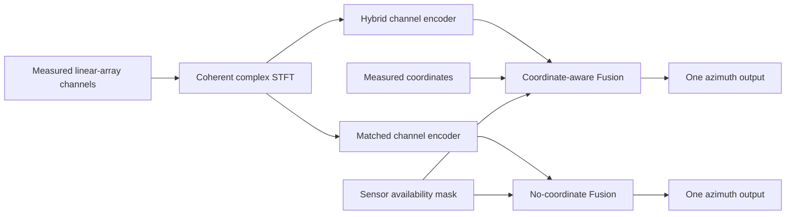

# Framework Architecture

> The active framework is the minimum finite study defined by the [authoritative roadmap](roadmap.md) and the [winter field protocol](../../experiments/winter_field_protocol.md). It is a proposed, evidence-gated design; no recording, implementation, calibration, or result is implied by this document.

## 7. Framework Overview

### 7.1 Active research question and boundary

The core experiment estimates **one source azimuth within a surveyed, known identifiable sector** from a measured physical **linear** hydrophone array. The source half-plane/sector prior is part of the task definition and is supplied identically to the compact neural pair and to MVDR/Capon, MUSIC, and diagnostic Bartlett processing. A linear array has structural front/back ambiguity; neither coordinates nor learning makes full-circle azimuth identifiable. If a sector cannot be established, the reported target must instead be an ambiguous direction/direction-cosine quantity under an amended claim.

The field array is one fixed, measured linear array. Its sensor count, spacing, aperture, calibration, and usable band remain field decisions rather than assumed ULA properties. The field result evaluates performance and domain shift on that array; it does not establish transfer to arbitrary, non-linear, or independently deployed physical topologies.

One-dimensional azimuth also requires fixed/known elevation or a measured depth/range bound making its effect negligible within the uncertainty budget. A linear-array direction projection and a half-plane prior alone do not identify azimuth with unconstrained elevation. The acquisition protocol, not the network, must establish this condition.

The minimum neural comparison is deliberately small:

1. one phase-preserving complex-STFT front end;
2. one compact supervised coordinate-aware model with the shared-sensor hybrid Conformer-like channel encoder in §9.1; and
3. a matched supervised no-coordinate twin with the same signal inputs, capacity budget, output, training data, optimization budget, and sector prior.

The model pair has one azimuth output. MVDR/Capon and MUSIC are required classical comparators under the same calibrated inputs and sector prior; Bartlett is diagnostic. This limited slate cannot support a broad neural-superiority or SOTA claim.



The encoder weights are shared across hydrophones within each model, not tied between the separately trained comparison arms. Coordinates enter Fusion, not channel encoding.

### 7.2 Evidence and scope gates

The minimum uses controlled simulation of the measured linear configuration across independent environments for development, practical method comparisons and calibration/measurement-uncertainty checks. Transfer to held-out linear layouts/spacing (E2) or non-linear simulated topologies (E4) is optional, not the primary inference or a minimum completion gate. The simulator's boundary assumptions and physical limitations must be checked; using BELLHOP alone does not validate an ice model.

Quality-controlled labelled recordings on the measured linear array are the central real-data evidence for method accuracy, robustness, domain shift and applicability limits, with independent acquisition groups where available. Within-linear subset/spacing sensitivity is optional and cannot establish arbitrary-topology or non-linear physical-array transfer.

Hardware, source, synchronization, positioning, access, and array feasibility are due for resolution by **2026-10-15**. The bench-validated representation, primary band, sample rate, identifiable sector, compact model compute budget, calibration/QA criteria, and analysis plan must be frozen by **2026-11-15**. Numerical choices are not fixed here: each needs recorded evidence, a responsible role, due date, and failure action in the decision register.

---

## 8. Input Representation Strategy

### 8.1 Primary front end

The primary neural input is **Re/Im STFT**: real and imaginary coefficients of the same complex short-time Fourier transform, carried as two feature channels. They are not concatenated along the frequency or time axis. Native complex storage and paired real/imaginary storage encode the same information; choosing real-valued or complex-valued network operations is a separate architecture decision. Magnitude-plus-phase parameterizations are catalogue candidates, not an interchangeable primary default.

Window function, hop, FFT size, retained physical band, transform scaling, sample rate, and observation duration require pre-campaign bench evidence and are frozen by the November gate. No numerical settings are implied by the tensor contract below.

For every multi-channel example, filtering, downconversion if used, resampling, STFT timing, and group-delay treatment must be coherent across sensors. The protocol records the array coordinate frame, sensor coordinates, timing reference, channel order, calibration version, original and processed sample rates, and all front-end parameters.

The common processing order is: immutable synchronous recordings, separately measured fixed calibration, coherent filtering and any required resampling, fixed-duration windows on a shared time grid, STFT, then the declared shared amplitude scale. Record the amplitude units. Filtering may operate on contiguous records before cropping; record its raw-sample support, transients, and group-delay treatment rather than treating each output window as independent by construction. Correct measured instrumental clock offsets, but do not independently align sensor arrival peaks: that would remove physical propagation delays.

The initial STFT convention uses non-centred frames without implicit padding (`center=False` in APIs with that option). Declare any explicit padding, FFT/window support, transform normalization, and frame-time convention before fitting. A different convention requires an explicit front-end freeze, not a library-default change. For temporal JEPA B, context/target separation includes the complete filtering and STFT support; different output frame indices alone do not prove disjoint raw observations.

### 8.2 Phase, delay, and normalization safeguards

The front end and encoder must preserve relative timing, inter-sensor phase, delay, coherence, and amplitude relationships needed for DOA. In particular:

- no independent random channel time shift, phase jitter, or phase randomization is a valid generic augmentation;
- a clock delay and a constant sensor phase offset are different calibration errors and must not be substituted for one another;
- no independent per-channel or per-frame normalization may erase spatial ratios or phase relations;
- the initial normalization choice is a fixed positive scalar fitted on permitted training material, shared across sensors, Re/Im components, and corresponding context/target views; a shared array-window scale is an explicitly declared alternative, never fitted independently to observed and direct targets; and
- any complex representation must avoid raw wrapped-phase regression in favour of real/imaginary or sine/cosine form.

A phase-integrity check accompanies the chosen front end: known or controlled relative delay/phase structure must remain recoverable after preprocessing and before the final azimuth output. A failure blocks neural interpretation rather than being repaired with a model change.

With one shared scale `s`, use `X/s` and `D/s` for the corresponding observed and direct-reference inputs; do not independently normalize the clean target or the real and imaginary parts. Fixed instrument calibration is not per-example statistical normalization. Track S fits this scale on simulated development only; R retains the S scale unless a different auxiliary fit is explicitly released.

### 8.3 Data-access boundary

For the immutable zero-shot sim-to-real track, training, normalization fitting, simulator tuning, SSL, architecture selection, and early stopping use only the allowed simulated development material. Sealed real acquisition groups—including unlabelled clips and noise-only material—never enter any of these steps. Calibration is frozen separately and supplied identically to every method.

This is track S. Separately authorized real-assisted unlabelled JEPA is track R only after a specific corpus/access release under [training §13.5](training_strategy.md#135-three-stage-jepa-protocol-and-gating). It does not change the immutable S result, authorize real simulator tuning or angular-label fine-tuning, or release sealed test groups. R is not automatically the E1 labelled-adaptation study.

The acquisition, manifest, group definition, calibration, and real-data access ledger are governed by the [winter field protocol](../../experiments/winter_field_protocol.md). The definitive real-evaluation contract and metrics are in the roadmap and evaluation plan; this architecture document does not create a second split policy.

### 8.4 Deferred representation context

The catalogue is broader than the selected experiment. Its **three principal candidates**, in priority order, are Re/Im STFT, time-domain baseband IQ, and the real-valued waveform. Only Re/Im STFT belongs to the mandatory minimum. The others are hypotheses, not promised implementations or a compulsory three-way comparison.

| Candidate | One-sensor shape, without batch | Role and limitation |
|---|---|---|
| **Re/Im STFT** | `[2,F,T]` | Primary; explicit time-frequency structure with complex coefficients |
| **Time-domain baseband IQ** | `[2,L_IQ]` | First alternative; complex envelope of the same selected physical band, without a fixed STFT input |
| **Real-valued waveform** | `[1,L]` | Next control candidate; the same calibrated, band-limited observation without a fixed analytic-signal or STFT feature conversion |
| Complex CWT | `[2,J,T_w]` | Reserve, requiring a specific time/scale-resolution hypothesis and measured cost |
| STFT magnitude plus sine/cosine phase | `[3,F,T]` | Reparameterization, not new input information; phase is unstable near zero amplitude and must not receive unjustified equal weight |
| Magnitude-only STFT or mel spectrum | `[1,F,T]` or `[1,K,T]` | Phase-information ablation, not a principal candidate; remaining amplitude/time cues may still carry direction information |

`J` denotes wavelet scales, `T_w` wavelet time positions, and `K` mel bands. These catalogue dimensions do not select numerical transforms. Learned filterbanks are an encoder/front-end architecture choice, not another measured input modality. GCC-PHAT, inter-sensor phase differences, spatial covariances, and learned beamspace features use multiple sensors; they are not interchangeable inputs to the same single-channel encoder.

A separately approved reserve representation comparison would test primary Re/Im STFT against **one** chosen alternative, prioritizing IQ then real waveform, without crossing it with JEPA stages. Listing the three principal candidates does not authorize a three-arm comparison; wider sweeps require a new pre-test scope/resource decision.

### 8.5 Input tensor contract

`N` is the number of array examples in a batch, `M` the sensor count, `L` processed real samples per window, `F` retained STFT frequency bins, and `T` STFT frames. `N_ch` counts individual sensor windows in an encoder batch; it is not an independent-environment sample size.

| Object | Shape and logical dtype | Meaning |
|---|---|---|
| Real observation windows | `[N,M,L]`, `float32` | Synchronous, calibrated and coherently band-limited time samples |
| Complex STFT coefficients | `[N,M,F,T]`, `complex64` | Complex representation before equivalent packing |
| Primary packed input | `[N,M,2,F,T]`, `float32` | Re and Im on a dedicated feature axis |
| Shared channel-encoder input | `[N_ch,2,F,T]`, `float32` | Independent channel processing with shared weights |
| Primary encoder output interface | `[N_ch,C,F_e,T_e]`, `float32` | Learned real feature/time-frequency grid; final `C` features are not assumed to be physical Re/Im pairs |
| Surveyed coordinates | `[N,M,3]`, `float32` | Coordinate-aware Fusion only, in the documented physical frame |
| Sensor availability | `[N,M]`, `bool` | Excludes unavailable sensors from attention keys/values, output queries and pooling; a missing sensor is not measured silence |
| Fusion frequency metadata | `[F_e]`, physical Hz | Declared frequency associated with each encoded frequency position; supplied identically to both neural arms |
| Optional IQ encoder input | `[N_ch,2,L_IQ]`, `float32` | I and Q of the baseband temporal signal |
| Optional real-waveform encoder input | `[N_ch,1,L]`, `float32` | One real feature channel |

For a full valid array batch, reshape `N*M` sensor windows for the shared encoder, then restore `[N,M,C,F_e,T_e]` before Fusion. Encoding only valid sensors is also possible if the example/sensor association is retained. Coordinates and masks follow that association, never a learned wiring-slot identifier. Pretraining may batch individual channel windows without a full array, but provenance and any paired diagnostic views retain their parent scene/session, sensor, and timing identities.

The layout `[N_ch,F_e*T_e,C]` is an equivalent storage form only when all features and their frequency/time index mapping are retained. Permuting axes and reshaping are not pooling or learned compression, and this layout does not authorize attention over the entire flattened TF grid. The canonical interface and array/sensor association above remain unchanged.

The primary channel E interface stays fixed across Stage-1 JEPA task/data recipes and all downstream branches. Alternate temporal input blocks belong to separately approved front-end work; report different adapters rather than claiming an equal-backbone comparison. Re/Im storage alone does not guarantee phase retention.

### 8.6 Baseband IQ contract

An analytic signal `x_a(t) = x(t) + j*Hilbert(x(t))` is not automatically baseband or lower-rate. Here the first alternative means the complex envelope of the selected physical band:

```text
u_m(t) = LPF{x_a,m(t) * exp(-j*2*pi*f_c*t)}
```

Only after valid band selection and anti-alias filtering may it be decimated. Share the oscillator frequency and phase/time reference across sensors and windows; do not reset them independently. Record the physical centre frequency `f_c`, original/processed rates, retained band, filters, delays, transients, and raw-sample support. If `f_c` varies, preserve that physical-frequency information in the declared model/metadata contract instead of silently discarding it with the carrier.

Neither analytic conversion nor IQ adds measured information, guarantees phase preservation, or establishes superiority to Re/Im STFT. The real-waveform control uses the same calibrated physical observation and band, not untreated ADC counts. Compare observation duration and retained physical bandwidth rather than tensor element counts; a valid lower-rate IQ tensor can describe the same observation with fewer samples. The common evaluation and resource rules for any selected contrast are in [evaluation §17.5](evaluation.md#175-selected-input-representation-comparison).

An analytic conversion implemented by a whole-record Hilbert/FFT transform can depend on samples outside the labelled crop. Such output windows cannot be claimed to have disjoint raw support merely because their indices differ. Any later temporal-prediction use must establish bounded processing support and a sufficient guard interval; the catalogue does not waive the existing B leakage gate.

---

## 9. Compact Supervised Encoder Pair

### 9.1 Shared model contract

The scratch coordinate-aware/no-coordinate pair and JEPA branches share the same selected compact hybrid scaffold and physical input. The core choice is not a CNN-vs-Transformer sweep; Phase integrity of the complete encoder is a blocking gate before Stage-2 SSL.

The channel encoder `E` processes each hydrophone separately with shared weights. It supplies a time-frequency feature grid to a separate inter-channel Fusion and then one azimuth head; it does not itself estimate azimuth or attend to other sensors. No global time/frequency pooling precedes Fusion. Selecting this scaffold is a core architecture decision, not an additional E4 experiment or a CNN-first prerequisite. The same scaffold is used for the main JEPA study; Stage 1 trains E, Stage 2 trains Fusion with E frozen, and Stage 3 compares parallel frozen-head and joint branches.

#### 9.1.1 Selected hybrid channel encoder

The selected basis is a **hybrid**, not a fully complex Conformer:

```text
Re/Im STFT [N_ch,2,F,T], float32
    -> equivalent native complex input [N_ch,1,F,T], complex64
    -> compact complex Conv2D stem [N_ch,C_s,F_e,T_e], complex64
    -> paired Re/Im stem features [N_ch,2*C_s,F_e,T_e], float32
    -> real temporal Conformer-like blocks at each frequency position, C = 2*C_s
    -> local frequency mixing
    -> learned real features [N_ch,C,F_e,T_e], float32
```

`C_s` counts complex stem features; `C` counts the final learned real features. Packing Re/Im is lossless, but learned projections, attention, convolution, normalization, and subsampling need not be. The output is not automatically a set of physical complex amplitudes, and the whole hybrid has no asserted strict phase-equivariance guarantee.

The temporal blocks follow the [Conformer](https://arxiv.org/abs/2005.08100) principle: half-step residual feed-forward module, temporal multi-head self-attention, temporal convolution module, and a second half-step residual feed-forward module. Retaining a separate frequency grid with local frequency mixing is this study's adaptation, not an imported ASR front end or a ready hydrophone model. No mel-only input, speech decoder, pretrained speech weights, or published speech-model size is implied.

For temporal processing, reshape `[N_ch,C,F_e,T_e]` to `[N_ch*F_e,T_e,C]`, apply the same temporal-block parameters across channels and frequency positions, and restore the grid before local frequency mixing. Do not flatten `F_e*T_e` into one attention sequence or pool each sensor to one vector before inter-channel comparison. Restore array/sensor grouping as specified in §8.5 before Fusion.

The engineering presets in §9.1.3 specify candidate depths, stem/feature widths, attention-head counts, and FFN expansion. Selecting one preset is still a measured decision, as are kernels, positional encoding, normalization axes/statistics, strides/subsampling, observation length, and the exact implemented parameter count. Freeze the complete configuration under the local resource and phase-integrity gates by **2026-11-15**; successful speech use or native complex operator support is not feasibility evidence for this pipeline. The presets do not mandate a multi-size training study or capacity escalation.

#### 9.1.2 Temporal attention and observation windows

Distinguish the STFT analysis window that produces a spectral frame, the model observation window containing `T_e` encoded time positions, and any attention neighbourhood assigned to a query. The initial policy is **full temporal attention within the bounded current observation window, separately at each frequency position**. Sliding or overlapping observation crops along a recording do not make this attention local and do not create independent scientific units.

Attention may be bidirectional inside the already available window. The design does not require causal attention, streaming inference, a persistent KV cache, or scene state. In JEPA B, encode the current context and future target as separate windows with disjoint raw support: neither attention, convolution, data-dependent normalization nor a shared signal cache may import the other window. Bidirectionality within each separate window is permitted; encoding the complete record and then slicing features is not.

The temporal pair count scales with `N_ch*F_e*T_e^2`, before accounting for heads and feature width. Measure actual memory and time at the declared shapes/backend; do not assume that every backend materializes a full score matrix. Sliding-window/local attention is not the initial configuration. A resource-driven change must be explicitly recorded during development, before comparative pretraining and final configuration freeze, and applied equally across methods. Local attention can reduce the pair count to order `N_ch*F_e*T_e*W_attn` for neighbourhood size `W_attn` only with an appropriate local implementation; a mask on dense attention alone does not establish that saving.

#### 9.1.3 Engineering size presets and single-size selection

The following are accepted **engineering presets for the primary STFT hybrid**, not measured optima, completed implementations, or three required experimental arms. `B_enc` counts temporal Conformer blocks; it is not the JEPA task B or the observation batch size.

| Preset | Complex stem width `C_s` | Real Conformer width `C` | Blocks `B_enc` | Attention heads | FFN hidden width |
|---|---|---|---|---|---|
| **E-S** | 32 | 64 | 2 | 4 | 256 |
| **E-M** | 48 | 96 | 4 | 4 | 384 |
| **E-L** | 64 | 128 | 6 | 4 | 512 |

Each of the two FFN modules in a Conformer block has hidden width **`4*C`**. All presets use **`2*C_s = C`**: Re/Im packing already gives the temporal block's input width, so no additional stem-to-Conformer width projection is required. The hybrid operations, full within-window temporal attention, local frequency-mixing principle, and final real feature-grid interface remain the same. If resource measurements compare presets, hold the physical observation window, representation, attention policy, and non-size processing choices fixed; disclose any necessary difference rather than attributing it solely to model size.

- **E-M is the first candidate** for the resource and full-encoder phase/delay pilot, not the already frozen final model.
- **E-S is the smaller fallback** if E-M does not fit the measured resource envelope.
- **E-L is a reserve**, requiring an explicit development rationale and resource decision before freeze. It is not a compulsory next run or an automatic larger-model rescue for a failed diagnostic or unfavourable result.

The initial **E-M pilot candidate is `C=96`, `F_e=F`, `T_e≈T/2`**: first test moderate temporal subsampling in the complex stem without simultaneously reducing the frequency axis. This is a development starting point, not the frozen configuration or evidence that subsampling preserves phase/delay information. Exact output sizes, encoded-position alignment, and raw-sample support must follow the declared kernels, strides, and padding/boundary handling; `T_e≈T/2` alone does not specify an implementation. Retaining frequency indexing does not certify phase preservation either. Accept or revise the candidate using the existing full-encoder phase/delay and measured-resource gates before configuration freeze.

This pilot retains the preset's output width `C`; it does not add a separate output-width projection such as `96→32`, latent-slot aggregation, or quantization. A compulsory full-resolution-versus-subsampled comparison and an output-form/resolution-by-pretraining matrix are not added.

Choose and freeze **one size** for the scratch coordinate-aware/no-coordinate pair, JEPA Stages 1–3 and matched scratch control. Freeze the selection before comparative training and by the 2026-11-15 architecture gate. Presets are not a mandatory sweep. The measured budget of the three-stage primary study is **TODO**; the obsolete five-method E4 resource estimate cannot be reused.

The pairwise-attention arithmetic term scales as `N_ch*F_e*B_enc*T_e^2*C`; this is not a total FLOP count or memory prediction, because projections, FFNs, convolutions and backend storage also contribute. Shared encoder parameters are not multiplied by the hydrophone count; processing more sensor windows increases work and activation storage. Count exact parameters from the eventual complete implementation and measure the full training/inference paths, including the applicable EMA teacher, decoder, predictors, and other auxiliaries. No parameter totals, runtime, memory fit, or accuracy are claimed from this table alone.

### 9.2 Coordinate contract

Coordinates are physical measurements in the declared array coordinate frame, centred only by a documented geometry-derived reference. The selected Fusion uses the shared Cartesian coordinate encoding in §10.2, not fixed ULA mirror pairs or an additional pairwise geometry bias. Coordinates are not channel indices, and neither model may receive a learned slot embedding that can leak wiring order.

In the minimum, coordinates describe the measured linear configuration and the no-coordinate twin is a controlled component ablation. If E2/E4 geometry transfer is selected, its target layouts/spacing/topologies must be excluded from training and selection before that separate simulation result is interpreted. No such study is mandatory, and a successful simulation result cannot be combined with fixed-array field performance to imply transfer to new physical geometries.

The twin is an **information ablation**, not automatically a strong practical neural baseline. Before interpreting it, check whether its unordered no-coordinate observations identify the signed sector target at all; symmetric linear layouts can introduce additional indistinguishable cases when channel position is withheld. Record that ambiguity/error floor in controlled development. A gain caused by supplying missing information is not, by itself, architectural novelty or superiority over conventional fixed-layout neural estimators.

### 9.3 Mandatory integrity canaries

Before interpreting any coordinate effect, the protocol retains all of the following safeguards:

- **Joint permutation canary:** jointly permuting sensor signals, coordinates, calibration fields, and masks must leave the global prediction unchanged within the predeclared reporting resolution.
- **Coordinate association canary:** detaching or permuting coordinates while holding their signal channels fixed is a labelled diagnostic of broken signal-coordinate association. Its expected effect and acceptance interpretation are set before evaluation; it is not a license to select a model on sealed real data.
- **No-coordinate check:** the matched twin must have no direct or indirect coordinate/topology/slot path.
- **Phase-integrity check:** controlled inter-sensor delay/phase structure remains available through preprocessing and aggregation.

A failed canary invalidates the corresponding neural geometry interpretation. Passing a canary does not remove linear-array mirror ambiguity or prove real-array transfer.

### 9.4 Optional/deferred architecture context

Graph encoders, steering-aware branches, alternative backbone families and deployed generative models remain reserve candidates rather than required experiments. They cannot replace the selected E/Fusion after final-data inspection; additional work needs a separate pre-test scope and resource decision.

The selected complex Conv2D stem and real Conformer stages are deliberate architecture choices, not guarantees of useful phase. The same backbone is used for Stage-1 JEPA A/S and conditional B, frozen in Stage 2 and reused in Stage 3. Inspect delay/phase after the entire E before Fusion; no VAE/H method matrix or CNN-vs-Transformer sweep is part of the main study.

---

## 10. Geometry-Conditioned Array Encoder

### 10.1 Active geometry scope

The minimum encoder operates on the measured linear configuration. Simulation varies propagation conditions and justified calibration/coordinate uncertainty for method evaluation, not to mandate new-layout transfer. Deliberate spacing/aperture/subset contrasts are optional E2 work; non-linear topology transfer is optional simulation-only E4 work. Neither creates evidence for an unmeasured non-linear physical array.

The real deployment is fixed after survey and calibration. If a controlled real sensor subset is available, it is E2 sensitivity evidence within that deployment only. The comparison does not create a second field geometry or an independent topology replicate.

### 10.2 Array aggregation requirements

The selected **general coordinate-aware channel-attention Fusion** accepts a set of sensor features, measured coordinates and availability masks. It does not require ULA spacing, mirror partners, a fixed sensor count, or a fixed wiring order. Array aggregation must be invariant after joint permutation of signals and their associated coordinates, calibration fields and masks. Geometry cannot be inferred from a stable channel slot, array name or source-side label.

Fusion is separate from the channel encoder's temporal attention: it compares sensors independently at each retained `(f,t)` position. This is a core architecture choice, not an extra E4 arm or a compulsory comparison with graph, steering-aware or ULA-equivariant models. Its pilot dimensions are accepted below; complete implementation settings and feasibility remain subject to the shared 2026-11-15 freeze and integrity gates. The selected single-azimuth head and supervised loss are specified in §12; Fusion does not add another task.

Steering vectors and covariance construction for MVDR/Capon, MUSIC, and Bartlett use the same measured calibration, coordinate frame, sound-speed/range assumptions, and identifiable sector as the neural models. The far-field assumption must be justified by measured geometry or replaced by valid range-aware steering/restricted conditions; it is not presumed by the network.

#### 10.2.1 Inputs and coordinate/frequency encoding

Restore `H: [N,M,C,F_e,T_e]` from the shared encoder. Fusion also receives surveyed coordinates `[N,M,3]`, sensor availability `[N,M]`, and the physical frequency vector `[F_e]`; declared TF validity/padding masks accompany the retained grid. The frequency-to-position mapping follows the actual stem/subsampling alignment, not an assumed physical phase interpretation of latent features.

Use `r_tilde_m = (r_m - r_0) / L_0`, where `r_0` is a documented geometry-derived reference, for example the centroid of the full surveyed array. Do not change that reference with channel ordering or incidental sensor dropout. `L_0` is one fixed physical length scale shared across examples, not each array's own aperture. Coordinates remain in the declared physical frame; no learned sensor identity or ULA ordering is substituted for them.

The shared Cartesian coordinate MLP is `g_r: 3 -> C -> C`, with GELU between its linear layers (`3 -> 96 -> 96` for E-M). A small shared frequency MLP `g_f: R -> R^C` encodes `f_Hz / f_0`, where `f_0` is one fixed physical frequency scale. Its exact layer configuration, the scale values and the reference rule are recorded before freeze. Form each token as:

```text
p_m       = g_r(r_tilde_m)
q_f       = g_f(f_Hz / f_0)
z_m,f,t   = h_m,f,t + p_m + q_f
```

Coordinate encodings are computed once per geometry and frequency encodings once per grid, then broadcast over the corresponding axes. This does not change the encoder output width or add a stem/output compression projection. Frequency metadata and its encoding are available identically to both neural arms.

#### 10.2.2 Masked channel-attention block

Treat `[N*F_e*T_e,M,C]` as the conceptual attention layout: each sequence contains the sensors at one common TF position. Share Fusion parameters across TF positions. Do not flatten sensors, frequency and time into a joint attention sequence. The accepted first pilot uses:

| Fusion component | Initial setting |
|---|---|
| Blocks | **1** |
| Feature width | Encoder width `C`, initially **96** |
| Attention heads | **4**, initially 24 features per head |
| FFN hidden width | **`2*C`**, initially `96 -> 192 -> 96` |
| Block structure | Pre-LayerNorm MHSA and FFN, each with a residual connection |
| LayerNorm scope | Feature axis `C` of each sensor/TF token, not the sensor axis |

The Fusion FFN is distinct from the encoder's `4*C` FFNs. For each head and valid query sensor `i` at fixed `(f,t)`, with `V` the available sensor set and `d_h=C/4`:

```text
z_bar_i = LayerNorm(z_i)
Q_i = W_Q z_bar_i; K_i = W_K z_bar_i; V_i = W_V z_bar_i
alpha_ij = softmax over j in V of (Q_i^T K_j / sqrt(d_h))
a_i = W_O concat_heads(sum over j in V of alpha_ij V_j)
u_i = z_i + a_i
y_i = u_i + FFN(LayerNorm(u_i))
```

Both signal and coordinate/frequency encodings therefore affect Q, K and V. Attention weights are learned through the common supervised azimuth loss, not prescribed by a nearest-neighbour rule. The initial construction adds no pairwise geometry-logit bias, explicit steering-vector branch, reference-microphone GCC input, or mirror-pair decomposition. Learned attention weights are not automatically GCC, covariance, physical phase differences or calibrated explanations.

#### 10.2.3 Masking and ordered aggregation

Exclude unavailable sensors from attention keys/values and from the output queries used downstream. Then take a **masked mean over sensors**, yielding `[N,C,F_e,T_e]`, followed by a mean over valid TF positions, yielding `[N,C]` for the one azimuth head. Channel interaction precedes all global TF pooling.

Skip completely masked TF positions without evaluating an all-masked softmax or dividing by a zero valid count. If no valid pooled observation remains, return no azimuth and use the existing prediction-failure protocol; do not invent silence or an angle, or silently remove a scored window. Padding must not influence attention or either pooling denominator.

#### 10.2.4 Matched no-coordinate arm and invariance

Keep the same channel-attention, pooling, frequency encoding and head structure in the no-coordinate twin. Supply the same constant zero three-vector to `g_r` for every sensor instead of coordinate-derived inputs; any learned `g_r(0)` is a shared constant, not a sensor identifier. No centring result, aperture, pair displacement, mirror pairing, topology label or coordinate-derived attention path may reach this arm. The parameterization is matched while the geometry information is removed; the identifiability caveat of §9.2 still applies.

Shared token operations and channel attention are permutation-equivariant; masked aggregation makes the global result invariant to joint sensor/metadata permutation. This is not a guarantee of rotation/reflection equivariance, phase preservation, elimination of linear-array mirror ambiguity, or accuracy on an unseen geometry. Accepting different sensor counts and coordinates is an interface property, not demonstrated arbitrary-array generalization.

#### 10.2.5 Evidence, resources and transfer boundary

The channel pairwise-attention arithmetic term scales as `N*F_e*T_e*M^2*C`; this is not a total FLOP or memory prediction. Parameter matrices do not grow with sensor count, but work and activation storage do. Measure the full encoder/Fusion/head forward, backward and inference paths at the actual masks, sizes and backend, and run the existing permutation, association, no-coordinate and phase/delay canaries. These remain required evidence, not already passed checks.

The core evidence remains the surveyed physical linear array. Coordinate inputs alone do not establish transfer: new-geometry performance needs permitted diverse training geometries, held-out layouts excluded from fitting/selection, and a declared identifiable geometry domain. Such work remains the optional E2/E4 scope in §10.1, not a new mandatory matrix or a claim about arbitrary physical deployments.

#### 10.2.6 Published precedents and project adaptation

[GI-DOAEnet — Baek, Chang & Cohen, IEEE TASLP 2025](https://doi.org/10.1109/TASLPRO.2025.3577336) directly adds microphone positional encodings to per-channel features before projecting Q/K/V for channel-wise MHSA (§II-C/D, equations 7–12). It uses sinusoidal spherical-coordinate encodings, frequency-collapsed channel features, temporal GRUs, a different channel aggregation and spatial-spectrum heads. Its staged geometry training is not evidence that supplying coordinates alone guarantees transfer.

[AGG-RL — Baek et al., ICLR 2026](https://proceedings.iclr.cc/paper_files/paper/2026/hash/ee860a9fa65a55a335754c557a5211de-Abstract-Conference.html) builds AuGeonet on this channel-attention principle using reference-relative microphone encoding and LNuDFT-based reference-pair GCC-PHAT features, then scores candidate directions. Those additional input and head mechanisms are not imported here.

The retained TF grid, Cartesian coordinate MLP, explicit physical-frequency encoding and compact single-block Fusion are this project's adaptation, not a verbatim implementation of either paper. Their room-acoustic results do not establish underwater/under-ice validity, measured resource fit or novelty for the present study.

### 10.3 Structural limitation

For a linear array, reflected directions across the array axis can produce the same delay pattern. The surveyed source half-plane/sector is therefore a shared experimental prior, not a neural advantage. All results must name the sector and ambiguity condition; no architecture section permits a 360-degree identifiable azimuth statement or silently clipped predictions.

---

## 11. Channel JEPA, Fusion JEPA and Deferred Scene Dynamics

### 11.1 Fixed transferable interfaces and ordered gates

Stage 1 trains the selected one-channel hybrid `E` (§9.1) without cross-sensor attention; simulation A/S predicts EMA features of the separately stored receiver-specific direct `D_m` from the observed `X_m`. Conditional B on observed separated windows may use approved R or simulated B/S control; real A/R is gated on a **validated estimated** direct `D_hat_m`, not the known transmitted signal alone. See [training §13.5](training_strategy.md#135-three-stage-jepa-protocol-and-gating). On simulated independently grouped cases, freeze E and probe pairwise TDOA/phase from two independently encoded channels on a **common clock** before attempting Fusion SSL. A probe is an accessibility test, not DOA proof. No per-channel independent time alignment or phase randomization is permitted merely to improve SSL loss.

### 11.2 Stage-2 pre-pooling Fusion token contract

The ordinary array readout in §10.2 pools valid sensor tokens and then TF tokens. For SSL only, expose Fusion **per-sensor per-TF tokens before either pooling**; this adds an output interface, not a deployed head. For `N_good>=3`, sample `K∈[1,N_good-2]` hidden channels and their identities; at least two valid visible channels and one hidden remain. Sampling distribution and coverage of baseline lengths are **TODO: development freeze**. Frozen E may compute all features for the EMA teacher, but online Fusion and predictor must not receive hidden content: zeros plus an explicit availability mask, masked attention/pooling, removal before any cross-sensor normalization/aggregation. Predictor knows full **measured** coordinates and missingness, predicts tokens at all indices, and takes loss **only on hidden valid sensor/TF positions**. Target EMA Fusion sees the full eligible array; its weights/normalization state track the trainable Fusion, while E stays frozen. A teacher token is not a physical complex coefficient and need not preserve DOA phase automatically. At application, use E+Fusion pooled representation+one head; drop both temporary predictors and EMA copies.

### 11.3 Stage-3 parallel supervised descendants

From the identical E+Fusion SSL checkpoint, branch 3a freezes both and learns a fresh head, whereas 3b fine-tunes both with a different fresh head. They are not consecutive. Both use the same raw-component azimuth MSE (§12), labelled group/access/sector convention and evaluation failure policy. Full supervised-from-scratch with matched downstream budget is the comparator for 3b; Stage-1-only frozen/joint comparators diagnose the extra value of Fusion SSL where budget permits. The no-coordinate arm is separate and retains identical noncoordinate information. Report SSL pretraining cost alongside downstream cost and label S, R and E1 separately.

### 11.4 Deferred boundary

B predicts **signal** windows for representation learning, not world/scene dynamics or source tracking. No recurrent scene state, rollout capability, multiple sources, 3-D localization, or extra deployed head is implied by JEPA. These remain outside the March 2027 deadline-bound method. Phase preservation, latency, token layout, collapse, leakage, geometry and resource fit are gates, not already confirmed properties.

## 12. Downstream Heads

The minimum uses **one supervised azimuth**, parameterized by a two-component Cartesian direction target rather than an angular class grid. Given the `[N,C]` feature after masked sensor and valid-TF pooling (§10.2.3), the initial compact head is `Linear(C,C) -> GELU -> Linear(C,2)` (`96 -> 96 -> 2` for E-M). Its raw output `(a,b)` is not constrained to unit norm and has no output activation. These two components encode one direction, not separate source-presence, elevation, or uncertainty tasks.

In the declared coordinate frame and angle convention, use target `u(theta) = (cos(theta), sin(theta))` for each eligible supervised example, with `theta` in radians. The selected **training objective** is mean per-example squared Euclidean error over the two raw components:

```text
L_DOA = (1/B) * sum_i [(a_i - cos(theta_i))^2 + (b_i - sin(theta_i))^2]
```

`B` counts eligible labelled examples in the batch. This specifies a sum over both components, not a mean that divides again by two. Train the scratch pair and joint Stage-3 branch with this target and loss; frozen Stage-3 branch trains only its head on the identical target and loss. Do not normalize `(a,b)` before this loss, backpropagate through `atan2`, or import an angular-grid/cross-entropy, spectrum/BCE, IPD, PIT, auxiliary confidence or extra geometry loss. For **unit** vectors only, squared distance equals `2*(1-cos(theta_hat-theta))`; raw-output MSE also penalizes vector magnitude and must not be described as purely angular.

At inference, if both raw components are finite and `sqrt(a^2+b^2)` exceeds a common predeclared numerical degeneracy threshold `tau >= 0`, decode `theta_hat = atan2(b,a)` using the declared angle convention. Exact zero is always degenerate. Set `tau` from numerical/implementation considerations on permitted development data, identically for the neural pair and any Stage-3 head, and freeze it before final scoring; it is not a confidence or result-tuning threshold. A non-finite or degenerate vector, or an empty valid Fusion observation, yields **no azimuth** and enters the existing prediction-failure protocol in [evaluation §18.1](evaluation.md#181-primary-azimuth-metric-and-identifiability). Do not turn `(0,0)` into the implementation's default `atan2(0,0)=0`, silently discard such windows, or clip/reflect finite decoded predictions into the sector. The raw vector norm is not a calibrated confidence.

The primary **evaluation metric** is the separately specified circular azimuth error in §18.1, not the training MSE. The surveyed identifiable sector, linear-array front/back ambiguity, known/bounded elevation and equal sector prior for classical and neural methods remain unchanged. A two-component head does not claim two sources, a 3-D direction or full-circle identifiability. This is a compact adaptation of Cartesian-direction training, not a verbatim [ACCDOA](https://arxiv.org/abs/2010.15306) activity-coupled SELD head; no source-activity norm semantics are imported. Head width, `tau`, finite-value handling, complete-model phase/delay and resource evidence remain subject to the existing 2026-11-15 freeze, not already measured feasibility.
