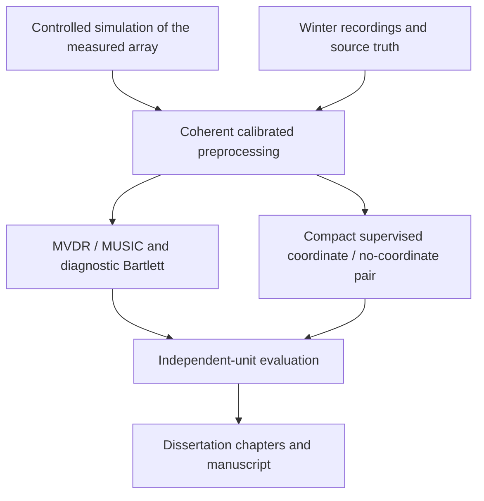

# Research Framework Overview

> Active scope: Candidate of Sciences dissertation, complete text by **2027-03-31**, with mandatory winter 2026–2027 under-ice bay measurements on **only a linear hydrophone array**. The [roadmap](roadmap.md) controls scope/calendar; the [winter field protocol](../../experiments/winter_field_protocol.md) controls acquisition and real-data evaluation.

## Document Status

This is a deadline-bound research plan, not an implemented system or evidence of completed experiments. The repository contains documentation only.

The owner has confirmed the candidate-dissertation target, full-text deadline, winter recording opportunity and linear-only real array. The required number of published articles, institutional requirements, exact bay, hardware, source, geometry and safe acquisition dates remain open decisions with owners and due dates in roadmap §25.2. Nothing here promises a degree, accepted papers or safe ice on a scheduled date.

## Abstract

The study investigates hydroacoustic azimuth estimation on the available linear array under shallow-water multipath and winter measurement conditions. Its central contribution is the method and experimentally established accuracy, robustness and applicability limits. A compact supervised coordinate-aware model is compared with MVDR/Capon and MUSIC; its matched no-coordinate twin is a component ablation, and Bartlett is diagnostic. Controlled simulation supports development and analysis for the measured configuration; labelled under-ice recordings establish the real-data evidence. Transfer to different geometries is optional simulation research, not a minimum dissertation result.
For the primary Re/Im STFT, the selected common core is a hybrid Conformer-like channel encoder: compact complex Conv2D stem, lossless paired real/imaginary representation, real temporal processing that retains the frequency grid, then separate Fusion and one azimuth head. Its architecture/configuration contract is [§9.1](architecture.md#91-shared-model-contract); it is not an additional E4 experiment.

The intended result is a bounded, reproducible scientific study and a full dissertation text. Positive neural advantage is a hypothesis, not a completion guarantee. E4 may be one bounded two-stage channel-encoder comparison, a selected primary-Re/Im-STFT-versus-one-resource-approved-alternative comparison, or simulated topology transfer; it does not authorize all principal front ends or a representation × pretraining × architecture factorial. Predictive scene dynamics and a multi-head “world model” remain outside the deadline-bound programme.

## Framework Pipeline

Simulation, real development recordings and held-out real groups have separate access rights; the diagram does not permit training on final test data.

## 1. Purpose and Scope

### 1.1 Purpose

Produce a scientifically justified candidate-dissertation investigation of single-source azimuth estimation on a linear hydrophone array, with measured-data evidence and an explicit account of physical assumptions, calibration, identifiability and sim-to-real limitations.

The minimum is the finite M1–M5 package in roadmap §27: labelled winter data, controlled simulation/classical methods, the compact paired comparison, evidence-bounded analysis and the full written work.

### 1.2 Scope boundary

- **Required:** one phase-preserving primary **Re/Im STFT** front end, one azimuth output, compact supervised comparison, classical baselines, trustworthy real measurements and reproducibility.
- **Conditional before February cutoffs:** small labelled real-development adaptation; within-linear subset/spacing sensitivity; modest calibration/ice-assumption sensitivity; or E4 as exactly one two-stage channel-encoder comparison, a selected primary-Re/Im-STFT-versus-one-resource-approved-alternative comparison, or simulated arbitrary-topology study.
- **Deferred beyond April:** predictive scene dynamics, broad model/representation ladders, additional downstream task heads, multi-source tracking, 3-D localization and an operational real-time product. E4's temporal task concerns signal windows during pretraining only, not scene/world dynamics or source tracking.

The broad representation catalogue is not a selected experiment slate. Its three principal candidates are primary Re/Im STFT, first-alternative time-domain baseband IQ, and next-control real-valued waveform; complex CWT, magnitude plus sine/cosine phase STFT, and magnitude-only STFT/mel are wider catalogue entries. Only Re/Im STFT is mandatory. A resource-approved E4 front-end comparison selects exactly one alternative, prioritizing IQ and then the real waveform; adding both requires a scope/resource revision. It remains mutually exclusive with E4's channel-encoder and topology options. [Architecture §8](architecture.md#8-input-representation-strategy) contains the detailed representation strategy.

Detailed numerical settings must follow apparatus/measurement and development evidence, with their rationale recorded before final evaluation.
The [E-S/E-M/E-L engineering presets](architecture.md#913-engineering-size-presets-and-single-size-selection) specify candidate widths, depths, heads and FFN expansion; the final choice and remaining configuration/resource fit are evidence-gated before the freeze. E-M is the first pilot candidate, E-S the resource fallback and E-L a development reserve, not three mandatory experiments. One chosen size serves the core pair and all optional encoder-pretraining regimes plus downstream `0`. The initial scope is full temporal attention within each bounded input window at every frequency position, not flattened time-frequency or cross-sensor attention, streaming, or a local-attention result switch.

## 2. Target Domain

The real experiment is a winter bay recording campaign conducted from ice with **a linear array**. Uniform spacing is not confirmed. Sensor count, submerged coordinates, aperture, source range/depth, sample rate, usable band and calibration must be established before final measurement/evaluation freezing.

Novik Bay near Russky Island was the previous motivating setting; the owner has not reconfirmed that specific site. The active protocol must record the actual authorised location and environmental metadata without treating a candidate location as an observed dataset.

### 2.1 Identifiability and physical validity

For a linear array, mirror directions can share the same propagation-delay pattern. The core azimuth experiment therefore needs a known source half-plane/identifiable sector established by the measurement arrangement and survey, with the same prior supplied to every comparator. Neither coordinates nor a neural model creates unobserved directional information. If the sector cannot be justified, agree an ambiguous-direction/direction-cosine task before freezing rather than silently reporting unambiguous 360-degree azimuth.

The one-dimensional azimuth interpretation also requires fixed/known source elevation or a measured depth/range bound showing negligible elevation effects for the stated uncertainty. A half-plane prior alone does not identify azimuth from a linear-array direction projection when elevation is unconstrained.

Ground truth comes from the **actual underwater source and receiver positions**, not just intended bearings or hole locations. Depth, hanging-cable motion, array orientation, timing drift and gain/phase response enter the uncertainty budget. Far-field assumptions must be checked for the measured aperture, frequency and range; restricted valid conditions or declared range-aware steering may be needed without expanding the claim to general localization.

Ice changes both boundary conditions and recorded noise. A pressure-release open-water surface is not an ice model. BELLHOP or another declared simulator may support controlled development, but a generic acoustic simulation plus real noise cannot be described as validated under-ice propagation or substituted for labelled real recordings.

### 2.2 Relationship to existing work and novelty

Geometry-aware neural DOA, microphone positional encoding and variable-array methods already exist. The literature pointers in [architecture.md](architecture.md) and the earlier research record are starting points for a current prior-art review, not proof of novelty in this project.

Candidate contributions to assess with the supervisor are: a justified linear-array method or modification; experimentally established applicability/limitations under measured winter conditions; and a reproducible methodology linking metrology, physically qualified simulation and independent evaluation. An implementation, a dataset or superiority over a deliberately information-deprived ablation is not automatically a new scientific result.

The September requirements review must connect proposed contributions to the scientific specialty and dissertation rules. The November pilot is a second adequacy checkpoint. A rigorous null result can be informative but does not, by itself, guarantee that the dissertation meets novelty requirements. No unverified external “current baseline” pipeline is assumed to exist or be available to this project.

## 3. Research Motivation

Classical DOA methods expose physical assumptions and provide indispensable references, but multipath, noise, calibration error and finite observations can challenge those assumptions. A compact neural estimator may offer different error/failure behaviour; that must be measured against correctly configured classical methods, not presumed.

Winter acquisition is a scarce opportunity: a later model cannot repair missing channel synchronization, unknown source truth or an unusable spatial arrangement. Preparing acquisition, quality checks, independent groups and backups therefore takes precedence over broad model exploration.

Controlled simulations allow causal contrasts and repeatable development before winter. Real recordings are required in the minimum to assess the discrepancy between that controlled setting and the measured linear array. Dissertation writing proceeds alongside both, rather than waiting for all experiments to end.

## 4. Research Questions and Evidence Boundaries

### 4.1 Minimum questions

1. **Method accuracy and robustness:** how does the compact estimator compare with the declared classical methods under controlled conditions representative of the measured linear array, and which method components affect its errors and failures?
2. **Measured-array effectiveness and domain shift:** how do the frozen methods perform on independent labelled winter acquisition groups, and what failures are associated with calibration, noise, multipath or simulation mismatch?
3. **Applicability:** which angular sector, range, frequency, data-quality and environmental conditions support the reported results, and where does the measurement/model contract fail?

These are related questions in one study, not three promised positive contributions or a prescribed number of articles. The [evaluation plan](evaluation.md) specifies metrics, independent units, fair information access and limits on uncertainty claims.

Transfer to geometries excluded from training is an additional simulation hypothesis under E2/E4, not an obligatory question in this minimum. A simulation transfer result and a real fixed-array result remain separate findings; combining them does not demonstrate transfer to a new real geometry.

### 4.2 Claims that the available design cannot establish

A fixed real linear array cannot establish transfer to arbitrary non-linear physical topologies. A sensor subset is a within-array sensitivity condition, not a second independent expedition. A single session cannot establish generalisation across sessions. An unlabelled noise recording cannot establish DOA accuracy. A simulated signal with real noise added is still not a recording of a real localized source.

No positive effect, statistical power, SOTA ranking, open-water generality, real-time deployment readiness or validated ice physics is presumed. If evidence is insufficient, report the limitation and assess the minimum with the supervisor rather than changing the claim after viewing final results.

### 4.3 Optional E4 two-stage encoder study and data tracks

E4 is one mutually exclusive extension, not a JEPA-only programme. Its Stage 1 compares five pretraining variants on the same transferable shared channel encoder: VAE, HuBERT-style masked-unit prediction (H), and JEPA task ablations A, B and A+B. JEPA is one methodological family: A and B are its direct-reference and observed-future task ablations, and A+B combines them. Stage 1 has neither Fusion/DOA-head training nor supervised-from-scratch 0; frozen-encoder, low-capacity spatial probes diagnose relative phase and delay access only. They cannot prove a final DOA benefit.
The selected backbone for every variant is the same hybrid Conformer-like channel encoder specified in [architecture §9.1](architecture.md#91-shared-model-contract): a compact complex stem followed by lossless paired real/imaginary features, real within-window temporal processing at each frequency position and local frequency mixing. It retains the feature grid for separate Fusion and the azimuth head; neither the core selection nor a CNN-first/architecture comparison is an E4 factor.

Stage 2 compares all five pretrained encoders with the same full model trained supervised from scratch (0): six regimes whose Fusion and azimuth head start anew and whose encoder, Fusion and one head train jointly. The no-coordinate twin remains outside this SSL matrix. Planned three paired seeds are evidence-gated; six times three is **18 downstream fits total**, not necessarily 18 extra fits after a matching core. The total five-focused-working-day cap is a stop cap rather than a runtime estimate, so the full pretraining, codebook/probe and downstream resource scope must be remeasured before launch. The [canonical training §13.5 protocol](training_strategy.md#135-two-stage-channel-encoder-pretraining-study) specifies the targets, phase/support safeguards, diagnostics, resource ledger and complete comparison; no subset may be silently pruned or expanded into a factorial.

S is the default strict sim-only track: permitted simulation alone fits encoders, temporary branches, normalizers, codebooks, probes and selection. R is an optional, explicitly approved **unlabelled** real-assisted pretraining track within E4's same total budget, with released provenance and group splits; it does not authorize real angular-label fine-tuning, simulator tuning, or use of sealed groups. R is distinct from labelled E1 and is not automatic: without an approved corpus it is absent. B, VAE and H may use approved R material under its access contract; A/A+B require paired references and are not fabricated for R. A selected R contrast is reported separately rather than silently multiplying the method matrix.

[Kingma and Welling's VAE](https://arxiv.org/abs/1312.6114), [HuBERT](https://arxiv.org/abs/2106.07447), [GigaAM](https://arxiv.org/html/2607.10371v1), and [I-JEPA](https://arxiv.org/html/2301.08243v3) are methodological precedents for the respective latent, masked-unit and masked continuous-target ideas. GigaAM is speech recognition, and none of these sources validates phase-preserving hydrophone processing, under-ice data, or hydroacoustic DOA.

## 5. Terminology

### 5.1 Linear hydrophone array

A set of hydrophones arranged along a line, with surveyed submerged coordinates. Uniform spacing is an additional property to measure, not part of the owner's confirmation.

### 5.2 DOA and sector

DOA is the source direction relative to the declared array coordinate frame. The primary output is azimuth within a physically identifiable preregistered sector. The sector/half-plane prior and its uncertainty are part of the experiment, not a model-specific privilege.

### 5.3 Backbone, predictor, and head

The backbone is the selected common hybrid Conformer-like channel encoder for the primary Re/Im STFT: a compact complex Conv2D stem produces losslessly packed paired real/imaginary features; real temporal Conformer-like blocks apply full attention within the available input window independently at each frequency position, then local frequency mixing returns a real learned feature grid. It has no sensor-coordinate, slot or cross-sensor-attention path; sensors regroup only for separate Fusion and the one azimuth head. The output is generic real learned coordinates, not guaranteed complex amplitudes or strict phase preservation. In optional E4, this same fixed encoder can undergo Stage-1 VAE, HuBERT-style or JEPA pretraining before Stage-2 joint encoder-plus-Fusion supervised fine-tuning; temporary decoders, classifiers, EMA targets and predictors are removed before inference. This does not add a downstream head, require streaming, or demonstrate transfer; [architecture §9.1](architecture.md#91-shared-model-contract) is canonical.

### 5.4 Independent acquisition group

A field deployment/session/day block defined from the acquisition process and dependence structure. Multiple files, repeated transmissions, bearings or overlapping windows do not automatically create independent groups. Simulation instead uses independent acoustic environments as its top-level inference units.

### 5.5 “World model”

The repository name is historical. The active dissertation plan does not implement or claim a world model, RL environment model or predictive latent **scene** dynamics. The bounded E4 temporal SSL exception predicts latent signal windows only during pretraining; it is not source tracking or a scene/world-dynamics claim. Papers and dissertation claims should use the actual method/task description.

## 6. Repository Boundary and Reproducibility Contract

The repository contains **research documentation only**: the framework, roadmap and winter field protocol.

Document authority:

1. [Roadmap](roadmap.md): minimum, extensions, decisions, calendar and full-text deadline.
2. [Winter field protocol](../../experiments/winter_field_protocol.md): preparation, acquisition, truth, QA, access and field gates.
3. [Architecture](architecture.md), [training](training_strategy.md), [data](data_and_simulation.md), [evaluation](evaluation.md) and [risks](risks.md): the coordinated method/evidence contracts.

Future results require pinned implementation/configuration versions, immutable raw and derived-data identities, calibration and split manifests, access records, evaluation outputs and a claim-to-evidence map. Implementation/artifact hosting remains to be decided; no executable repository, dataset or model result is implied by a documented requirement.
