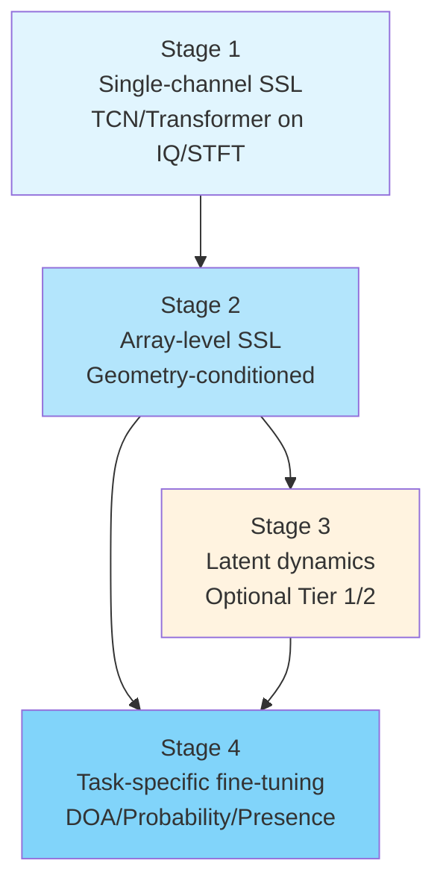

# Training And Adaptation Strategy

> Split from `docs/research_framework.md`. This file covers self-supervised stages, objectives, augmentations, fine-tuning, and geometry adaptation.

## 12. Self-Supervised Training Strategy

The framework uses self-supervised learning before supervised fine-tuning.

### 12.1 Stage 1: Single-Channel Self-Supervised Pretraining



The first stage trains the single-channel encoder on unlabeled hydrophone-channel data.

The recommended first baseline for this stage is a TCN encoder trained on IQ or analytic-signal windows with a masked signal modeling objective. This baseline should be established before evaluating Transformer, CNN + TCN, contrastive, or hybrid objectives.

Advanced encoder families should be staged by risk. Conformer-lite and CNN-augmented Transformer variants are Base-scale Tier 1 candidates after the first TCN masked-modeling baseline is stable. wav2vec 2.0 / HuBERT-style transfer, AST-like encoders, S4, Mamba, Mamba-2, and Hyena remain Tier 2 candidates until Tier 0 and Tier 1 evidence exists.

Candidate objectives:

- masked signal modeling as the preferred first objective;
- masked time-frequency modeling;
- data2vec-style contextual latent prediction as the first advanced SSL bridge after masked modeling;
- JEPA-style next-embedding prediction as a later Tier 2 objective;
- contrastive learning as a comparison baseline;
- hybrid masked plus contrastive learning as a follow-up objective;
- denoising prediction;
- temporal consistency learning.

#### Stage 1 Data Sampling and Curriculum Strategy

Pre-training data in this framework is inherently imbalanced across signal families, SNR regimes, BELLHOP environment types, and array geometries. Naive uniform or empirical-frequency sampling allows dominant conditions (e.g., CW signals at high SNR from common environment configurations) to swamp minority conditions, degrading representation quality for rare but physically important scenarios.

Therefore, pre-training and fine-tuning should use a **cluster-aware sampling strategy** analogous to cluster-level data balancing in large-scale multilingual speech SSL (GigaAM Multilingual, arXiv:2607.10371). The procedure is:

1. **Cluster construction:** Group training examples into acoustic clusters based on:
   - Signal family (CW, LFM chirp, NLFM chirp, broadband pulse, impulsive transient, band-limited noise burst);
   - SNR/SIR regime (clean, white noise, colored noise, narrowband interference, acoustic interferer);
   - BELLHOP environment family (e.g., shallow vs. deep water, high vs. low sound-speed gradient, soft vs. hard bottom).

2. **Cluster-level sampling weights:** Assign sampling probabilities at the cluster level, not per example. Head clusters (high empirical frequency) are down-weighted; tail clusters are up-weighted. The exact weight vector must be treated as a hyperparameter and reported.

3. **Domain-aware fine-tuning sampling:** Within each cluster, explicitly balance sub-domains. For example, within the "Kazakh" cluster, balance open-source, synthetic, and weakly-supervised subsets so that large synthetic subsets do not dominate spontaneous or real-recorded conditions.

This strategy is especially critical for label-efficiency experiments (10%/50% label budgets), where a small labeled subset can be severely skewed if sampling is not cluster-aware.

**Clustering algorithm:** For cluster construction over BELLHOP environment families or acoustic condition groups, community-detection methods such as the Clauset-Newman-Moore greedy modularity maximization algorithm (Phys Rev E 2004) may be used to partition a similarity graph into acoustic clusters. Edge weights in the similarity graph should reflect acoustic condition co-occurrence or parametric distance, normalized by individual condition frequency to prevent high-frequency conditions from dominating cluster formation.

#### Stage 1 Objective Family: Masked Signal or Masked Feature Modeling

This is the preferred first Stage 1 objective because it is simple, label-free, and directly tests whether the single-channel encoder can recover local hydroacoustic signal structure from partial context.

For IQ or analytic-signal inputs, the model receives a time chunk with masked spans and predicts either:

- the masked complex samples or analytic-signal patches;
- low-dimensional latent targets computed from the unmasked clean chunk;
- summary features such as local energy, envelope, phase increment, or frequency-slope targets, when raw reconstruction proves too sensitive to irrelevant sample-level detail.

For STFT or CWT inputs, the model receives a masked time-frequency or time-scale patch and predicts:

- masked magnitude or complex coefficients;
- masked phase representation, if phase is represented explicitly;
- latent patch embeddings produced by a target encoder.

Raw reconstruction should be treated as a diagnostic baseline rather than the final objective if it encourages the model to spend capacity on sample-perfect reconstruction without improving downstream DOA. The preferred first implementation is therefore:

```text
corrupted single-channel chunk
        ↓
single-channel encoder
        ↓
masked-region predictor
        ↓
masked latent or feature target
```

Required controls:

- mask length and mask ratio defined in physical time;
- identical masking policy across IQ, STFT, and CWT comparisons where possible;
- no channel-independent random time shifts when the same encoder is later used in array-level training;
- report reconstruction loss separately from downstream probe performance.

This objective is inspired by masked audio representation learning families such as wav2vec 2.0 and HuBERT, but it must be adapted to hydroacoustic IQ, STFT, or CWT inputs rather than copied as a speech-recognition recipe.

#### Stage 1 Objective Family: Contrastive Predictive Learning

Contrastive learning is a comparison baseline, not the preferred first objective. It is useful for testing whether the encoder learns representations that distinguish future or related chunks from unrelated chunks.

The hydroacoustic adaptation should use physically meaningful positives and carefully controlled negatives:

- positive pair: two views of the same physical-time chunk, adjacent chunks from the same source event, or context and future chunk from the same recording segment;
- in-batch negatives: chunks from different source signals, environments, source bearings, or non-overlapping time intervals;
- hard negatives: same signal family but different DOA or different BELLHOP environment.

The basic pattern follows contrastive predictive coding:

```text
context chunks up to time t
        ↓
context encoder / temporal model
        ↓
context embedding
        ↓
predict future latent target among negatives
```

Candidate losses:

- InfoNCE or CPC-style contrastive loss;
- supervised-free temporal contrast over future chunks;
- optional angularly stratified negative sampling in BELLHOP-only diagnostic studies, while ensuring labels are not used by the model input.

Risks:

- the model may separate signal family or SNR rather than DOA-relevant morphology;
- negatives sampled from different environments may encourage environment-ID discrimination;
- channel or recording identity may leak into the representation.

Diagnostics should include nearest-neighbor retrieval by signal family, SNR, source bearing, environment ID, and source seed. A good contrastive representation should not be useful only because it memorizes synthetic source or environment identity.

#### Stage 1 Objective Family: wav2vec 2.0-Style Quantized Latent Prediction

A wav2vec 2.0-style objective may be evaluated after the masked-modeling baseline is stable and the project has enough unlabeled BELLHOP-generated or real hydroacoustic data to justify larger pretraining.

The hydroacoustic adaptation is:

```text
single-channel IQ / analytic / STFT feature sequence
        ↓
feature encoder
        ↓
masked latent sequence
        ↓
context network
        ↓
contrastive prediction of quantized target latent
```

The target quantizer must be learned or fitted on hydroacoustic features, not inherited from speech. The protocol must report:

- quantizer type and codebook size;
- whether targets are learned jointly or precomputed;
- mask span duration in seconds;
- number and source of negatives;
- whether the objective is applied to IQ, STFT, CWT, or latent features.

This objective should be considered high-cost and data-hungry. It is not part of the minimum viable claim set unless a simpler Stage 1 baseline already shows that single-channel pretraining improves downstream DOA or label efficiency.

#### Stage 1 Objective Family: HuBERT-Style Hidden-Unit Prediction

A HuBERT-style objective replaces raw reconstruction with prediction of clustered hidden units over masked regions. It is attractive when raw waveform or STFT reconstruction is too low-level, but it introduces a new dependency: the quality and stability of unsupervised clusters.

The hydroacoustic adaptation is:

```text
unlabeled single-channel chunks
        ↓
offline feature extraction
        ↓
unsupervised clustering into hydroacoustic hidden units
        ↓
masked encoder training to predict cluster IDs
```

Candidate cluster sources:

- IQ or analytic-signal encoder features from a preliminary masked-modeling model;
- STFT or CWT patch embeddings;
- handcrafted diagnostic features such as envelope, spectral centroid, bandwidth, or chirp-rate features, used only for cluster construction and reported explicitly.

Required diagnostics:

- cluster occupancy and collapse checks;
- cluster stability across random seeds;
- cluster association with signal family, SNR, source seed, environment ID, and source presence;
- downstream head-only probe comparison against masked-modeling and supervised-from-scratch baselines.

This objective must not be described as discovering universal hydroacoustic units unless cluster stability and downstream usefulness are demonstrated.

#### Stage 1 Objective Family: data2vec-Style Contextual Latent Prediction

A data2vec-style objective predicts contextual latent representations from a masked view, using teacher targets from the full input. This is conceptually close to the framework's latent-prediction direction and avoids discrete cluster design.

The hydroacoustic adaptation is:

```text
masked single-channel view
        ↓
student encoder
        ↓
student latent

full or weakly corrupted single-channel view
        ↓
EMA teacher encoder
        ↓
contextual target latent
```

The student predicts teacher latents for masked regions or masked chunks. Candidate losses are cosine distance, normalized L2, or Smooth L1 on normalized latents, with variance/covariance regularization when collapse appears.

This objective is a candidate bridge between Stage 1 masked modeling and Stage 1 JEPA-style next-embedding prediction. It should be evaluated only after the simple masked-modeling baseline is stable.

#### Stage 1 Objective Family: Denoising and Corrupted-Input Prediction

Denoising SSL trains the encoder to preserve source-relevant structure under corruption. It is useful for hydroacoustic data only if corruptions are physically plausible.

Allowed corruptions:

- additive white or colored sensor noise;
- bounded gain variation;
- weak narrowband interference;
- mild band-limited dropout;
- real-noise augmentation when the real-noise split policy prevents recording-identity leakage.

Disallowed or restricted corruptions:

- arbitrary phase randomization;
- independent time shifts that would destroy later array-level delay cues;
- strong frequency warping with no physical justification;
- noise mixing that creates impossible spatial scenes.

Targets may be clean features, clean latent embeddings, or weakly corrupted teacher embeddings. The objective should be evaluated by downstream robustness under held-out noise and interference, not only by denoising loss.

#### Stage 1 Objective Family: Temporal Consistency

Temporal consistency encourages nearby chunks from the same physical event to have compatible representations while preserving meaningful changes such as onset, offset, chirp evolution, or source motion.

Candidate forms:

- consistency between overlapping views of the same chunk;
- smoothness penalty between adjacent chunk embeddings;
- predictive consistency between context and future latent;
- event-boundary-aware consistency where onset/offset regions are excluded or down-weighted.

This objective should remain weak. If it dominates training, it can over-smooth transient or moving-source cues needed by Stage 3 and source-presence heads.

#### Stage 1 Advanced Objective: JEPA-Style Next-Embedding Prediction

The most promising advanced Stage 1 objective is V-JEPA-inspired next-embedding prediction for single-channel IQ, STFT, or CWT chunk sequences. The model should predict the latent representation of a next or future chunk, not reconstruct the raw chunk itself.

The basic training pattern is:

```text
chunk_t
        ↓
online single-channel encoder
        ↓
embedding_t
        ↓
predictor
        ↓
predicted_embedding_t+1

chunk_t+1
        ↓
target single-channel encoder
        ↓
stop-gradient target_embedding_t+1
```

The target encoder should use stop-gradient targets. An EMA teacher is the preferred target-encoder mechanism for this objective, because it provides a more stable prediction target and reduces collapse risk.

The objective may be applied to:

- IQ or analytic waveform chunks;
- STFT time-frequency windows or patches;
- CWT time-scale windows or patches.

Candidate prediction losses include:

- cosine distance between normalized predicted and target embeddings;
- normalized L2 or MSE loss;
- Smooth L1 loss;
- additional variance or covariance regularization if collapse is observed.

The first version should use one-step prediction. Follow-up variants should evaluate:

- multi-horizon prediction, for example `t+1`, `t+2`, and `t+4`;
- temporal-gap prediction, where the target chunk is separated from the context by a gap;
- masked chunk prediction inside a longer context window;
- bidirectional or context-window prediction, if it does not conflict with downstream causal or real-time constraints.

This objective is compatible with real unlabeled single-channel recordings. It does not require DOA labels or BELLHOP ground truth. Real recordings used for this stage must still be split by independent recording session, day, environment, or device rather than by random overlapping windows.

Stage 1 encoder quality must be verified through:

- embedding variance, covariance, and collapse diagnostics;
- nearest-neighbor diversity in embedding space;
- shallow probes for signal activity, signal family, or SNR regime when labels or synthetic metadata are available;
- downstream comparison after array-level training;
- explicit checks that timing-sensitive and phase-sensitive information has not been discarded.

Candidate augmentations:

- masking;
- additive noise;
- amplitude scaling;
- variable window sampling;
- window cropping;
- common time shifts, if physically justified;
- phase jitter, if physically justified;
- mild frequency perturbation, if physically justified.

Augmentations must be checked for physical validity. Transformations that destroy DOA-relevant timing, phase, or coherence information must not be applied independently across channels in array-level training. The single-channel SSL stage should not train the encoder to discard information that the geometry-conditioned array encoder needs later for DOA estimation.

### 12.2 Stage 2: Array-Level Self-Supervised Pretraining

The second stage trains the geometry-conditioned array encoder on per-hydrophone outputs produced by the single-channel encoder, together with geometry metadata.

Candidate objectives:

- masked channel prediction as the first baseline;
- masked sensor prediction as the first baseline;
- cross-channel signal reconstruction as a spatial-acoustic pretext objective;
- data2vec-style or BYOL-style teacher-student alignment as the first advanced array-level SSL bridge after masked sensor prediction;
- DINOv3-inspired array-level teacher-student self-distillation as a later Tier 2 objective;
- spatial contrastive learning as a comparison objective;
- cross-channel consistency;
- cross-spectral prediction as an auxiliary objective over learned tokens, not as an input feature;
- inter-channel phase prediction as an auxiliary objective over learned tokens, not as an input feature;
- teacher-student representation alignment;
- geometry-conditioned latent prediction.

#### Stage 2 Baseline: Masked Sensor or Channel Prediction

The first Stage 2 baseline should mask one or more hydrophone channels and train the geometry-conditioned array encoder to predict their latent representations from visible per-channel encoder outputs and geometry metadata.

The prediction target may be:

- a masked-channel latent embedding;
- a masked-channel temporal feature map;
- STFT or CWT latent patches for the masked channel;
- pairwise relation tokens between the masked sensor and visible sensors.

This baseline directly tests whether the array encoder uses inter-channel structure and geometry rather than only aggregating independent single-channel embeddings.

#### Stage 2 Objective Family: Cross-Channel Signal Reconstruction

Cross-channel signal reconstruction is a strong Stage 2 candidate because it directly forces the model to use information from other hydrophones and geometry metadata to infer missing information in one channel. It is inspired by spatial acoustic SSL work that masks part of one channel and reconstructs it from the remaining multi-channel observation.

The hydroacoustic adaptation should operate on Stage 1 encoder outputs, not raw handcrafted spatial features:

```text
visible hydrophone latents
+ sensor geometry
+ masked target hydrophone identity and coordinates
        ↓
geometry-conditioned array encoder
        ↓
masked-channel decoder / predictor
        ↓
target hydrophone latent, patch, or feature map
```

Possible targets:

- masked hydrophone latent sequence from the frozen or EMA single-channel encoder;
- masked STFT or CWT latent patches;
- masked-channel phase-increment or delay-sensitive auxiliary targets;
- pairwise relation token between the masked hydrophone and visible hydrophones.

This objective is most useful when the masked channel is predictable from the propagation geometry and other channels. It is less useful if the masked target is dominated by sensor-local noise that cannot be inferred from the array.

Required controls:

- mask target hydrophones across all sensor positions, not only fixed indices;
- randomize channel order and pass the permutation canary before reporting results;
- compare against a no-geometry reconstruction model;
- report reconstruction error by sensor position, source angle, SNR, and BELLHOP environment.

#### Stage 2 Objective Family: Spatial Contrastive Learning

Spatial contrastive learning tests whether the array encoder can learn representations that preserve both "what" signal is present and "where" it appears in the array. It should be treated as a comparison objective because contrastive losses are sensitive to augmentation and negative-sampling policy.

Positive views may include:

- weakly corrupted views of the same array scene;
- different subarrays from the same scene, if enough sensors remain for DOA;
- masked-sensor and full-sensor views of the same scene;
- same physical scene under bounded sensor gain or noise perturbations.

Negative views may include:

- different source DOA in the same BELLHOP environment;
- different source signal with the same DOA;
- different BELLHOP environment with similar DOA;
- noise-only or interference-only scenes when source-presence learning is included.

The protocol must avoid positives that destroy DOA cues. In particular, independent per-channel time shifts, phase randomization, or arbitrary channel shuffling without corresponding geometry permutation are invalid augmentations.

Candidate losses:

- InfoNCE over global array-scene embeddings;
- supervised-free contrast over masked/full array views;
- multi-positive contrast across valid subarrays of the same scene;
- optional VICReg-style variance/covariance terms to reduce collapse risk.

Diagnostics:

- retrieval by DOA sector, signal family, SNR, environment ID, and geometry ID;
- held-out geometry transfer under head-only probing;
- check that environment-ID or source-seed memorization is not the main source of contrastive success.

#### Stage 2 Advanced Objective: DINOv3-Inspired Array Self-Distillation

The main advanced Stage 2 objective should be DINOv3-inspired teacher-student self-distillation for multi-channel hydrophone array representations built from per-channel encoder outputs. This is an array-domain adaptation of self-distillation ideas from vision SSL, not a direct application of DINOv3 and not evidence of hydroacoustic DOA performance by itself.

The intended training pattern is:

```text
Teacher view:
full or weakly corrupted per-channel encoder outputs
+ full geometry metadata
        ↓
EMA teacher array encoder
        ↓
stop-gradient target array-scene embedding / sensor tokens / pairwise structure

Student view:
masked or corrupted per-channel encoder outputs
+ same geometry metadata
        ↓
online student array encoder
        ↓
student array-scene embedding / sensor tokens
```

The student should match the stop-gradient teacher targets. The teacher should be an EMA version of the student unless a protocol justifies another target-encoder mechanism.

Candidate teacher targets include:

- global array-scene embedding;
- per-sensor tokens;
- pairwise sensor-relation tokens;
- geometry-aware pairwise relation tokens;
- sensor-token similarity or Gram matrix, inspired by dense DINOv3-style feature stabilization.

The first version should use weak teacher corruption and stronger student corruption:

- teacher: full sensor set or weak sensor/noise corruption;
- student: masked sensors, sensor dropout, subarray masking, bounded gain perturbation, or SNR degradation;
- both views: identical geometry metadata after applying any channel permutation.

The objective must include collapse diagnostics. DINO-style centering/sharpening, BYOL-style EMA targets, data2vec-style contextual teacher targets, or VICReg-style variance/covariance penalties may be used as stabilization mechanisms, but each stabilization mechanism must be reported as part of the objective rather than treated as an implementation detail.

This objective becomes a valid claimed contribution only after the masked-sensor or cross-channel reconstruction baseline has demonstrated useful geometry-conditioned representations.

#### Stage 2 Objective Family: Spatial HuBERT / Hidden Spatial Unit Prediction

A Spatial-HuBERT-style objective can be evaluated when the project wants discrete spatial-acoustic targets without DOA labels. It clusters multi-channel or array-level features and trains the array encoder to predict masked hidden units.

Candidate hidden-unit sources:

- clustered Stage 2 array-scene latents from a preliminary masked-sensor model;
- clustered pairwise relation tokens;
- clustered spatial features computed from simulated metadata for diagnostic purposes, reported explicitly and not used as privileged model input;
- clustered acoustic-map embeddings, if an acoustic-map branch is evaluated.

Training pattern:

```text
masked or corrupted array view
+ geometry metadata
        ↓
array encoder
        ↓
predict hidden spatial unit IDs over masked sensors / windows / relation tokens
```

Risks:

- clusters may encode environment ID, array topology, or source family rather than reusable spatial structure;
- cluster assignments may be unstable across seeds;
- discrete targets may hide continuous DOA ambiguity.

Required diagnostics:

- cluster occupancy and entropy;
- association of clusters with DOA, environment, geometry, signal family, and SNR;
- head-only DOA probe comparison against continuous latent-prediction alternatives.

#### Stage 2 Objective Family: Geometry-Conditioned Latent or Acoustic-Map Prediction

A geometry-conditioned latent prediction objective asks the array encoder to predict a spatial representation under a specified geometry. This is related to recent self-supervised acoustic-map ideas, but the hydroacoustic version must stay within the framework's information constraints.

Possible targets:

- array-scene latent under a full-sensor teacher view;
- sensor-token or pairwise-token field under masked/subarray student views;
- coarse angular acoustic map produced by a non-privileged beamforming or SRP-style teacher;
- latent acoustic map embedding, if the experiment explicitly introduces an acoustic-map branch.

The teacher must not use privileged BELLHOP labels or oracle environment information unless the target is clearly labeled as a privileged upper-bound diagnostic. If a classical beamformer or SRP map is used as a teacher, the report must state which geometry, sound-speed, and steering-grid assumptions the teacher uses.

This objective is useful for connecting learned representations to interpretable spatial maps, but it should not replace direct comparison against classical baselines.

#### Stage 2 Auxiliary Objectives: Phase, Delay, Cross-Spectrum, and Coherence Prediction

Auxiliary objectives may predict DOA-relevant inter-channel structure from learned tokens without feeding handcrafted spatial features as primary Stage 2 inputs.

Allowed auxiliary targets:

- inter-channel phase-difference class or regression target over selected frequency bands;
- bounded TDOA or delay-bin target;
- pairwise coherence target;
- cross-spectrum latent summary;
- sensor-token similarity target.

These targets should be used carefully:

- if computed from the same inputs, they are self-supervised diagnostics rather than labels;
- if computed from BELLHOP metadata or oracle DOA, they become supervised or privileged diagnostic targets and must be reported separately;
- they must not leak source DOA labels into a pretraining objective that is claimed as label-free.

The preferred first use is as an auxiliary diagnostic head with a small loss weight, not as the main Stage 2 training objective.

#### Stage 2 Corruption and Augmentation Policy

The student view may use physically meaningful array-level corruptions:

- random channel masking;
- random sensor dropout;
- subarray masking;
- SNR degradation;
- additive noise;
- channel fading or attenuation;
- sensor gain perturbation;
- partial channel corruption;
- missing-channel simulation.

Phase distortion, phase jitter, timing jitter, and per-channel delay perturbation are allowed only as bounded sensor calibration or synchronization error simulations. They must not be used as generic invariance augmentations, because they may destroy DOA-relevant inter-channel phase and delay structure.

The teacher view should be full or only weakly corrupted. Strong corruptions should be applied primarily to the student view so that the teacher remains a stable target for array-scene structure.

#### Stage 2 Diagnostics

Stage 2 training must include diagnostics that verify array-level representation quality:

- embedding variance, covariance, and active-dimension checks;
- masked-sensor latent prediction quality;
- phase and delay preservation checks;
- inter-channel coherence preservation checks;
- geometry-transfer probes on held-out ULA, square, or rectangular arrays;
- downstream DOA comparison after supervised fine-tuning;
- evaluation under SNR degradation, missing sensors, and held-out BELLHOP environments.

### 12.3 Stage 3: Predictive Latent Dynamics

The third stage trains the latent dynamics module after Stage 2 has produced a sequence of geometry-conditioned array-scene latent states.

The first Stage 3 protocol should freeze the single-channel encoder and the geometry-conditioned array encoder. Only the dynamics module should be trained. This prevents Stage 3 from overwriting Stage 1 temporal signal features or Stage 2 geometry-aware aggregation.

First baselines:

- no dynamics;
- temporal average pooling over scene latents;
- temporal attention pooling over scene latents;
- small TCN over scene latents;
- small GRU or recurrent block over scene latents.

Candidate objectives:

- predict the next array-scene latent state;
- predict multiple future array-scene latent states;
- predict masked scene-latent tokens;
- maintain consistency between predicted and observed scene latents;
- refine the current scene latent with a residual temporal update.

#### Stage 3 Objective Family: One-Step Scene-Latent Prediction

The simplest learned Stage 3 objective predicts the next array-scene latent from the current or recent latents. It tests whether scene-level temporal structure adds value beyond Stage 1 within-channel temporal modeling and Stage 2 within-window array aggregation.

Training pattern:

```text
z_scene[t-k : t]
        ↓
small temporal module
        ↓
predicted z_scene[t+1]

stop-gradient target z_scene[t+1]
```

The first version should freeze Stage 1 and Stage 2. Targets should be produced by the frozen or EMA Stage 2 array encoder on the future chunk. The prediction horizon must be defined in physical time, not only in chunk indices.

Candidate losses:

- cosine distance between normalized predicted and target scene latents;
- normalized L2 or Smooth L1;
- weak variance/covariance regularization if collapse appears.

The objective should be considered successful only if it improves downstream DOA stability or robustness without degrading source onset, offset, or moving-source behavior.

#### Stage 3 Objective Family: Multi-Horizon Scene-Latent Prediction

Multi-horizon prediction asks the dynamics module to predict multiple future scene latents, for example `t+1`, `t+2`, and `t+4`, with horizons expressed in seconds.

This objective is useful for separating:

- short-term smoothing of noisy latents;
- medium-term source-motion continuity;
- longer-horizon scene evolution under changing SNR, source activity, or interference.

The protocol should report loss and downstream performance separately by horizon. A model that improves only the shortest horizon may simply be learning local smoothness.

#### Stage 3 Objective Family: Masked Scene-Latent Modeling

Masked scene-latent modeling hides one or more latents inside a temporal context and trains the Stage 3 module to infer them from surrounding scene latents.

Training pattern:

```text
z_scene[t-3], z_scene[t-2], MASK, z_scene[t], z_scene[t+1]
        ↓
temporal module
        ↓
predicted z_scene[t-1]
```

This can be non-causal and therefore must be clearly separated from any future real-time or causal deployment claim. It is useful as a representation-quality objective and as a diagnostic for temporal structure, but not as proof of causal tracking performance.

#### Stage 3 Objective Family: Residual Temporal Refinement

Residual refinement predicts a small correction to the current scene latent rather than replacing it:

```text
z_refined[t] = z_scene[t] + delta_t
```

This is preferred for first experiments because it reduces the risk of destroying Stage 2 geometry-aware information. Candidate training signals include:

- consistency between refined current latent and a cleaner teacher latent;
- reduced jitter under static-source scenes;
- robustness to missing or corrupted windows;
- improved source-presence stability under intermittent noise.

The residual magnitude should be monitored. If the residual dominates the original Stage 2 latent, the module is no longer a lightweight dynamics refinement and should be treated as a different architecture.

#### Stage 3 Objective Family: Temporal Consistency and Contrastive Preservation

Temporal consistency losses can regularize Stage 3 so that nearby scene latents are stable when the physical scene is stable. Contrastive preservation can keep the refined or predicted latent tied to the current scene identity.

Allowed forms:

- weak smoothness between adjacent refined latents under static-source conditions;
- consistency between overlapping context windows;
- contrastive loss that keeps latents from the same scene trajectory close while separating different source trajectories or environments.

Risks:

- over-smoothing moving sources;
- suppressing impulsive transients;
- hiding source onset/offset changes;
- memorizing synthetic trajectory generator artifacts.

The loss must be weak and evaluated against event-aware tests. Stage 3 should not be reported as beneficial unless it improves at least one temporal robustness metric without harming event or moving-source metrics.

Candidate losses:

- cosine distance between predicted and target scene latents;
- normalized L2 or MSE between predicted and target scene latents;
- temporal consistency loss;
- latent preservation loss for residual refinement;
- variance or covariance regularization if collapse appears.

Stage 3 diagnostics should include:

- prediction error by horizon;
- temporal jitter reduction under static-source conditions;
- over-smoothing checks on source onset, offset, and impulsive transients;
- source presence detection performance;
- downstream DOA performance with and without dynamics;
- performance under missing or corrupted windows.

### 12.4 Stage 4: Task-Specific Fine-Tuning

Stage 4 attaches supervised task heads to the pretrained backbone produced by Stage 1, Stage 2, and optionally Stage 3.

The Stage 4 input is the learned latent representation from the shared backbone:

```text
Stage 1 single-channel encoder
+ Stage 2 geometry-conditioned array encoder
+ optional Stage 3 latent dynamics
        ↓
task-specific heads
```

Stage 4 should not bypass the single-channel encoder or the geometry-conditioned array encoder. Its role is to adapt the learned representation to labeled DOA-related tasks.

The core Stage 4 outputs are:

- DOA regression;
- angular probability-map estimation;
- source presence detection.

The Stage 4 adaptation ladder should include:

1. **Linear or head-only probing**  
   The full backbone is frozen and only a minimal task head is trained. This is the primary test of whether the pretrained representation already contains DOA-relevant information.

2. **Head-only nonlinear fine-tuning**  
   The backbone remains frozen, but a stronger nonlinear head is trained. Candidate heads may include MLP, lightweight temporal, or multi-task heads.

3. **Adapter tuning**  
   The backbone is frozen or nearly frozen, and lightweight adapters are trained. Candidate adapters include bottleneck adapters, LoRA-like adapters, geometry adapters, task adapters, and noise-domain adapters.

4. **Partial fine-tuning**  
   Only selected parts of the backbone are unfrozen. Candidate variants include Stage 3 only, Stage 2 plus heads, final Stage 1 blocks, normalization layers, or geometry adapters.

5. **Gradual unfreezing**  
   Fine-tuning starts with task heads and then progressively unfreezes Stage 3, Stage 2, and only then selected Stage 1 blocks if necessary.

6. **Calibration-only tuning**  
   The backbone and main heads remain frozen while temperature scaling, confidence thresholds, probability-map calibration, or source-presence thresholds are tuned.

7. **Full end-to-end fine-tuning**  
   The full backbone and heads are unfrozen. This mode may be used as an upper-bound comparison, but it should not be the primary evidence for lightweight adaptation or geometry transfer.

Stage 4 training modes should include:

- supervised training from scratch as a neural baseline;
- SSL-pretrained frozen backbone with heads trained from labels;
- SSL-pretrained backbone with adapter tuning;
- SSL-pretrained backbone with partial fine-tuning;
- semi-supervised fine-tuning when labeled DOA data are limited;
- domain-adaptive fine-tuning for new geometries, noise domains, Novik Bay benchmark data, or later real recordings.

Semi-supervised Stage 4 training may combine a labeled DOA subset with unlabeled BELLHOP-generated data, real-noise-augmented data, or real recordings. Candidate methods include consistency regularization, pseudo-labeling, teacher-student refinement, confidence filtering, entropy minimization for angular probability maps, and self-training.

The loss functions should be tied to the downstream heads:

- DOA regression may use circular angular loss, sine/cosine representation loss, direction-vector loss, or angular-bin offset loss;
- angular probability maps may use cross-entropy, negative log-likelihood, soft-label distribution loss, and calibration-aware evaluation;
- source presence detection may use binary cross-entropy or focal loss when source-present and source-absent windows are imbalanced;
- multi-task fine-tuning may combine regression, probability-map, and source-presence losses with explicit loss weights.

Each Stage 4 protocol must report:

- which backbone stages are frozen or trainable;
- which adapters, heads, and calibration parameters are trainable;
- the amount of labeled data used;
- whether unlabeled data are used during fine-tuning;
- the loss functions and loss weights;
- whether fine-tuning is performed on BELLHOP simulation, real-noise-augmented BELLHOP data, Novik target benchmark data, or real recordings.

---

## 13. Geometry Adaptation Protocol

The framework must explicitly evaluate adaptation to hydrophone array geometry.

Recommended evaluation scenarios:

| Scenario | Purpose |
|---|---|
| Same geometry, new noise | Test noise robustness |
| Same geometry, new source type | Test source generalization |
| Same geometry, new environment | Test channel generalization |
| New geometry, no fine-tuning | Test zero-shot geometry transfer |
| New geometry, head-only tuning | Test lightweight task adaptation |
| New geometry, adapter tuning | Test geometry adaptation without full retraining |
| New geometry, partial fine-tuning | Test moderate adaptation |
| New geometry, full fine-tuning | Establish upper bound |

The claim that the model can adapt to a specific array without full retraining is valid only if the framework includes explicit experiments on unseen or modified geometries.

For the initial experiments, the geometry-adaptation protocol should use simple array families such as ULA and square or rectangular arrays. At minimum, future protocols should define:

- which array geometries are used during training;
- which array geometries are held out for transfer testing;
- whether the held-out geometry changes only sensor spacing or also array topology;
- whether the geometry transfer test uses zero-shot inference, head-only tuning, adapter tuning, partial fine-tuning, or full fine-tuning;
- the amount of labeled data allowed for each adaptation mode;
- the metric threshold or relative improvement required to call geometry adaptation successful.

Claims about adaptation to arbitrary hydrophone arrays are not supported by this framework unless experiments include sufficiently diverse held-out geometries and explicit adaptation-budget comparisons.

The initial geometry-transfer study should include:

- train on ULA and test on square or rectangular arrays;
- train on square or rectangular arrays and test changed spacing;
- test a held-out topology not used during training;
- test same topology with changed aperture;
- test missing sensors and subarray inference;
- test sensor-coordinate perturbations that represent bounded calibration error.

Each held-out geometry test should be evaluated under the following adaptation modes:

- zero-shot inference;
- head-only tuning;
- geometry-adapter tuning;
- partial array-encoder fine-tuning;
- full fine-tuning as an upper bound.

Geometry adaptation should be judged using:

- performance degradation relative to same-geometry evaluation;
- improvement over a no-geometry-input baseline;
- performance gap to full fine-tuning;
- robustness under missing sensors;
- robustness under SNR degradation;
- consistency across held-out BELLHOP environments.

The geometry-conditioned backbone should be considered successful only if it improves over no-geometry baselines and reduces the gap to full fine-tuning under at least one held-out topology or changed-aperture scenario.

---
