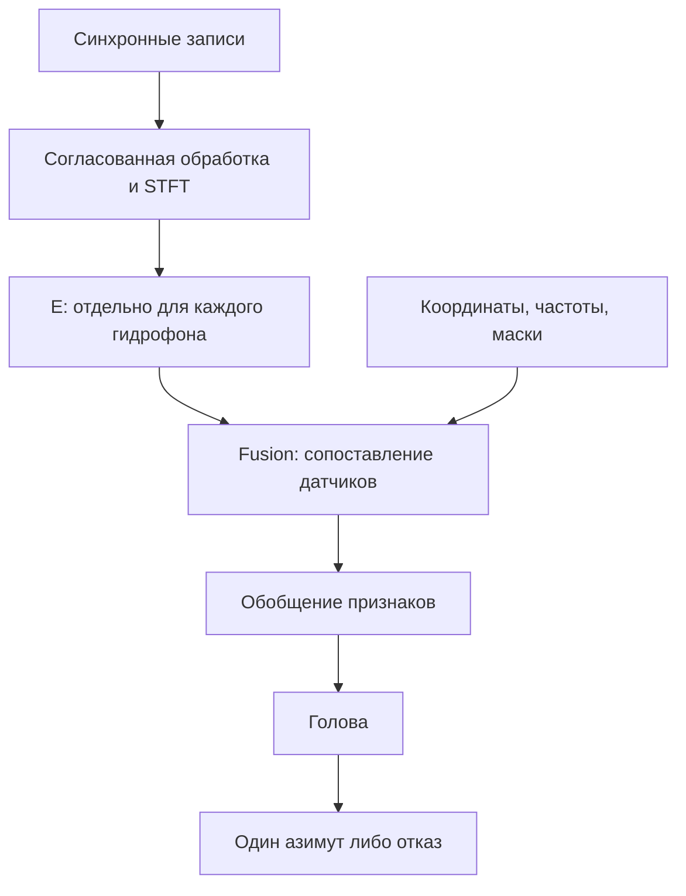
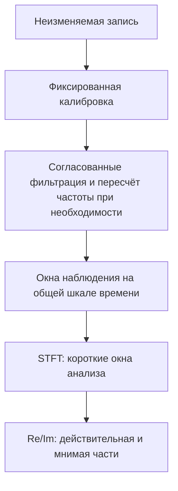
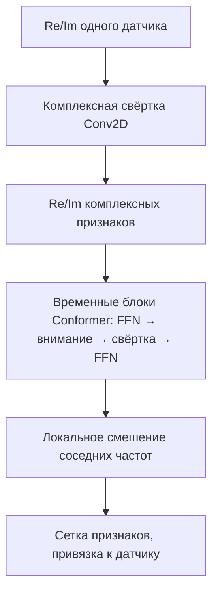
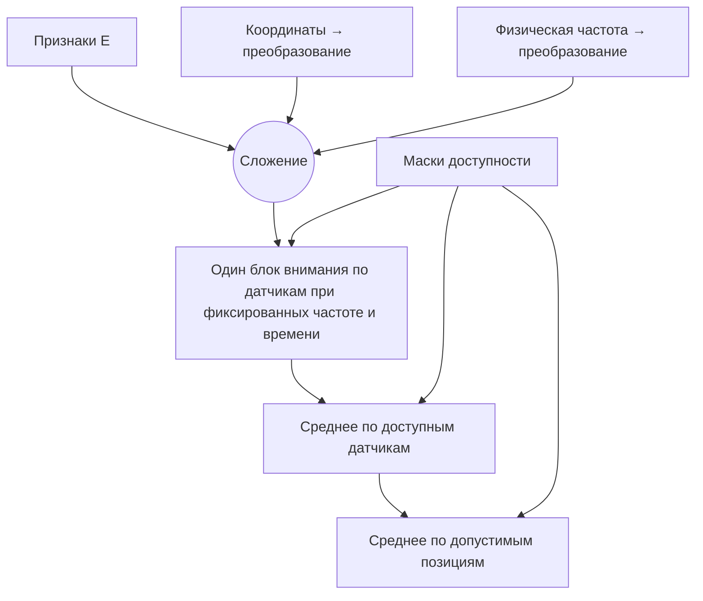
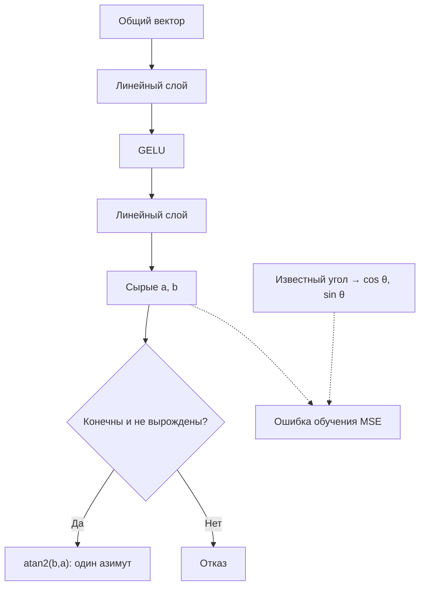
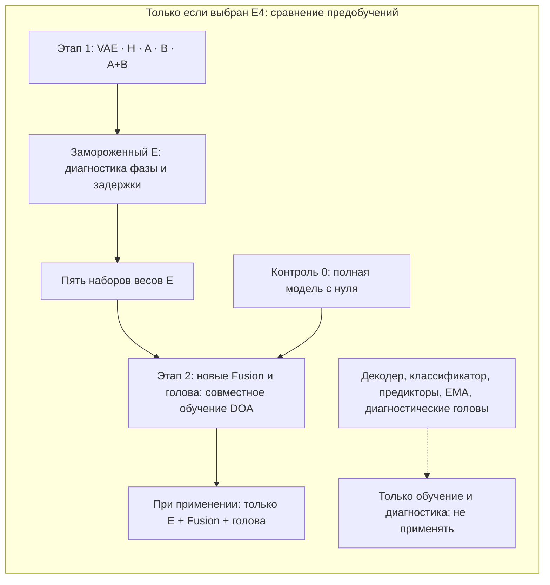

# Оценка азимута подо льдом: краткая сводка проекта

## Задача и результат проекта

Проект исследует, как определить **один азимут одного подводного источника** по синхронным записям линейной решётки гидрофонов. Направление прихода звука называют DOA (Direction of Arrival). Компактный нейросетевой оцениватель сравнят с классическими методами на контролируемой симуляции и на **обязательных подлёдных измерениях зимой 2026–2027 годов** в бухте, на одной фактически измеренной линейной решётке. Результатом должны стать данные с проверенной разметкой, сравнение точности и отказов, анализ ограничений и полный текст кандидатской диссертации **к 31.03.2027**.

**Это план, не отчёт о реализации.** Аппаратура, площадка, параметры сигнала и измерений ещё требуют подтверждения. Ни точность, ни преимущество нейросети, ни публикационные результаты не установлены. Срок полного текста не означает срок защиты или принятия статьи; требования к публикациям предстоит выяснить. Без пригодных зимних данных натурная часть не считается выполненной.

## Что необходимо согласовать для измерений

Численные настройки не выбираются по этой сводке: их подтверждают измерениями, испытанием тракта и протоколом до съёмки. Для каждого решения нужны доказательство, ответственный за согласование и действие при неудаче.

| Что нужно уточнить | Какое подтверждение нужно | Для чего |
|---|---|---|
| Линейная решётка: число и расположение гидрофонов, апертура, глубины | Обследование подводных координат и неопределённости; проверка линейности | Направление, сектор, задержки и пределы метода |
| Управляемый источник: тип, форма, полоса, длительность и повторяемость сигнала, глубины, дальности | Разрешение на излучение, пробная передача, журнал пусков и положений | Известный сигнал и истинное направление |
| Регистратор: общий такт, синхронность, дискретизация, формат, карта каналов | Открываемые пробные многоканальные файлы; проверка дрейфа и встроенной обработки | Сохранить межканальные фазу и задержку |
| Калибровка и обработка: усиление, полярность, фазовый отклик, фильтры и архив | Отдельные записи калибровки, проверка неизменяемых исходников и копий | Равный физический вход для методов |
| Подводная геометрия источника и приёмников | Способ обследования, единая система координат, оценка ошибки положения | Истинный азимут, сектор, дальнее поле и угол места |
| Среда, допуск к бухте и безопасность льда | Полевые разрешения, наблюдения условий и решение квалифицированной службы | Реальная осуществимость; безопасность важнее графика |
| Группы записей и доступ | План фона до/после передач, независимых выездов, отдельного закрытого теста и журнала доступа | Честная проверка без утечки в обучение |

Сырые файлы сохраняют неизменными, с контрольными суммами и проверяемыми копиями. Для каждой серии фиксируют калибровку, условия, неисправные каналы, подводные координаты и их ошибки. Часть независимых групп заранее резервируют для итоговой проверки; повторные передачи и окна внутри одного выезда не заменяют новых выездов.

## Когда можно определить азимут

Линейная решётка **не обязана быть равномерной**. Она главным образом наблюдает проекцию направления на свою ось: положения по разные стороны оси могут давать зеркально неоднозначный ответ. Нужен обследованный физически различимый сектор (например, известная полуплоскость источника), **общий для нейросетей и классических методов**. Ни координаты, ни обучение не восстанавливают отсутствующую информацию и не дают однозначного обзора на 360°.

Также угол места должен быть известен, фиксирован или ограничен измеренными глубинами и дальностями настолько, чтобы его влияние было допустимо. При неизвестном угле места даже выбранной полуплоскости недостаточно. Для модели дальнего поля проверяют измеренные дальности, апертуру и длины волн; иначе заранее объявляют ограничение условий или модель с учётом дальности. План лунок и поверхностный пеленг **не заменяют подводных положений источника и датчиков с неопределённостью**. Если условия не соблюдены, до итоговой оценки меняют формулировку результата на наблюдаемую проекцию/неоднозначное направление, а не подгоняют метки или прогнозы.

## Как устроен оцениватель

**Общий путь.** Первая модель использует измеренные координаты; контрольная обучается отдельно. У каждой свои веса E, Fusion и головы: рисунок показывает путь **одной** координатной модели, а не общую голову двух моделей.

*Схема 1. В контрольной модели координатная ветвь получает одинаковый нулевой вход; физическая частота и маски остаются.*

**Подготовка сигнала.** Обработка одинакова для всех гидрофонов и сохраняет общий временной, фазовый и амплитудный отсчёт. Приборные смещения часов корректируют, но **физическую задержку прихода не выравнивают** по датчикам. Окно наблюдения модели содержит несколько кадров короткого преобразования Фурье (STFT); это не одно и то же окно. Параметры фильтра, полосы, частоты дискретизации и STFT ещё предстоит обосновать.

*Схема 2. Сохраняют общий масштаб и отсчёт; численные настройки определяют после испытаний, не по рисунку.*

**Энкодер E.** Каждый гидрофон обрабатывается отдельно **одними и теми же весами внутри модели**. Вход — действительная и мнимая части STFT (Re/Im). Комплексная свёртка Conv2D сначала извлекает локальные признаки; их без потерь раскладывают на Re/Im. Затем вещественные блоки Conformer сопоставляют моменты времени **внутри текущего ограниченного окна отдельно на каждой частоте** и локально смешивают соседние частоты. Частотно-временная сетка остаётся до Fusion, вместе с привязкой к гидрофону. В E нет координат, междатчиковых связей и усреднения всего окна.

*Схема 3. В блоке две половинные ветви FFN с остаточными связями; внимание полное в пределах доступного окна. Комплексный стем и упаковка Re/Im **не гарантируют**, что последующие обучаемые блоки сохранят нужную фазу.*

**Fusion.** Для каждой одной и той же позиции частоты и времени он сравнивает **датчики**, не складывая все моменты в одну последовательность. Координаты центрируются по фиксированному правилу измеренной геометрии и делятся на **один общий физический масштаб длины**, а не на апертуру каждого примера. Отдельно кодируется физическая частота, одинаково для обеих моделей. Маски исключают отсутствующие датчики и недопустимые позиции. Сначала усредняют доступные датчики, затем допустимые частотно-временные позиции; при полностью пустом наблюдении получают отказ.

*Схема 4. Внимание и сеть FFN используют нормировку по компонентам признаков до блока (pre-LN) и остаточные связи. В контроле без координат преобразованию координат подают нулевую тройку, а частоту сохраняют; порядок каналов и скрытый номер места не сообщают геометрию.*

**Голова.** Из общего вектора линейный слой, нелинейность GELU и ещё один линейный слой получают два **сырых** числа `(a,b)`. Они приближают `(cos θ, sin θ)` и кодируют **один азимут θ, не две координаты источника**. Обучение минимизирует среднее по примерам от суммы квадратов отклонений этих чисел (MSE); перед этим выход не нормируют. MSE не равна угловой ошибке в градусах.

*Схема 5. Цель и пунктирные стрелки существуют только при обучении. Порог вырождения заранее фиксируют; длина вектора не считается уверенностью. Угол не подрезают под сектор, пустое наблюдение и неконечный выход — отказы, а не нулевой угол.*

Первый инженерный кандидат **E-M**: 48 комплексных / 96 вещественных признаков и четыре временных блока; Fusion — один блок с четырьмя головами, голова — **96→96→2**. Осуществимость, сохранение фазовых подсказок и точные размеры сетки ещё проверяют. **E-S** — меньший резерв при ограничении ресурсов; **E-L** — больший лишь при отдельном обосновании. До сравнения фиксируют **один** размер для обеих моделей и, если понадобится, всех вариантов предобучения.

## С чем сравниваем и как проверяем

| Метод | Статус | Что показывает |
|---|---|---|
| Координатная компактная модель | Обязательно | Основная оценка одного азимута |
| Та же структура без координат | Обязательно, контроль | Роль доступной геометрической информации, не превосходство над всеми нейросетями |
| MVDR/Capon | Обязательно | Направление с минимальной выходной мощностью при сохранении выбранного направления |
| MUSIC | Обязательно | Поиск направления по сигнальному и шумовому подпространствам |
| Bartlett | Диагностически | Проверка согласованного суммирования и физической настройки |

На контролируемой симуляции разрабатывают методы в независимо созданных акустических условиях измеренной линейной геометрии. **BELLHOP — только кандидат** для распространения звука: модель свободной поверхности сама по себе не проверенная модель льда. Затем методы оценивают на заранее закрытых независимых натурных группах; отдельно сообщают отличие симуляции от записи. Фиксированную измеренную геометрию и отдельную калибровку можно дать всем методам на заранее одинаковых условиях, но записи закрытого теста — даже без меток и с одним шумом — не идут в обучение, настройку симулятора или выбор метода.

Ошибка — круговое расстояние между истинным и предсказанным углом. По каждой группе показывают медиану, 95-й процентиль (p95), долю допустимых ответов и причины отказа. В **парном** сравнении на одинаковых допустимых примерах отказ получает **180°**; отдельно приводят ошибки только состоявшихся ответов. Для независимой группы сначала берут медиану ошибки с учётом отказов, затем среднее по повторным обучениям; группы сравнивают с равным весом, а MVDR и MUSIC — **по отдельности**. Окна и повторные обучения не увеличивают число независимых измерений. При малом числе выездов выводы остаются описательными.

До интерпретации результата проверяют сохранность межканальной фазы/задержки после **всего** E и Fusion, совместную перестановку каналов с координатами и масками, а также правильную привязку каналов к координатам. Это планируемые проверки, **не пройденные испытания**. Контроль без координат может дополнительно терять различимость направления на симметричной решётке; его выигрыш или проигрыш не доказывает универсального качества архитектуры.

## Предобучение — необязательное исследование

**E4 необязательно** и возможно лишь после защиты обязательных измерений, анализа и текста. На E4 отведено не более **пяти сосредоточенных рабочих дней суммарно** как предел работы, а не прогноз времени вычислений. Внутри E4 выбирают **один** из трёх взаимоисключающих вопросов: сравнение предобучений E; основной STFT против **одного** другого входа (сначала IQ, затем вещественный временной сигнал как следующий кандидат); либо перенос на иные геометрии **только в симуляции**. Одновременно активно не более одного расширения E1–E4.

Если выбран именно вариант предобучений, используют все пять строк ниже. На этапе 1 E учится **без меток азимута**, после чего его фиксируют и одинаковыми небольшими диагностическими головами проверяют доступность относительной фазы и задержки. Это ещё не локализация.

| Вариант | Что предсказывает при предобучении |
|---|---|
| VAE | Восстанавливает наблюдаемый сигнал, не обязательно очищенный |
| H (по принципу HuBERT) | Кластерные псевдометки скрытых частей наблюдения, не углы |
| JEPA A | Признаки прямой безшумной компоненты **того же окна** из симуляции |
| JEPA B | Признаки **будущего наблюдаемого окна**, не динамику сцены или чистый сигнал |
| JEPA A+B | Обе задачи, с отдельными предикторами |

На этапе 2 сравнивают **все пять** начальных E и **контроль 0** — такую же полную модель, обученную с нуля по известным углам. Для каждой инициализации заново создают Fusion и голову, после чего **совместно обучают E + Fusion + голову**. Контрольная модель без координат — другая абляция и в эту шестёрку не входит. Декодеры, классификаторы, предикторы, копия E с экспоненциальным усреднением весов (EMA) и диагностические головы при применении не нужны.

*Схема 6. Пять предобучений и шестой вариант с нуля проверяют на одинаковом конечном задании; вспомогательные ветви не превращаются в выходы модели.*

Основной режим **S** обучает и настраивает модели только на разрешённой симуляции. Режим **R** возможен лишь по отдельному разрешению для реальных **неразмеченных групп разработки** при предобучении; закрытые итоговые группы запрещены и здесь. **E1** — другое расширение, адаптация по разрешённым реальным данным с угловыми метками, не нулевой перенос S и не R. Для A и A+B нужен настоящий симуляционный эталон прямой компоненты: наложение шума на реальную запись его не создаёт.

## Контрольные даты и признаки завершения

Даты — контрольные точки, **не прогноз безопасного льда**. При небезопасных условиях съёмку не проводят; отсутствие пригодных зимних данных нельзя скрыто заменить симуляцией.

| Дата | Что должно быть решено или подготовлено |
|---|---|
| 30.09.2026 | Научные требования к диссертации и публикациям, план вклада |
| 15.10.2026 | Осуществимость аппаратуры, источника, подводной разметки, доступа и безопасности |
| 15.11.2026 | Фиксация полосы, сектора, обработки, калибровки, анализа и одной конфигурации модели по испытаниям |
| 30.11.2026 | Сквозная репетиция записи, проверки меток и архивирования |
| Зима 2026–2027; 15.01.2027 | Разрешённая безопасная съёмка; проверка наличия пригодных размеченных данных и плана действий при их отсутствии |
| 01.02 / 15.02.2027 | Не начинать новые расширения после первой даты; зафиксировать дополнительные результаты ко второй |
| 28.02.2027 | Зафиксировать основные данные, сравнения и таблицы |
| 10.03 / 31.03.2027 | Полный черновик / окончательный полный текст диссертации |

**M1** — пригодные размеченные зимние записи с архивом и истинной геометрией. **M2** — физически квалифицированная симуляция и классические методы. **M3** — компактная модель и контроль без координат. **M4** — анализ ошибок, отказов, неопределённости и ограничений. **M5** — полный текст и подготовленная рукопись. Если M1 отсутствует, натурная часть M4 тоже не завершена: требуется явно согласовать изменённый научный объём, не переименовать симуляцию в натурный результат.

## Глоссарий

### Измерения и сигнал

| Термин | Простое объяснение и роль здесь |
|---|---|
| Гидрофон; линейная решётка; апертура | Подводный микрофон; датчики вдоль линии; расстояние между крайними датчиками. Геометрию измеряют под водой. |
| DOA, азимут, угол места | Направление прихода; горизонтальный угол; наклон относительно горизонта. Выход здесь — азимут. |
| Идентифицируемый сектор; зеркальная неоднозначность | Область однозначного ответа. Линейная решётка может не различать зеркальные направления. |
| Фаза; межканальная задержка; когерентность | Сдвиг колебания; разность прихода к датчикам; согласованность сигналов. Эти подсказки сохраняют. |
| Калибровка | Отдельно измеренная поправка на различия каналов прибора: усиление, фазу, полярность и время. |
| Многолучёвость | Один звук приходит несколькими путями из-за отражений; может искажать наблюдаемое направление. |
| Дальнее и ближнее поле | Вдали фронт волны примерно плоский; вблизи существенна кривизна. Допустимость приближения проверяют. |
| STFT и Re/Im | Короткое преобразование Фурье показывает частоты во времени; Re/Im — действительная и мнимая части коэффициентов. |
| Частотно-временная сетка | Позиции «частота × момент», по которым E сохраняет признаки до сравнения гидрофонов. |
| IQ; вещественный временной сигнал | Компоненты комплексной огибающей той же полосы; обработанные отсчёты без STFT. Необязательные альтернативы. |

### Блоки нейросети

| Термин | Простое объяснение и роль здесь |
|---|---|
| Признаки; энкодер E | Выученное описание сигнала; E преобразует запись **одного** гидрофона в сетку, но не выдаёт угол. |
| Общие веса | Одна настройка E для всех гидрофонов **внутри модели**; сравниваемые модели обучают отдельно. |
| Комплексная свёртка Conv2D | Обучаемый фильтр комплексных коэффициентов по времени и частоте в начале E. |
| Conformer | Сочетание временного внимания и свёртки; не готовая речевая модель и не гарантия точности. |
| Временное и междатчиковое внимание | Сравнение моментов одного датчика в E; сравнение датчиков в Fusion при одной частоте и времени. |
| Fusion | Блок, сопоставляющий гидрофоны и объединяющий их признаки перед одним ответом. |
| Координатное и частотное преобразование; MLP | Обучаемые сети превращают положение и частоту в признаки Fusion. MLP — линейные слои с нелинейностью. |
| FFN; линейный слой | FFN — сеть преобразования признаков внутри блока; линейный слой — взвешенное преобразование. |
| GELU | Нелинейность между слоями, не дающая свести их к одному линейному шагу. |
| Нормировка; остаточная связь | Масштабирование компонент признаков; добавление входа к выходу блока. Не независимая нормировка сигналов датчиков. |
| Маска доступности; усреднение | Отмечает доступные датчики и позиции; среднее сначала по датчикам, затем по сетке. |
| Выходная голова | Последние слои: два числа дают один угол, не положение или уверенность. |

### Обучение

| Термин | Простое объяснение и роль здесь |
|---|---|
| Обучение по известным углам; предобучение без них | Первое использует истинные направления; второе предварительно учит E задаче о сигнале. |
| VAE; декодер | Вариационный автоэнкодер; временный декодер восстанавливает **наблюдаемый**, не обязательно чистый сигнал. |
| HuBERT-style H; K-means; псевдометки | Предсказание скрытых частей по меткам группировки K-means, не угловым меткам. |
| JEPA A, B, A+B; предиктор | Временный предиктор признаков: прямой компонент симуляции, будущее наблюдение или обе цели отдельно. |
| EMA-копия | Временная плавно усредняемая копия E для целевых признаков JEPA; не входит в оцениватель. |
| Замороженный E; диагностическая голова | E не меняется; небольшая диагностика проверяет доступность фазы/задержки, не качество локализации. |
| Контроль 0 | Полная модель, обученная по углам с нуля без предобучения. |
| Информационная абляция | Сравнение с отдельно обученной моделью, у которой убраны координаты, но оставлены сигнал и частота. |
| S, R и адаптация E1 | S — только симуляция при настройке; R — отдельно разрешённое предобучение на реальных данных без углов; E1 — отдельная адаптация с угловыми метками. |

### Сравнения и результат

| Термин | Простое объяснение и роль здесь |
|---|---|
| MVDR/Capon | Классический метод: минимизирует выходную мощность при сохранении выбранного направления. Обязательный ориентир. |
| MUSIC | Классический поиск направления по сигнальному и шумовому подпространствам. Обязательный ориентир. |
| Bartlett | Согласованное по задержкам суммирование сигналов. Здесь диагностический ориентир. |
| BELLHOP | Кандидат для расчёта распространения звука; без проверки граничных условий не является моделью льда. |
| MSE; круговая ошибка | Ошибка обучения двух чисел; расстояние между углами с учётом перехода через 0°/360°. |
| Медиана; p95 | Серединная ошибка и значение, не превышаемое в 95 % случаев: типичный и тяжёлый случаи. |
| Отказ; доля допустимых ответов | Нет корректного угла; доля показывает, на скольких примерах метод ответил. |
| Независимая группа; утечка; повторное обучение | Отдельный выезд или среда; запрещённое использование итоговых данных при настройке; повтор обучения не создаёт измерений. |

## Где находятся технические подробности

Полные контракты [архитектуры](docs/research/framework/architecture.md), [обучения](docs/research/framework/training_strategy.md), [сравнения и оценки](docs/research/framework/evaluation.md), [сроков и результатов](docs/research/framework/roadmap.md) и [зимнего полевого протокола](docs/experiments/winter_field_protocol.md) остаются источниками конкретных процедур и настроек. Эта сводка объясняет их назначение, но не заменяет протокол измерений.
